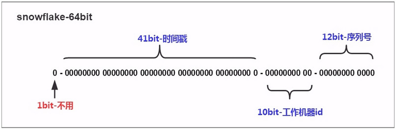

- 从数据库对象的粒度上可粗略的分为server、database、schema、table、colmun。这里server相当于instance（实例），一台机器可以装多个实例，一个实例有多个数据库，一个数据库有多个schema(模式），schema相当于把相似的表做个归类。

--查询当前库中的架构

SELECT * FROM sys.schemas AS s

--若schema不存在, 则创建schema

IF SCHEMA_ID('xxx') IS NULL EXEC sp_executesql N'CREATE SCHEMA xxx'


## 1>相关文章

### 1-1>EF Core

*EF Core 相关的千倍性能之差： AutoMapper ProjectTo VS Mapster ProjectToType 

https://www.cnblogs.com/dudu/p/10449485.html

*好大一个坑： EF Core 异步读取大字符串字段比同步慢100多倍
https://www.cnblogs.com/dudu/p/10423126.html

*EF Core官网教程
https://docs.microsoft.com/zh-cn/ef/core/

*Entity Framework Core 3.1 极简入门教程（完结）

https://www.bilibili.com/video/BV1xa4y1v7rR

*ASP.NET MVC+EF实现如何驾驭超复杂业务逻辑而不失漂亮的代码

https://www.bilibili.com/video/BV12v411b7yF

*EF Core中如何使用LEFT JOIN

https://www.cnblogs.com/OpenCoder/p/12324249.html

*EF Core 3.1 系列

[asp.net core 系列 19 EFCore介绍](https://www.cnblogs.com/MrHSR/p/10328029.html)

[asp.net core 系列 20 EF基于数据模型创建数据库](https://www.cnblogs.com/MrHSR/p/10333073.html)

[asp.net core 系列 21 EF现有数据库进行反向工程](https://www.cnblogs.com/MrHSR/p/10336962.html)

[asp.net core 系列 22 EF(连接字符串,连接复原,DbContext)](https://www.cnblogs.com/MrHSR/p/10364918.html)

[asp.net core系列 23 EF模型配置(概述, 类型和属性的包含与排除)](https://www.cnblogs.com/MrHSR/p/10373374.html)

[asp.net core系列 24 EF模型配置(主键,生成值,最大长度,并发标记)](https://www.cnblogs.com/MrHSR/p/10374981.html)

[asp.net core系列 25 EF模型配置(隐藏属性)](https://www.cnblogs.com/MrHSR/p/10383576.html)

[asp.net core系列 26 EF模型配置(实体关系)](https://www.cnblogs.com/MrHSR/p/10393861.html)

[asp.net core系列 27 EF模型配置(索引,备用键,继承)](https://www.cnblogs.com/MrHSR/p/10399692.html)

[asp.net core系列 28 EF模型配置(字段,构造函数，拥有实体类型)](https://www.cnblogs.com/MrHSR/p/10405099.html)

[asp.net core系列 29 EF模型配置(查询类型,关系数据库建模)](https://www.cnblogs.com/MrHSR/p/10411284.html)

[asp.net core系列 30 EF管理数据库架构--必备知识 迁移](https://www.cnblogs.com/MrHSR/p/10417484.html)

[asp.net core系列 31 EF管理数据库架构--必备知识 反向工程](https://www.cnblogs.com/MrHSR/p/10425437.html)

[asp.net core系列 32 EF查询数据 必备知识(1)](https://www.cnblogs.com/MrHSR/p/10435921.html)

[asp.net core系列 33 EF查询数据 (2)](https://www.cnblogs.com/MrHSR/p/10444143.html)

[asp.net core系列 34 EF保存数据(1)](https://www.cnblogs.com/MrHSR/p/10448663.html)

[asp.net core系列 35 EF保存数据(2) -- EF系列结束](https://www.cnblogs.com/MrHSR/p/10455037.html)

*NetCore3.1webApi + EFCore + DI 框架封装

https://www.cnblogs.com/ouyangkai/p/12850893.html

*利用EFCore 封装Repository（可扩展不同数据的sql操作）

https://www.cnblogs.com/lxshwyan/p/10794412.html

*IOC+EF+Core项目搭建EF封装(1~3)

https://www.cnblogs.com/shuaimeng/p/11338620.html

https://www.cnblogs.com/shuaimeng/p/11338760.html

https://www.cnblogs.com/shuaimeng/p/11338802.html

[EF Core日志记录生成的sql语句](https://blog.csdn.net/u011511086/article/details/112509821)

*并发令牌讲解(ChangeTracker, Timestamp, rowversion)

https://www.cnblogs.com/rajesh/p/11093193.html

*EF Core乐观并发控制：RowVersion

https://haokan.baidu.com/v?pd=wisenatural&vid=16607248529233004348

*EF Core系列

https://www.cnblogs.com/yaopengfei/p/10666076.html

*EFCore 复杂SQL查询踩坑记录

https://blog.csdn.net/weixin_38138153/article/details/115282786

*对于经常接触的分页你确定你真的会吗

https://www.cnblogs.com/xuejiaming/p/14187680.html

*Wei.Repository EFCore3.0+Dapper 封装Repository

https://github.com/a34546/Wei.Repository


### 1-2>MySQL

*MySQL系列

[mysql 基础篇系列(23)](https://www.cnblogs.com/MrHSR/category/1209857.html)

[mysql 进阶篇系列(55)](https://www.cnblogs.com/MrHSR/category/1255732.html)

[mysql 架构篇系列(3)](https://www.cnblogs.com/MrHSR/category/1323212.html)

[Docker 搭建 MySQL8.0 主从复制环境](https://www.cnblogs.com/fallTakeMan/p/14038888.html)


### 1-3>Fluent API

*FluentAPI详细用法
https://www.cnblogs.com/wangshaod/p/10025836.html

*官网

https://www.learnentityframeworkcore.com/configuration/fluent-api


### 1-4>Mapster

官方文档

https://github.com/MapsterMapper/Mapster/wiki

[非专业翻译] 高性能对象映射框架 - Mapster
https://www.cnblogs.com/staneee/p/14912794.html

Mapster (C# 对象映射器)

https://www.cnblogs.com/fanfan-90/p/12164927.html

说说 abp vnext 与 Mapster

https://www.cnblogs.com/jidanfan/p/14506944.html


### 1-5>AutoMapper

automapper
https://www.cnblogs.com/keatkeat/p/10041574.html


### 1-6>UnitofWork


### 1-7>Dapper

*用了Dapper之后通篇还是SqlConnection，真的看不下去了

https://blog.csdn.net/huangxinchen520/article/details/107812338

*DotNet Core中使用dapper

https://www.cnblogs.com/taotaozhuanyong/p/11757738.html

*Net Core中使用Dapper封装数据操作库

https://blog.csdn.net/qazlj/article/details/87283155

*NetCore Dapper封装

https://www.cnblogs.com/xtxk110/p/14901387.html

*C#的dapper使用

https://www.cnblogs.com/flywong/p/9666963.html

*.net core 中简单封装Dapper.Extensions

https://www.cnblogs.com/nontracey/p/9988759.html

*.Net Core中使用Dapper构建泛型仓储

https://www.cnblogs.com/zhangnever/p/11926045.html

*.NET Core实战项目之CMS 第十二章 开发篇-Dapper封装GURD及仓储代码生成器实现

https://blog.csdn.net/qq_36178899/article/details/85111256

*.NetCore中使用Dapper

https://blog.51cto.com/u_15127634/3273203

*Dapper 官网

https://github.com/DapperLib/Dapper

------

## 2>DbContext

安装包: Microsoft.EntityFrameworkCore.SqlServer

### 2-1>DbContext 生存期

*DbContext的生存期从创建实例时开始，并在释放实例时结束。

*使用后释放DbContext非常重要

*DbContext 不是线程安全的.

### 2-2>依赖注入DbContext

```C#
public void ConfigureServices(IServiceCollection services) 
{
	services.AddControllers();
	services.AddDbContext<ApplicationDbContext>
	(
		options => options.UseSqlServer("name=ConnectionStrings:DefaultConnection")
	);
}

public class ApplicationDbContext : DbContext
{
    public ApplicationDbContext(DbContextOptions<ApplicationDbContext> options)
        : base(options)
    {
    }
    //或者在这里配置连接字符串
    protected override void OnConfiguring(DbContextOptionsBuilder optionsBuilder)
    {
        optionsBuilder.UseSqlServer(_connectionString);
    }
}

public class MyController
{
    private readonly ApplicationDbContext _context;

    public MyController(ApplicationDbContext context)
    {
        _context = context;
    }
}
```

### 2-3>使用new实例化DbContext

```c#
public class ApplicationDbContext : DbContext
{
    private readonly string _connectionString;

    public ApplicationDbContext(string connectionString)
    {
        _connectionString = connectionString;
    }

    protected override void OnConfiguring(DbContextOptionsBuilder optionsBuilder)
    {
        optionsBuilder.UseSqlServer(_connectionString);
    }
}
//或
public class ApplicationDbContext : DbContext
{
    public ApplicationDbContext(DbContextOptions<ApplicationDbContext> options)
        : base(options)
    {
    }
}
var contextOptions = new DbContextOptionsBuilder<ApplicationDbContext>()
    .UseSqlServer(@"Server=(localdb)\mssqllocaldb;Database=Test")
    .Options;
using var context = new ApplicationDbContext(contextOptions)
{
    //TODO...
}
```

### 2-4>使用DbContext工厂

```C#
public void ConfigureServices(IServiceCollection services)
{
    services.AddDbContextFactory<ApplicationDbContext>(
        options =>
            options.UseSqlServer(@"Server=(localdb)\mssqllocaldb;Database=Test"));
}

public class ApplicationDbContext : DbContext
{
    public ApplicationDbContext(DbContextOptions<ApplicationDbContext> options)
        : base(options)
    {
    }
}

private readonly IDbContextFactory<ApplicationDbContext> _contextFactory;

public MyController(IDbContextFactory<ApplicationDbContext> contextFactory)
{
    _contextFactory = contextFactory;
}

public void DoSomething()
{
    using (var context = _contextFactory.CreateDbContext())
    {
        //TODO...
    }
}
```

### 2-5>DbContextOptions

三种方式获取此生成器:

- 在 AddDbContext 和相关方法中
- 在 OnConfiguring 中
- 使用 new 显式构造

3-1>UseQueryTrackingBehavior(设置查询的默认跟踪行为)

*跟踪查询
TrackAll: 已追踪的实例会被标识解析, 如果是相同的实体, 则每次返回相同实例.

*非跟踪查询
NoTracking: 不会标识解析, 即使是相同的实体, 也会返回新实例.

```C#
var blogs = context.Blogs
    .AsNoTrackingWithIdentityResolution()
    .ToList();
```

*标识解析

NoTrackingWithIdentityResolution:后台使用独立的更改追踪器, 每个实例具体化一次, 建议使用AsNoTrackingWithIdentityResolution代替AsNoTracking, 性能优化.

*自定义投影: 如果设置了跟踪查询, 那么查询返回的结果只要包含了实体类行, 就会跟踪这个实体类型, 非实体类型不跟踪.

### 2-6>避免 DbContext 线程处理问题

不支持在同一 DbContext 实例上运行多个并行操作.

------

## 3>实体配置

### 3-1>在DbContext.OnModelCreating内配置实体

### 3-2>通过特性配置

*排除表映射: [NotMapped]

*表名称: [Table("blogs")]

*表架构: [Table("blogs", Schema = "blogging")]

*表注释: [Comment("Blogs managed on the website")]

*排除属性映射: [NotMapped]

*列名: [Column("blog_id")], 实体属性会自动映射到与属性同名的列.

*列数据类型: [Column(TypeName = "varchar(200)")]

*最大长度: [MaxLength(500)]

*必填: [Required]

*列注释: [Comment("The URL of the blog")]

*主键: [Key], 将Id或[class name]Id的属性自动映射为主键, 联合主键只能通过Fluent API来设置.

*指定值生成的时机: [DatabaseGenerated(DatabaseGeneratedOption.Identity)], [DatabaseGenerated(DatabaseGeneratedOption.Computed)], [DatabaseGenerated(DatabaseGeneratedOption.None)]

*并发标记: 下面两种方式采用乐观锁机制, 在性能和死锁情况上都优于悲观锁.

ConcurrencyCheck: 对某个字段进行并发检测. 

Timestamp: 对所有列进行并发检测

[Timestamp]
public byte[] Timestamp { get; set; }

*索引

```C#
[Index(nameof(Url))]
public class Blog
{
    //TODO...
}
```

*复合索引: [Index(nameof(FirstName), nameof(LastName))]

*唯一索引: [Index(nameof(Url), IsUnique = true)]

*指定索引名称: [Index(nameof(Url), Name = "Index_Url")]

*支持字段:

```C#
public class Blog
{
    private string _validatedUrl;

    public int BlogId { get; set; }

    [BackingField(nameof(_validatedUrl))]
    public string Url
    {
        get { return _validatedUrl; }
    }

    public void SetUrl(string url)
    {
        // put your validation code here

        _validatedUrl = url;
    }
}
```

*无键实体类型:

```C#
[Keyless]
public class BlogPostsCount
{
    public string BlogName { get; set; }
    public int PostCount { get; set; }
}
```


### 3-3>通过Fluent API配置

*从模型中排除类型: modelBuilder.Ignore<BlogMetadata>();

*从迁移中排除: 

modelBuilder
	.Entity<IdentityUser>()
	.ToTable("AspNetUsers", t => t.ExcludeFromMigrations());

*表名称:

modelBuilder
	.Entity<Blog>()
	.ToTable("blogs");

*表架构: 

modelBuilder
	.Entity<Blog>()
	.ToTable("blogs", schema: "blogging");

*也可以设置上限文的默认架构

modelBuilder.HasDefaultSchema("blogging");

*视图映射: 视图不会在 add-migration 自动创建, 需要手动创建

modelBuilder
	.Entity<Blog>()
	.ToView("blogsView", schema: "blogging");

*表值函数映射: 若要将实体映射到表值函数, 该函数必须是无参数的.

```sql
CREATE FUNCTION dbo.BlogsWithMultiplePosts()
RETURNS TABLE
AS
RETURN
(
    SELECT b.Url, COUNT(p.BlogId) AS PostCount
    FROM Blogs AS b
    JOIN Posts AS p ON b.BlogId = p.BlogId
    GROUP BY b.BlogId, b.Url
    HAVING COUNT(p.BlogId) > 1
)
```

```C#
modelBuilder.Entity<BlogWithMultiplePosts>().HasNoKey().ToFunction("BlogsWithMultiplePosts");
```

```C#
var query = from b in context.Set<BlogWithMultiplePosts>()
            where b.PostCount > 3
            select new { b.Url, b.PostCount };
```

*表注释:

modelBuilder
	.Entity<Blog>()
	.HasComment("Blogs managed on the website");

*排除属性映射:

modelBuilder.Entity<Blog>()
	.Ignore(b => b.LoadedFromDatabase);

*列名: 

modelBuilder.Entity<Blog>()
	.Property(b => b.BlogId)
	.HasColumnName("blog_id");

*列数据类型:

```C#
modelBuilder.Entity<Blog>(
	eb =>
	{
		eb.Property(b => b.Url).HasColumnType("varchar(200)");
		eb.Property(b => b.Rating).HasColumnType("decimal(5, 2)");
	});
```

*最大长度:

modelBuilder.Entity<Blog>()
	.Property(b => b.Url)
	.HasMaxLength(500);

*精度和小数位数: 一般是decimal和DateTime.

modelBuilder.Entity<Blog>()
	.Property(b => b.Score)
	.HasPrecision(14, 2);

modelBuilder.Entity<Blog>()
	.Property(b => b.LastUpdated)
	.HasPrecision(3);

*必填:

modelBuilder.Entity<Blog>()
	.Property(b => b.Url)
	.IsRequired();

*列排序比较规则: (下面的例子表示列的值不区分大小写)

modelBuilder.Entity<Customer>()
	.Property(c => c.Name)
	.UseCollation("SQL_Latin1_General_CP1_CI_AS"); 

*列注释: 

modelBuilder.Entity<Blog>()
	.Property(b => b.Url)
	.HasComment("The URL of the blog");

*主键: 可以设置单个主键及联合主键, 可以自定义主键的名称, 

```C#
modelBuilder.Entity<Car>()
	.HasKey(c => c.LicensePlate);

modelBuilder.Entity<Car>()
	.HasKey(c => new { c.State, c.LicensePlate });

modelBuilder.Entity<Blog>()
	.HasKey(b => b.BlogId)
	.HasName("PrimaryKey_BlogId");
```

*默认值(如果插入的行没有该列的值，将使用默认值): 

```C#
modelBuilder.Entity<Blog>()
	.Property(b => b.Rating)
	.HasDefaultValue(3);

modelBuilder.Entity<Blog>()
	.Property(b => b.Created)
	.HasDefaultValueSql("getdate()");
```

*计算列(通常具有引用其他列的表达式):

```C#
modelBuilder.Entity<Person>()
	.Property(p => p.DisplayName)
	.HasComputedColumnSql("[LastName] + ', ' + [FirstName]");
```

可以使用stored来持久化计算列的值, 即将计算后的结果存到列.

```C#
modelBuilder.Entity<Person>()
	.Property(p => p.DisplayName)
	.HasComputedColumnSql("[LastName] + ', ' + [FirstName]", stored: true);
```

*指定值生成的时机:

```C#
modelBuilder.Entity<Blog>()
	.Property(b => b.Inserted)
	.ValueGeneratedOnAdd();
	
modelBuilder.Entity<Blog>()
	.Property(b => b.LastUpdated)
	.ValueGeneratedOnAddOrUpdate();

modelBuilder.Entity<Blog>()
	.Property(b => b.BlogId)
	.ValueGeneratedNever();
```

*日期/时间值生成:

AddTime可以使用默认值的方式

```C#
modelBuilder.Entity<Blog>()
	.Property(b => b.Created)
	.HasDefaultValueSql("getdate()");
```

UpdateTime需要自行实现(如下面例子的触发器):

```sql
CREATE TRIGGER [dbo].[Blogs_UPDATE] ON [dbo].[Blogs]
    AFTER UPDATE
AS
BEGIN
    SET NOCOUNT ON;

    IF ((SELECT TRIGGER_NESTLEVEL()) > 1) RETURN;

    DECLARE @Id INT

    SELECT @Id = INSERTED.BlogId
    FROM INSERTED

    UPDATE dbo.Blogs
    SET LastUpdated = GETDATE()
    WHERE BlogId = @Id
END
```

*并发标记:

```C#
//指定某个字段为并发字段
modelBuilder.Entity<Person>()
	.Property(p => p.LastName)
	.IsConcurrencyToken();

//指定整个实体的并发字段, 实体任何字段有更改, 并发字段的值都会自动改变
modelBuilder.Entity<Blog>()
	.Property(p => p.Timestamp)
	.IsRowVersion();
```

*配置1对N: 导航属性可以最终只保留 public List<Post> Posts { get; set; }, 这个属性足以说明Blog与Post的1对多关系.

```C#
public class Blog
{
    public int BlogId { get; set; }
    public string Url { get; set; }

    public List<Post> Posts { get; set; }
}

public class Post
{
    public int PostId { get; set; }
    public string Title { get; set; }
    public string Content { get; set; }

    public int BlogId { get; set; }
    public Blog Blog { get; set; }
}
```

HasOne/WithOne用于引用导航属性, HasMany/WithMany用于集合导航属性, 配置的套路: 把关系配置在多的一端.

下面是1对N的例子:

```C#
public class Blog
{
    public int BlogId { get; set; }
    public string Url { get; set; }

    public List<Post> Posts { get; set; }
}

public class Post
{
    public int PostId { get; set; }
    public string Title { get; set; }
    public string Content { get; set; }
    public Blog Blog { get; set; }
}

modelBuilder.Entity<Post>()
            .HasOne(p => p.Blog)
            .WithMany(b => b.Posts);
```

或者

```C#
public class Blog
{
    public int BlogId { get; set; }
    public string Url { get; set; }

    public List<Post> Posts { get; set; }
}

public class Post
{
    public int PostId { get; set; }
    public string Title { get; set; }
    public string Content { get; set; }
}

modelBuilder.Entity<Blog>()
            .HasMany(b => b.Posts)
            .WithOne();
```

*配置导航属性: 对已经配置好的导航属性, 用Navigation进行细节配置.

```C#
modelBuilder.Entity<Blog>()
    .HasMany(b => b.Posts)
    .WithOne();

modelBuilder.Entity<Blog>()
    .Navigation(b => b.Posts)
    .UsePropertyAccessMode(PropertyAccessMode.Property);
```

*指定外键:

```C#
//单个外键
modelBuilder.Entity<Post>()
            .HasOne(p => p.Blog)
            .WithMany(b => b.Posts)
            .HasForeignKey(p => p.BlogForeignKey);

//联合外键
modelBuilder.Entity<RecordOfSale>()
            .HasOne(s => s.Car)
            .WithMany(c => c.SaleHistory)
            .HasForeignKey(s => new { s.CarState, s.CarLicensePlate });
```

*指定外键名称:

```C#
modelBuilder.Entity<Post>()
        .HasOne(p => p.Blog)
        .WithMany(b => b.Posts)
        .HasForeignKey(p => p.BlogId)
        .HasConstraintName("ForeignKey_Post_Blog");
```

*没有导航属性, 设置1对多关系(一般也没人会这么干吧-_-||):

```C#
public class Blog
{
    public int BlogId { get; set; }
    public string Url { get; set; }
}

public class Post
{
    public int PostId { get; set; }
    public string Title { get; set; }
    public string Content { get; set; }

    public int BlogId { get; set; }
}

modelBuilder.Entity<Post>()
            .HasOne<Blog>()
            .WithMany()
            .HasForeignKey(p => p.BlogId);
```

*指定外键是否必填:

```C#
modelBuilder.Entity<Post>()
        .HasOne(p => p.Blog)
        .WithMany(b => b.Posts)
        .IsRequired();
```

*级联删除:

```C#
modelBuilder.Entity<Post>()
        .HasOne(p => p.Blog)
        .WithMany(b => b.Posts)
        .OnDelete(DeleteBehavior.Cascade);
```

*配置1对1: 在一对多关系中，具有引用导航的实体是依赖实体，具有集合导航的实体是主体. 在1对1的关系中, 需要显示指定主从关系.

```C#
public class Blog
{
    public int BlogId { get; set; }
    public string Url { get; set; }

    public BlogImage BlogImage { get; set; }
}

public class BlogImage
{
    public int BlogImageId { get; set; }
    public byte[] Image { get; set; }
    public string Caption { get; set; }

    public int BlogForeignKey { get; set; }
    public Blog Blog { get; set; }
}

modelBuilder.Entity<Blog>()
            .HasOne(b => b.BlogImage)
            .WithOne(i => i.Blog)
            .HasForeignKey<BlogImage>(b => b.BlogForeignKey);
```

*配置N对N: 多对多关系需要两侧的集合导航属性.

```C#
public class User
{
    public int Id { get; set; }
    public string Name { get; set; }
    public int Age { get; set; }
    public bool Gender { get; set; }
}
public class Role
{
    public int Id { get; set; }
    public string RoleName { get; set; }
}
public class UserRoleRelation
{
    public int Id { get; set; }
    public int UserId { get; set; }
    public int RoleId { get; set; }
 
    public virtual User User { get; set; }
    public virtual Role Role { get; set; }
}

modelBuilder
    .Entity<UserRoleRelation>().
	.ToTable("UserRoleRelation")
    .HasKey(r => r.Id)
	.Property(r => r.UserId).IsRequired()
	.Property(r => r.RoleId).IsRequired()
	.HasOne(r => r.User).WithMany().HasForeignKey(r => r.UserId).IsRequired().OnDelete(DeleteBehavior.ClientCascade))
    .HasOne(r => r.Role).WithMany().HasForeignKey(r => r.RoleId).IsRequired().OnDelete(DeleteBehavior.ClientCascade));
```

*索引: 

modelBuilder.Entity<Blog>()
	.HasIndex(b => b.Url);

*复合索引:

modelBuilder.Entity<Person>()
	.HasIndex(p => new { p.FirstName, p.LastName });

*唯一索引:

modelBuilder.Entity<Blog>()
	.HasIndex(b => b.Url)
	.IsUnique();

*指定索引名称:

modelBuilder.Entity<Blog>()
	.HasIndex(b => b.Url)
	.HasDatabaseName("Index_Url");

*条件约束:

modelBuilder.Entity<Product>()
	.HasCheckConstraint("CK_Prices", "[Price] > [DiscountedPrice]", c => c.HasName("CK_Product_Prices"));

*继承: 没用到, 需要了解可参考:https://docs.microsoft.com/zh-cn/ef/core/modeling/inheritance

*序列: 没用到, 需要了解可参考:https://docs.microsoft.com/zh-cn/ef/core/modeling/sequences

*支持字段:

```C#
modelBuilder.Entity<Blog>()
	.Property(b => b.Url)
	.HasField("_validatedUrl");
```

*值转换

Expression<Func<TModel, TProvider>> convertToProviderExpression

Expression<Func<TProvider, TModel>> convertFromProviderExpression

一个是写库时要把实体属性类型转为表字段类型, 一个是读库时, 把表字段类型回转为实体模型中属性的类型.

```C#
var converter = new ValueConverter<List<UpgradeWayModel>, string>
(
    v => JsonHelper.ToJson(v),
    v => JsonHelper.ToObject<List<UpgradeWayModel>>(v)
);
 
modelBuilder
	.Entity<Test>()
	.Property(e => e.TestName)
	.HasConversion(converter);
```

*内置的转换器: https://docs.microsoft.com/zh-cn/ef/core/modeling/value-conversions?tabs=fluent-api

*值比较器: https://docs.microsoft.com/zh-cn/ef/core/modeling/value-comparers?tabs=ef5

*种子数据: https://docs.microsoft.com/zh-cn/ef/core/modeling/data-seeding

*实体类型构造函数: 可以注入容器的所有服务

*表拆分(表共享): 多个实体共同映射同一张表的不同字段, 组成一张总的表. 将主键映射到相同的列, 并且在同一个实体类型的主键与另一个实体类型的主键之间配置至少一个关系.

```C#
public class Order
{
    public int Id { get; set; }
    public OrderStatus? Status { get; set; }
    public DetailedOrder DetailedOrder { get; set; }
}
public class DetailedOrder
{
    public int Id { get; set; }
    public OrderStatus? Status { get; set; }
    public string BillingAddress { get; set; }
    public string ShippingAddress { get; set; }
    public byte[] Version { get; set; }
}

modelBuilder.Entity<DetailedOrder>(
    dob =>
    {
        dob.ToTable("Orders");
        dob.Property(o => o.Status).HasColumnName("Status");
    });

modelBuilder.Entity<Order>(
    ob =>
    {
        ob.ToTable("Orders");
        ob.Property(o => o.Status).HasColumnName("Status");
        ob.HasOne(o => o.DetailedOrder).WithOne().HasForeignKey<DetailedOrder>(o => o.Id);
    });
```

*从属属性: https://docs.microsoft.com/zh-cn/ef/core/modeling/owned-entities

*无键实体类型:

modelBuilder.Entity<BlogPostsCount>()
	.HasNoKey();

*在具有相同 DbContext 类型的多个模型之间交替: https://www.jianshu.com/p/d401c0bb3046

*空间数据: https://docs.microsoft.com/zh-cn/ef/core/modeling/spatial

*指定基类型: HasBaseType.

```C#
modelBuilder.Entity<RssBlog>().HasBaseType<Blog>();
```

*隐藏属性: 也叫影子属性，该属性不是在.net实体类中定义的属性，而是在EFCore模型中为该实体类型定义的属性。这些属性的值和状态完全在变更跟踪器中维护。

```C#
//配置隐藏属性, 只能通过 Fluent API 来创建
public class Blog
{
    public int BlogId { get; set; }
    public string Url { get; set; }
}
modelBuilder.Entity<Blog>().Property<DateTime>("LastUpdated");

//设置隐藏属性值, 通过ChangeTracker API可以为隐藏属性LastUpdated设置时间值, 提交到数据库表中。
BloggingContext.Entry(blog).Property("LastUpdated").CurrentValue = DateTime.Now;
BloggingContext.Add<Blog>(blog);
await BloggingContext.SaveChangesAsync();

//读取blog表数据
var blogs = context.Blogs.OrderBy(b => EF.Property<DateTime>(b, "LastUpdated"));
```

------

## 4>管理数据库架构

### 4-1>Code first使用Migration, DB First使用方向工程.

### 4-2>使用命令的注意事项

*默认启动项目需要能生成exe, 在dbcontext的项目及exe项目安装nuget包 Microsoft.EntityFrameworkCore.Tools

*之前命令前, 记得在Startup.ConfigureServices配置上下文: services.AddDbContext<CALCDbContext>();

### 4-3>指令列表

```powershell
Add-Migration               Adds a new migration.
Script-Migration            Generates a SQL script from migrations.
Update-Database             Updates the database to a specified migration.
Remove-Migration            Removes the last migration.

Drop-Database               Drops the database.
Get-DbContext               Lists and gets information about available DbContext types.
Get-Migration               Lists available migrations.
Scaffold-DbContext          Scaffolds a DbContext and entity types for a database.
Script-DbContext            Generates a SQL script from the DbContext. Bypasses any migrations.
```

### 4-4>管理迁移文件

```powershell
//生成迁移文件
Add-Migration InitCALCDb
Add-Migration InitCALCDb -OutputDir DbMigration
Add-Migration InitCALCDb -Context CALCDbContext -OutputDir DbMigration

//删除迁移(若迁移文件已用于执行update-database, 则无法使用Remove-Migration, 只能从最新的迁移文件一个一个往回删除)
Remove-Migration
Remove-Migration -Context CALCDbContext //删除最新生成的迁移文件

//生成数据库脚本
Script-Migration
Script-Migration -Context CALCDbContext
Script-Migration -Context CALCDbContext -Output CALCDbScript.sql //脚本生成到启动项目根目录下
Script-Migration -Context CALCDbContext -Output F:\100_StudyPro\NetCoreDemos\Dylan.Repository\DbMigrationScript\CALCDbScript.sql //脚本生成到指定物理路径下
Script-Migration UpdateCALCDb1 AddIsDeleteInAuthor -Context CalcDbContext //生成UpdateCALCDb1版本到AddIsDeleteInAuthor版本之间的SQL

//更新数据库结构
Update-Database //升级到最新版本
Update-Database -Context CALCDbContext //升级到最新版本
update-database AddIsDeleteInAuthor -Context CALCDbContext //降级/升级到指定版本
Update-Database -Context CALCDbContext -Migration:0 //删除数据库中所有表(除了迁移历史表)
```

### 4-5>迁移文件注意事项

*系统自动生成的迁移文件不一定都是对的，有时候需要手动修改Add-Migration生成的文件, 比如修改字段名. 若系统已经存在列A, 若对实体做了重命名操作, 自动生成的脚本会执行drop column & add column操作, 这样的操作会导致列的值丢失, 因此需要手动干预.

```C#
migrationBuilder.DropColumn(
    name: "Name",
    table: "Customers");

migrationBuilder.AddColumn<string>(
    name: "FullName",
    table: "Customers",
    nullable: true);

//应该改成如下操作
migrationBuilder.RenameColumn(
    name: "Name",
    table: "Customers",
    newName: "FullName");
```

*往生成的迁移文件里添加原始sql语句

```C#
migrationBuilder.AddColumn<string>(
    name: "FullName",
    table: "Customer",
    nullable: true);

migrationBuilder.Sql(
@"
    UPDATE Customer
    SET FullName = FirstName + ' ' + LastName;
");

migrationBuilder.DropColumn(
    name: "FirstName",
    table: "Customer");

migrationBuilder.DropColumn(
    name: "LastName",
    table: "Customer");
```

### 4-6>迁移文件动态编程

https://docs.microsoft.com/zh-cn/ef/core/managing-schemas/migrations/operations

### 4-7>动态指定上下文

```C#
public static IHostBuilder CreateHostBuilder(string[] args)
    => Host.CreateDefaultBuilder(args)
        .ConfigureServices(
            (hostContext, services) =>
            {
                services.AddHostedService<Worker>();

                // Set the active provider via configuration
                var configuration = hostContext.Configuration;
                var provider = configuration.GetValue("Provider", "SqlServer");

                services.AddDbContext<BlogContext>(
                    options => _ = provider switch
                    {
                        "Sqlite" => options.UseSqlite(
                            configuration.GetConnectionString("SqliteConnection"),
                            x => x.MigrationsAssembly("SqliteMigrations")),

                        "SqlServer" => options.UseSqlServer(
                            configuration.GetConnectionString("SqlServerConnection"),
                            x => x.MigrationsAssembly("SqlServerMigrations")),

                        _ => throw new Exception($"Unsupported provider: {provider}")
                    });
            });

Add-Migration MyMigration -Args "--provider SqlServer"
Add-Migration MyMigration -Args "--provider Sqlite"
```

### 4-8>自定义迁移历史记录表

https://docs.microsoft.com/zh-cn/ef/core/managing-schemas/migrations/history-table

```C#
optionsBuilder.UseSqlServer(connectionString: connStr, sqlServerOptionsAction =>
{
	sqlServerOptionsAction.EnableRetryOnFailure(3, TimeSpan.FromMilliseconds(100), null); //设置重连
	if (!string.IsNullOrEmpty(Schema))
	{
		sqlServerOptionsAction.MigrationsHistoryTable(tableName: "__T_DBMigrationsHistory", schema: Schema);
	}
});
```

------

## 5>并发

先来了解下帮助解决并发冲突的三组值：

- Current values 当前值： 应用程序尝试写入数据库的值
- Original values 原始值： 被 EF Core 从数据库检索出来的值，位于任何更新操作之前的值
- Database values 数据库值： 当前数据库实际存储的值

当`SaveChanges`时, 如果捕获了`DbUpdateConcurrencyException`, 说明发生了并发冲突, 使用`DbUpdateConcurrencyException.Entries`为受影响的实体准备一组新值, 重新获取数据库中的值的并发令牌来刷新`Original values`, 然后重试直到没有任何冲突产生.

```C#
[HttpPut]
public async Task<Person> Update([FromBody]Person current)
{
	Person original = null;

	try
	{
		original = await _db.People.FindAsync(current.Id);
		original.FirstName = current.FirstName;
		original.LastName = current.LastName;
		await _db.SaveChangesAsync();
	}
	catch (DbUpdateConcurrencyException e)
	{
		foreach (var entry in e.Entries)
		{
			var currentValues = entry.CurrentValues;
			var databaseValues = await entry.GetDatabaseValuesAsync();

			if (entry.Entity is Person person)
			{
				// 更新什么值取决于实际需要
				person.FirstName = currentValues[nameof(Person.FirstName)]?.ToString();
				person.LastName = currentValues[nameof(Person.LastName)]?.ToString();
				// 这步操作是为了刷新当前 Tracker 的值， 为了通过下一次的并发检查
				entry.OriginalValues.SetValues(databaseValues);
			}
		}

		await _db.SaveChangesAsync();
	}

	return original;
}
```

```C#
//官方处理方式
using var context = new PersonContext();
// Fetch a person from database and change phone number
var person = context.People.Single(p => p.PersonId == 1);
person.PhoneNumber = "555-555-5555";

// Change the person's name in the database to simulate a concurrency conflict
context.Database.ExecuteSqlRaw(
    "UPDATE dbo.People SET FirstName = 'Jane' WHERE PersonId = 1");

var saved = false;
while (!saved)
{
    try
    {
        // Attempt to save changes to the database
        context.SaveChanges();
        saved = true;
    }
    catch (DbUpdateConcurrencyException ex)
    {
        foreach (var entry in ex.Entries)
        {
            if (entry.Entity is Person)
            {
                var proposedValues = entry.CurrentValues;
                var databaseValues = entry.GetDatabaseValues();

                foreach (var property in proposedValues.Properties)
                {
                    var proposedValue = proposedValues[property];
                    var databaseValue = databaseValues[property];

                    // TODO: decide which value should be written to database
                    // proposedValues[property] = <value to be saved>;
                }

                // Refresh original values to bypass next concurrency check
                entry.OriginalValues.SetValues(databaseValues);
            }
            else
            {
                throw new NotSupportedException(
                    "Don't know how to handle concurrency conflicts for "
                    + entry.Metadata.Name);
            }
        }
    }
}
```

*通常的处理方式：

 *Reload一下，放弃当前内存中的实体，重新到数据库中加载当前实体，然后用当前数据库中的值进行相应的业务处理。

 *直接提示用户，信息被修改，请重新操作一遍(可以更友好的提示一下)

```C#
{
	//保证T_Concurrency02有一条id=01的记录（age=10）
	ypfContext db1 = new ypfContext();
	ypfContext db2 = new ypfContext();

	try
	{
		var data1 = db1.T_Concurrency02.Where(u => u.id == "01").FirstOrDefault();
		var data2 = db2.T_Concurrency02.Where(u => u.id == "01").FirstOrDefault();

		data1.age = data1.age - 2;
		int result1 = db1.SaveChanges();

		data2.age = data2.age - 4;
		int result2 = db2.SaveChanges();  //发现age的值和原先查出来的不一致，会抛异常进入cache
	}
	catch (DbUpdateConcurrencyException ex)
	{
		var entityEntry = ex.Entries.Single();
		var original = entityEntry.OriginalValues.ToObject() as T_Concurrency02; //数据库原始值  10
		var database = entityEntry.GetDatabaseValues().ToObject() as T_Concurrency02; //数据库现在值 8
		var current = entityEntry.CurrentValues.ToObject() as T_Concurrency02; //当前内存值 6
		entityEntry.Reload(); //放弃当前内存中的实体，重新到数据库中加载当前实体

		current.age = database.age - 4;  //应该拿着当前数据库实际的值去处理，即8-4=4
		entityEntry.CurrentValues.SetValues(current);
		int result3 = db2.SaveChanges();
	}
}
```

```C#
try
{
	var firstPeople1 = EFDbContext.Peoples.FirstOrDefault();

	var peopleId = firstPeople1.Id;

	firstPeople1.Name = "people1";
	await EFDbContext.SaveChangesAsync(cancellationToken);

	return Json(new
	{
		peopleId
	});
}
catch (DbUpdateConcurrencyException ex)
{
	try
	{
		//将源数据更新为db数据, 然后现有数据更新为最新数据
		long id = default;
		foreach (var entry in ex.Entries)
		{
			var dbProValues = await entry.GetDatabaseValuesAsync(cancellationToken);
			var curProValues = entry.CurrentValues;

			id = long.Parse(curProValues["Id"].ToString());

			//若需要修改当前值, 可用下面的方法
			var curPeople = curProValues.ToObject() as People;
			if (curPeople == default)
			{
				throw ex;
			}
			curPeople.Name = "并发people";
			entry.CurrentValues.SetValues(curPeople);


			//将原始值用数据库值更新, 保证并发令牌为最新
			entry.OriginalValues.SetValues(dbProValues);
		}
		
		await EFDbContext.SaveChangesAsync(cancellationToken);
		return Json(new
		{
			id
		});
	}
	catch
	{
		throw ex;
	}
}
catch (Exception ex)
{
	var errorMsg = ex.GetInnerExceptionMsg();
	return Json(new
	{
		errorMsg
	});
}
```


------

## 6>反向工程 (不建议使用)

https://www.cnblogs.com/MrHSR/p/10425437.html

**对于已经存在的老项目, 需要升级到EF Core, 用Code first(EF Core只剩下Code First模式)作为ORM, 我的想法是手动创建好所有的类以DB Context, 然后在旧项目的库里手动创建迁移历史表, 往表里插入Init记录, 等以后有加新的表或者对旧库有新的更改，就可以继续使用Migration进行数据库维护.**


------

## 7>查询

### 7-1>跟踪/非跟踪查询

跟踪查询: 从实体查询出来, 一直到执行`SaveChanges()`, 系统会监视实体的所有改变.

非跟踪查询: 查询出来的实体, 系统不进行跟踪查询, 可用于非保存的查询, 如列表查询.

```C#
//跟踪查询
var resultList = await EFDbContext.Authors.AsTracking().Where(a => a.Name.Contains("_1")).ToListAsync();
//非跟踪查询
var resultList = await EFDbContext.Authors.AsNoTracking().Where(a => a.Name.Contains("_1")).ToListAsync();
//非跟踪查询(带标识解析, 性能更好)
var resultList = await EFDbContext.Authors.AsNoTrackingWithIdentityResolution().Where(a => a.Name.Contains("_1")).ToListAsync();
```

### 7-2>导航属性的数据加载方式

#### 7-2-1>预加载

```C#
//1>不预加载导航属性, 查询出来的导航属性值为空
var resultList =
	await EFDbContext.Authors
	.Take(3)
	.ToListAsync();

//2>预加载导航属性, 可以查询初导航属性的值
var resultList =
	await EFDbContext.Authors
	.Include(a => a.Blog)
    .Take(3)
	.ToListAsync();

//3>多级加载
/*
	SELECT [t0].[Id], [t0].[AddIP], [t0].[AddTime], [t0].[AddUserId], [t0].[Address], [t0].[BirthDate], [t0].[Code], [t0].[CompanyName], [t0].[Email], [t0].[Hometown], [t0].[LastUpdateIP], [t0].[LastUpdateTime], [t0].[LastUpdateUserId], [t0].[Name], [t0].[Tel], [t0].[Title], [t0].[Token], [t1].[Id], [t1].[AddIP], [t1].[AddTime], [t1].[AddUserId], [t1].[AuthorId], [t1].[LastUpdateIP], [t1].[LastUpdateTime], [t1].[LastUpdateUserId], [t1].[OpenDate], [t1].[Token], [t1].[Url], [t2].[Id], [t2].[AddIP], [t2].[AddTime], [t2].[AddUserId], [t2].[BlogId], [t2].[Content], [t2].[IsDelete], [t2].[LastUpdateIP], [t2].[LastUpdateTime], [t2].[LastUpdateUserId], [t2].[PostStatus], [t2].[ReleaseTime], [t2].[Title], [t2].[Token]
	FROM (
		SELECT TOP(3) [t].[Id], [t].[AddIP], [t].[AddTime], [t].[AddUserId], [t].[Address], [t].[BirthDate], [t].[Code], [t].[CompanyName], [t].[Email], [t].[Hometown], [t].[LastUpdateIP], [t].[LastUpdateTime], [t].[LastUpdateUserId], [t].[Name], [t].[Tel], [t].[Title], [t].[Token]
		FROM [CALC].[T_Author] AS [t]
	) AS [t0]
	LEFT JOIN [CALC].[T_Blog] AS [t1] ON [t0].[Id] = [t1].[AuthorId]
	LEFT JOIN [CALC].[T_Post] AS [t2] ON [t1].[Id] = [t2].[BlogId]
	ORDER BY [t0].[Id], [t1].[Id], [t2].[Id]
*/
var resultList =
	await EFDbContext.Authors
	.Include(a => a.Blog)
	.ThenInclude(b=>b.Posts)
	.Take(3)
	.ToListAsync();
//=>等同于下面的写法
resultList =
	await EFDbContext.Authors
	.Include(a => a.Blog.Posts)
	.Take(3)
	.ToListAsync();

//4>预加载的数据可以执行where, OrderBy, OrderByDescending, ThenBy, ThenByDescending, Skip 和 Take.
var resultList =
	EFDbContext.Authors
	.Include(a => a.Blog.Posts.Where(p => p.PostStatus == EnumPostStatus.Draft).OrderByDescending(p => p.Content))
	.Take(3);
```

#### 7-2-2>显式加载(加载查询出来实体的属性导航)

```C#
//1>显示加载导航属性
var resultList = EFDbContext.Authors.OrderByDescending(a => a.Name).ThenBy(a => a.Tel).Take(1).ToList();
if (resultList.Any())
{
	await EFDbContext.Entry(resultList[0])
		.Reference(a => a.Blog)
		.LoadAsync();

	await EFDbContext.Entry(resultList[0].Blog)
		.Collection(b => b.Posts)
		.LoadAsync();
}
```

### 7-3>拆分查询/合并查询

*EF默认使用拆分查询, 用户可以根据实际需求配置

```C#
protected override void OnConfiguring(DbContextOptionsBuilder optionsBuilder)
{
    optionsBuilder
        .UseSqlServer(
            @"Server=(localdb)\mssqllocaldb;Database=EFQuerying;Trusted_Connection=True",
            o => o.UseQuerySplittingBehavior(QuerySplittingBehavior.SplitQuery));
}
```

```C#
//使用拆分查询
using (var context = new BloggingContext())
{
    var blogs = context.Blogs
        .Include(blog => blog.Posts)
        .AsSplitQuery()
        .ToList();
}

//使用合并查询
using (var context = new SplitQueriesBloggingContext())
{
    var blogs = context.Blogs
        .Include(blog => blog.Posts)
        .AsSingleQuery()
        .ToList();
}
```

### 7-4>连接查询(cross join, inner join, left join)

```C#
//1>笛卡尔积查询(cross join)
/*
	SELECT [t].[Id] AS [AuthorId], [t].[Name], [t0].[Url], [t0].[OpenDate]
	FROM [CALC].[T_Author] AS [t]
	CROSS JOIN [CALC].[T_Blog] AS [t0]
	WHERE [t].[Id] = [t0].[AuthorId]
	ORDER BY [t].[Name], [t0].[Url] DESC
*/
var resultList =
				(from ab in
				(from author in EFDbContext.Authors
				 from blog in EFDbContext.Blogs
				 where author.Id == blog.AuthorId
				 select new
				 {
					 AuthorId = author.Id,
					 author.Name,
					 blog.Url,
					 blog.OpenDate
				 })//.ToList();
				 orderby ab.Name, ab.Url descending
				 select ab).ToList();

//2>内连接(inner join)
/*
	SELECT [t].[Id] AS [AuthorId], [t].[Name], [t0].[Url], [t0].[OpenDate]
	FROM [CALC].[T_Author] AS [t]
	INNER JOIN [CALC].[T_Blog] AS [t0] ON [t].[Id] = [t0].[AuthorId]
	ORDER BY [t].[Name], [t0].[Url] DESC
*/
var resultList = await
				(from ab in
				(from author in EFDbContext.Authors
				 join blog in EFDbContext.Blogs on author.Id equals blog.AuthorId
				 select new
				 {
					 AuthorId = author.Id,
					 author.Name,
					 blog.Url,
					 blog.OpenDate
				 })
				 orderby ab.Name, ab.Url descending
				 select ab).ToListAsync();

//3>先内连接(inner join), 再左外连接(left join)
/*
	SELECT [t].[Id] AS [AuthorId], [t].[Name] AS [AuthorName], [t0].[Url] AS [BlogUrl], [t0].[OpenDate] AS [BlogOpenDate], [t1].[Title], [t1].[PostStatus], [t1].[ReleaseTime]
	FROM [CALC].[T_Author] AS [t]
	INNER JOIN [CALC].[T_Blog] AS [t0] ON [t].[Id] = [t0].[AuthorId]
	LEFT JOIN [CALC].[T_Post] AS [t1] ON [t0].[Id] = [t1].[BlogId]
	ORDER BY [t].[Name], [t1].[Title] DESC
 */
var resultList =
	await
	(from author in EFDbContext.Authors
	 join blog in EFDbContext.Blogs on author.Id equals blog.AuthorId
	 join post in EFDbContext.Posts on blog.Id equals post.BlogId into rPosts
	 from rPost in rPosts.DefaultIfEmpty()
	 orderby author.Name, rPost.Title descending
	 select new
	 {
		 AuthorId = author.Id,
		 AuthorName = author.Name,
		 BlogUrl = blog.Url,
		 BlogOpenDate = blog.OpenDate,
		 Title = rPost.Title,
		 PostStatus = rPost.PostStatus,
		 ReleaseTime = rPost.ReleaseTime
	 }).ToListAsync();

//4>on条件不止一个, 用匿名对象
var query = from photo in context.Set<PersonPhoto>()
			join person in context.Set<Person>()
			on new { Id = (int?)photo.PersonPhotoId, photo.Caption }
			equals new { Id = person.PhotoId, Caption = "SN" }
			select new { person, photo };

//5>left join 另一种写法
var query2 = from b in context.Set<Blog>()
             from p in context.Set<Post>().Where(p => b.BlogId == p.BlogId).DefaultIfEmpty()
             select new { b, p };
```

### 7-5>分组查询(group by)

```C#
//1>EF的Goup by后的结果只能使用聚合操作(Average, Count, LongCount, Max, Min, Sum), 无法查询分组的明细(报错), 可以使用AsEnumerable将数据加载到内存操作
var resultList =
	await
		(from author in EFDbContext.Authors
		 group author by author.Code into g
		 select new
		 {
			 GroupKey = g.Key,
			 Count = g.Count()
		 }).ToListAsync();

//2>加载到内存进行分组操作
var resultList =
		(from author in EFDbContext.Authors.AsEnumerable()
		 group author by author.Code / 100 into g
		 select new
		 {
			 GroupKey = g.Key,
			 List = g.ToList()
		 }).ToList();
```

### 7-6>原生SQL查询(查询操作及非查询操作)

*使用原生`SQL`查询时需注意以下几个限制:

- SQL 查询必须返回实体类型的所有属性的数据。

- 结果集中的列名必须与属性映射到的列名称匹配。
- SQL 查询不能包含关联数据。

```C#
//执行普通查询, 使用占位符实现参数化查询
var queryParam1 = "Name_8%";
var schema = EFDbContext.Schema;
var resultList =
   await EFDbContext.Authors.FromSqlRaw(@"select top 10 T_Author.*
from CALC.T_Author as T_Author
inner join CALC.T_Blog as T_Blog
on T_Author.Id = T_Blog.AuthorId
where exists
(
	select T_Post.Id
	from CALC.T_Post as T_Post
	where T_Post.BlogId = T_Blog.Id
	and exists
	(
		select T_PostCollects.Id
		from CALC.T_PostCollects as T_PostCollects
		where T_PostCollects.PostId = T_Post.Id
	)
	and exists
	(
		select T_PostComments.Id
		from CALC.T_PostComments as T_PostComments
		where T_PostComments.PostId = T_Post.Id
	)
)
and T_Author.Name like {0}", queryParam1)
   .AsNoTrackingWithIdentityResolution()
   .Include(a => a.Blog.Posts)
   .ToListAsync();

//使用@参数名实现参数化查询
var queryParam1 = new SqlParameter(parameterName: "@AuthorName", value: "Name_8%");
var schema = EFDbContext.Schema;
var resultList = await EFDbContext.Authors.FromSqlRaw(@"select top 10 T_Author.*
from CALC.T_Author as T_Author
inner join CALC.T_Blog as T_Blog
on T_Author.Id = T_Blog.AuthorId
where exists
(
	select T_Post.Id
	from CALC.T_Post as T_Post
	where T_Post.BlogId = T_Blog.Id
	and exists
	(
		select T_PostCollects.Id
		from CALC.T_PostCollects as T_PostCollects
		where T_PostCollects.PostId = T_Post.Id
	)
	and exists
	(
		select T_PostComments.Id
		from CALC.T_PostComments as T_PostComments
		where T_PostComments.PostId = T_Post.Id
	)
)
and T_Author.Name like @AuthorName", queryParam1)
                   .AsNoTrackingWithIdentityResolution()
                   .Include(a => a.Blog.Posts)
                   .ToListAsync();

//执行普通查询, 使用模板插值实现参数化查询, 也可以执行返回表数据的存储过程
var user = "johndoe";
var blogs = context.Blogs
    .FromSqlInterpolated($"EXECUTE dbo.GetMostPopularBlogsForUser {user}")
    .ToList();

//执行存储过程
var user = "johndoe";
var blogs = context.Blogs
    .FromSqlRaw("EXECUTE dbo.GetMostPopularBlogsForUser {0}", user)
    .ToList();

//混合LINQ写法(存储过程无法使用LINQ组合查询, 若需要, 可在FromSqlInterpolated后使用AsEnumerable/AsAsyncEnumerable, 将数据加载到内存使用)
var searchTerm = "Lorem ipsum";
var blogs = context.Blogs
    .FromSqlInterpolated($"SELECT * FROM dbo.SearchBlogs({searchTerm})")
    .Where(b => b.Rating > 3)
    .OrderByDescending(b => b.Rating)
    .AsNoTracking()
    .ToList();

//执行原生非查询操作
//使用原生sql执行非查询操作
var paramArr = new SqlParameter[]
{
	new SqlParameter(parameterName:"@AuthorName",value:"Name_8%"),
};
var sql = string.Format(@"delete
from CALC.T_PostComments
where exists
(
	select T_Author.Id
	from CALC.T_Author as T_Author
	inner join CALC.T_Blog as T_Blog
	on T_Blog.AuthorId = T_Author.Id
	inner join CALC.T_Post as T_Post
	on T_Post.BlogId = T_Blog.Id
	where T_Author.Name like @AuthorName
	and T_PostComments.PostId = T_Post.Id
)");
var removeCount = await EFDbContext.Database.ExecuteSqlRawAsync(sql, paramArr, cancellationToken);
//也可以使用模板内查值方式 EFDbContext.Database.ExecuteSqlInterpolatedAsync
```

### 7-7>用户自定义的函数映射

#### 7-7-1>映射数据库的标量函数

```sql
CREATE FUNCTION dbo.CommentedPostCountForBlog(@id int)
RETURNS int
AS
BEGIN
    RETURN (SELECT COUNT(*)
        FROM [Posts] AS [p]
        WHERE ([p].[BlogId] = @id) AND ((
            SELECT COUNT(*)
            FROM [Comments] AS [c]
            WHERE [p].[PostId] = [c].[PostId]) > 0));
END
```

```C#
public int ActivePostCountForBlog(int blogId)
    => throw new NotSupportedException();

modelBuilder.HasDbFunction(typeof(BloggingContext).GetMethod(nameof(ActivePostCountForBlog), new[] { typeof(int) }))
    .HasName("CommentedPostCountForBlog");

//调用函数
/*
	SELECT [b].[BlogId], [b].[Rating], [b].[Url]
	FROM [Blogs] AS [b]
	WHERE [dbo].[CommentedPostCountForBlog]([b].[BlogId]) > 1
*/
var query1 = from b in context.Blogs
             where context.ActivePostCountForBlog(b.BlogId) > 1
             select b;
```

#### 7-7-2>映射数据库的表值函数

```sql
CREATE FUNCTION dbo.PostsWithPopularComments(@likeThreshold int)
RETURNS TABLE
AS
RETURN
(
    SELECT [p].[PostId], [p].[BlogId], [p].[Content], [p].[Rating], [p].[Title]
    FROM [Posts] AS [p]
    WHERE (
        SELECT COUNT(*)
        FROM [Comments] AS [c]
        WHERE ([p].[PostId] = [c].[PostId]) AND ([c].[Likes] >= @likeThreshold)) > 0
)
```

```C#
public IQueryable<Post> PostsWithPopularComments(int likeThreshold)
    => FromExpression(() => PostsWithPopularComments(likeThreshold));

modelBuilder.Entity<Post>().ToTable("Posts");
modelBuilder.HasDbFunction(typeof(BloggingContext).GetMethod(nameof(PostsWithPopularComments), new[] { typeof(int) }));

//调用
/*
    SELECT [p].[PostId], [p].[BlogId], [p].[Content], [p].[Rating], [p].[Title]
    FROM [dbo].[PostsWithPopularComments](@likeThreshold) AS [p]
    ORDER BY [p].[Rating]
*/
var likeThreshold = 3;
var query5 = from p in context.PostsWithPopularComments(likeThreshold)
             orderby p.Rating
             select p;
```

#### 7-7-3>其他不常用的复杂的功能

https://docs.microsoft.com/zh-cn/ef/core/querying/user-defined-function-mapping

### 7-8>全局查询筛选器(HasQueryFilter)

*常用于下面两种场景

- 假删除: `IsDeleted=0`

- 多租户(同一张表, 使用租户Id的模式): `TenantId=@TenantId`

  **多租户的实现方法(假想, 未验证):**

```C#
public class Blog
{
	public int BlogId { get; set; }
	public string Name { get; set; }
	public string Url { get; set; }

	public List<Post> Posts { get; set; }
}

//配置全局查询筛选器
modelBuilder.Entity<Blog>().HasQueryFilter(b => EF.Property<string>(b, "TenantId") == _tenantId);

//实体保存时, 利用AOP拦截保存动作, 写入影子属性TenantId的值
EFDbContext.Entry(blog).Property("TenantId").CurrentValue = systemConfigOption.Value?.TenantId;
```

*为指定表注册查询筛选器

```C#
modelBuilder.Entity<Blog>().HasQueryFilter(b => EF.Property<string>(b, "_tenantId") == _tenantId);
modelBuilder.Entity<Post>().HasQueryFilter(p => !p.IsDeleted);
```

```C#
//查询过滤(IsDeleted=0)
/*
SELECT [t0].[Id], [t0].[AddIP], [t0].[AddTime], [t0].[AddUserId], 
	[t0].[Address], [t0].[BirthDate], [t0].[Code], [t0].[CompanyName], 
	[t0].[Email], [t0].[Hometown], [t0].[IsDeleted], 
	[t0].[LastUpdateIP], [t0].[LastUpdateTime], [t0].[LastUpdateUserId], [t0].[Name], [t0].[Tel], [t0].[Title],
	[t0].[Token], [t1].[Id], [t1].[AddIP], [t1].[AddTime], [t1].[AddUserId], [t1].[AuthorId], [t1].[LastUpdateIP], 
	[t1].[LastUpdateTime], [t1].[LastUpdateUserId], [t1].[OpenDate], [t1].[Token], [t1].[Url], [t2].[Id], 
	[t2].[AddIP], [t2].[AddTime], [t2].[AddUserId], [t2].[BlogId], [t2].[Content], [t2].[IsDelete], 
	[t2].[LastUpdateIP], [t2].[LastUpdateTime], [t2].[LastUpdateUserId], [t2].[PostStatus],
	[t2].[ReleaseTime], [t2].[Title], [t2].[Token]
FROM (
	SELECT TOP(10) [t].[Id], [t].[AddIP], [t].[AddTime], 
	[t].[AddUserId], [t].[Address], [t].[BirthDate], [t].[Code], 
	[t].[CompanyName], [t].[Email], [t].[Hometown], [t].[IsDeleted],
	[t].[LastUpdateIP], [t].[LastUpdateTime],
	[t].[LastUpdateUserId],
	[t].[Name], [t].[Tel], [t].[Title], [t].[Token]
	FROM [CALC].[T_Author] AS [t]
	WHERE [t].[IsDeleted] <> CAST(1 AS bit)
	ORDER BY [t].[Name] DESC, [t].[Id]
) AS [t0]
LEFT JOIN [CALC].[T_Blog] AS [t1] ON [t0].[Id] = [t1].[AuthorId]
LEFT JOIN [CALC].[T_Post] AS [t2] ON [t1].[Id] = [t2].[BlogId]
ORDER BY [t0].[Name] DESC, [t0].[Id], [t1].[Id], [t2].[Id]
*/
var resultList =
	await EFDbContext.Authors
		.Include(a => a.Blog.Posts)
		.AsNoTrackingWithIdentityResolution()
		.OrderByDescending(a => a.Name)
		.ThenBy(a => a.Code)
		.Take(10)
		.ToListAsync(cancellationToken);
```

*查询过滤器进阶用法, 可以配置在导航属性上

```C#
modelBuilder.Entity<Blog>().HasQueryFilter(b => b.Posts.Count > 0);
//若配置了正反导航属性, 且对导航属性值做了全局过滤, 那么正反向的导航属性都需要配置上过滤条件, 避免LINQ查询没有使用Include, 导致查询结果不正确.
modelBuilder.Entity<Blog>().HasQueryFilter(b => b.Url.Contains("fish"));
modelBuilder.Entity<Post>().HasQueryFilter(p => p.Blog.Url.Contains("fish"));
```

***在查询中禁用筛选器**

```C#
blogs = db.Blogs
    .Include(b => b.Posts)
    .IgnoreQueryFilters()
    .ToList();
```

### 7-9>生成的SQL添加注释

*方便在众多的sql中定位目标sql(Tag支持多行文本)

```C#
private IQueryable<T> TaskLimitCount<T>(IQueryable<T> resultSource, int count = 10) => resultSource?.Take(count).TagWith("Tag in TaskLimitCount.");

private IQueryable<Author> GetAuthors(int code = 0) =>
	 EFDbContext.Authors.Where(a => a.Code >= code).OrderByDescending(a => a.Name).TagWith("Tag in GetAuthors.");

/*
-- Tag in GetAuthors.

-- Tag in TaskLimitCount.

SELECT TOP(@__p_1) 
[t].[Id], [t].[AddIP], [t].[AddTime], [t].[AddUserId], 
[t].[Address], [t].[BirthDate], [t].[Code], 
[t].[CompanyName], [t].[Email], [t].[Hometown], 
[t].[IsDeleted], [t].[LastUpdateIP], 
[t].[LastUpdateTime], [t].[LastUpdateUserId], 
[t].[Name], [t].[Tel], 
[t].[Title], [t].[Token]
FROM [CALC].[T_Author] AS [t]
WHERE ([t].[IsDeleted] <> CAST(1 AS bit)) AND ([t].[Code] >= @__p_0)
ORDER BY [t].[Name] DESC
*/
var resultList = await TaskLimitCount(GetAuthors(800), 15).ToListAsync();
```

### 7-10>null判断

*尽量用`==`来替换`!=`

*对于可空列的判断, 尽量先对该列进行null判断(entity.column1 != null)

```C#
var query2 = context.Entities.Where(
    e => e.String1 != null && e.String2 != null && (e.String1 != e.String2 || e.String1.Length == e.String2.Length));
```

### 7-11>查询的工作原理

1. LINQ 查询由 Entity Framework Core 处理，用于生成已准备好由数据库提供程序处理的表示形式
   - 结果会被缓存，以便每次执行查询时无需进行此处理
2. 结果会传递到数据库提供程序
   - 数据库提供程序确定可以在数据库中评估查询的哪些部分
   - 查询的这些部分会转换为特定数据库的查询语言（例如关系数据库的 SQL）
   - 查询会发送到数据库并返回结果集（返回的是数据库中的值，而不是实体实例中的）
3. 对于结果集中的每一项
   - 如果该查询是跟踪查询，EF 会检查数据是否表示上下文实例内更改跟踪器中的现有实体
     - 如果是，则会返回现有实体
     - 如果不是，则会创建新实体、设置更改跟踪并返回该新实体
   - 如果该查询是非跟踪查询，将始终创建并返回新实体

### 7-12>LINQ用法大全

#### `First/FirstOrDefault`: 返回集合中符合条件的第一个元素, 其实质就是在SQL语句中加TOP (1).

#### `Last/LastOrDefault`: 返回集合中符合条件的最后一个元素, 需要结合LINQ的OrderBy使用, 否则报错.

#### `Single`: 返回序列中的唯一记录, 如果没有或返回多条记录, 则引发异常.

#### `SingleOrDefault`: 回序列中的唯一记录, 如果该序列为空, 则返回默认值, 如果该序列包含多个元素, 则引发异常.

#### `ElementAt`: 返回指定索引的元素，如果索引超过集合长度，则抛出异常。

`ElementAtOrDefault`: 返回指定索引的元素，如果索引超过集合长度，则返回元素的默认值，不抛出异常。

```C#
//超出索引报错
var d2 = pList.ElementAt(3);
//超出索引，不报错，返回默认值，这里为null
var d3 = pList.ElementAtOrDefault(3);
```


#### `Distinct`: 去重.

#### `Count`/`LongCount`: 求个数.

```C#
var count= db.Customers.Count();
var count=db.Customers.Count(c=>c.age>20);
//等价于
var count=db.Customers.Where.(c=>c.age>20).Count();
```

#### `Sum`: 求和.

```C#
var q=db.Product.Select(o=>o.Freight).Sum();
var q=db.Product.Sum(o=>o.Freight);
```

#### `Min`: 最小值.

```C#
var q=db.Products.Select(p=>p.unitPrice).Min();
var q=db.Products.Min(p=>p.unitPrice);
```

#### `Max`: 最大值.

```C#
var q=db.Products.Select(p=>p.unitPrice).Max();
var q=db.Products.Max(p=>p.unitPrice);
```

#### `Average`: 求平均.

```C#
var q=db.Products.Select(p=>p.unitPrice).Average();
var q=db.Products.Average(p=>p.unitPrice);
```

#### `orderby`: 排序.

```C#
//单字段排序
var q = from p in db.Products
		orderby p.unitPirce
		select p;

//多字段排序
var q = from c in db.Customers
        orderby c.City descending, c.Name
        select c;

//多字段排序
var resultList = await EFDbContext.Authors
				.OrderByDescending(a => a.Name)
				.ThenBy(a => a.AddTime)
				.Take(5)
				.ToListAsync();
```

#### `Take`: 获取集合的前n个元素(top N)

#### `TakeWhile`: 直到指定条件就停止获取. **EF无法翻译, 需要使用AsEnumerable将数据加载到内存计算.** 

```c#
var resultList = EFDbContext.Authors.AsEnumerable()
				.TakeWhile(a => a.Code < 10)
				.ToList();
```

#### `Skip`: 跳过集合的前n个元素, 求剩下的元素.

```C#
/*
	SELECT 
        [t].[Id], [t].[AddIP], [t].[AddTime], [t].[AddUserId], [t].[Address], [t].[BirthDate], 
        [t].[Code], [t].[CompanyName], [t].[Email], [t].[Hometown], [t].[IsDeleted], [t].[LastUpdateIP], 
        [t].[LastUpdateTime], [t].[LastUpdateUserId], [t].[Name], [t].[Tel], [t].[Title], [t].[Token]
	FROM [CALC].[T_Author] AS [t]
	WHERE [t].[IsDeleted] <> CAST(1 AS bit)
	ORDER BY (SELECT 1)
	OFFSET 100 ROWS
*/
var resultList = await EFDbContext.Authors
				.Skip(100)
				.ToListAsync();
```

#### `SkipWhile`: 跳过集合的前n个元素, 直到符合指定条件为止, 求剩下的元素. **EF无法翻译, 需要使用AsEnumerable将数据加载到内存计算.** 

#### `Any`: 用于判断集合中是否有元素满足某一条件.

```C#
/*
	SELECT CASE
		WHEN EXISTS (
			SELECT 1
			FROM [CALC].[T_Author] AS [t]
			WHERE ([t].[IsDeleted] <> CAST(1 AS bit)) AND ([t].[Code] > CAST(800 AS bigint))) THEN CAST(1 AS bit)
		ELSE CAST(0 AS bit)
	END
*/
var resultList = await EFDbContext.Authors
				.AnyAsync(a => a.Code > 800);
```

#### `All`: 用于判断集合中所有元素是否都满足某一条件.

```C#
/*
	SELECT CASE
		WHEN NOT EXISTS (
			SELECT 1
			FROM [CALC].[T_Author] AS [t]
			WHERE ([t].[IsDeleted] <> CAST(1 AS bit)) AND ([t].[Code] <= CAST(800 AS bigint))) THEN CAST(1 AS bit)
		ELSE CAST(0 AS bit)
	END
*/
var resultList = await EFDbContext.Authors
				.AllAsync(a => a.Code > 800);
```

#### `Contains`: 用于查看包含关系、模糊查询等.

```C#
var resultList = await EFDbContext.Authors
   .Where(a => a.Name.Contains("Name_80")).ToListAsync();
//等同于
var resultList = await EFDbContext.Authors
  .Where(a => EF.Functions.Like(a.Name, "%Name_80%")).ToListAsync();
```

#### `Concat`: 连接不同的集合, 不会自动过滤相同项, 多个集合中连接的字段的类型必须完全一致.(类似SQL的Union All)

```C#
/*
	SELECT [t2].[Name]
	FROM (
		SELECT TOP(5) [t].[Name], [t].[Id], [t0].[Id] AS [Id0]
		FROM [CALC].[T_Author] AS [t]
		LEFT JOIN [CALC].[T_Blog] AS [t0] ON [t].[Id] = [t0].[AuthorId]
		WHERE ([t].[IsDeleted] <> CAST(1 AS bit)) AND ((
			SELECT COUNT(*)
			FROM [CALC].[T_Post] AS [t1]
			WHERE [t0].[Id] IS NOT NULL AND ([t0].[Id] = [t1].[BlogId])) > 0)
	) AS [t2]
	UNION ALL
	SELECT [t6].[Name]
	FROM (
		SELECT TOP(5) [t3].[Name], [t3].[Id], [t4].[Id] AS [Id0]
		FROM [CALC].[T_Author] AS [t3]
		LEFT JOIN [CALC].[T_Blog] AS [t4] ON [t3].[Id] = [t4].[AuthorId]
		WHERE ([t3].[IsDeleted] <> CAST(1 AS bit)) AND ((
			SELECT COUNT(*)
			FROM [CALC].[T_Post] AS [t5]
			WHERE [t4].[Id] IS NOT NULL AND ([t4].[Id] = [t5].[BlogId])) > 0)
		ORDER BY [t3].[Name] DESC
	) AS [t6]
*/
var resultList =
	await
	(
		EFDbContext.Authors
		.Include(a => a.Blog.Posts)
		.AsNoTrackingWithIdentityResolution()
		.Where(a => a.Blog.Posts.Count > 0)
		.Take(5)
		.Select(a => a.Name)
		.Concat
		(
			 EFDbContext.Authors
			.Include(a => a.Blog.Posts)
			.AsNoTrackingWithIdentityResolution()
			.Where(a => a.Blog.Posts.Count > 0)
			.OrderByDescending(a => a.Name)
			.Take(5)
			.Select(a => a.Name)
		)
	).ToListAsync();
```

#### `Union`: 连接多个不同的集合，自动过滤相同的选项，即求并集.(类似SQL的Union) 

```C#
/*
	SELECT [t0].[Id], [t0].[AddIP], [t0].[AddTime], [t0].[AddUserId], [t0].[Address], [t0].[BirthDate], [t0].[Code], [t0].[CompanyName], [t0].[Email], [t0].[Hometown], [t0].[IsDeleted], [t0].[LastUpdateIP], [t0].[LastUpdateTime], [t0].[LastUpdateUserId], [t0].[Name], [t0].[Tel], [t0].[Title], [t0].[Token]
	FROM (
		SELECT TOP(4) [t].[Id], [t].[AddIP], [t].[AddTime], [t].[AddUserId], [t].[Address], [t].[BirthDate], [t].[Code], [t].[CompanyName], [t].[Email], [t].[Hometown], [t].[IsDeleted], [t].[LastUpdateIP], [t].[LastUpdateTime], [t].[LastUpdateUserId], [t].[Name], [t].[Tel], [t].[Title], [t].[Token]
		FROM [CALC].[T_Author] AS [t]
		WHERE [t].[IsDeleted] <> CAST(1 AS bit)
		ORDER BY [t].[Name]
	) AS [t0]
	UNION
	SELECT [t2].[Id], [t2].[AddIP], [t2].[AddTime], [t2].[AddUserId], [t2].[Address], [t2].[BirthDate], [t2].[Code], [t2].[CompanyName], [t2].[Email], [t2].[Hometown], [t2].[IsDeleted], [t2].[LastUpdateIP], [t2].[LastUpdateTime], [t2].[LastUpdateUserId], [t2].[Name], [t2].[Tel], [t2].[Title], [t2].[Token]
	FROM (
		SELECT TOP(3) [t1].[Id], [t1].[AddIP], [t1].[AddTime], [t1].[AddUserId], [t1].[Address], [t1].[BirthDate], [t1].[Code], [t1].[CompanyName], [t1].[Email], [t1].[Hometown], [t1].[IsDeleted], [t1].[LastUpdateIP], [t1].[LastUpdateTime], [t1].[LastUpdateUserId], [t1].[Name], [t1].[Tel], [t1].[Title], [t1].[Token]
		FROM [CALC].[T_Author] AS [t1]
		WHERE [t1].[IsDeleted] <> CAST(1 AS bit)
		ORDER BY [t1].[Name]
	) AS [t2]
*/
var resultList =
	await (EFDbContext.Authors
			.AsNoTrackingWithIdentityResolution()
			.TagWith("First collection")
			.OrderBy(a => a.Name)
			.Take(4)
			.Union
			(
				 EFDbContext.Authors
					.AsNoTrackingWithIdentityResolution()
					.TagWith("Sec collection")
					.OrderBy(a => a.Name)
					.Take(3)
			))
			.ToListAsync();
```

#### `Intersect`: 求多个几个集合之间的交集.

```C#
/*
	SELECT [t0].[Id], [t0].[AddIP], [t0].[AddTime], [t0].[AddUserId], [t0].[Address], [t0].[BirthDate], [t0].[Code], [t0].[CompanyName], [t0].[Email], [t0].[Hometown], [t0].[IsDeleted], [t0].[LastUpdateIP], [t0].[LastUpdateTime], [t0].[LastUpdateUserId], [t0].[Name], [t0].[Tel], [t0].[Title], [t0].[Token]
	FROM (
		SELECT TOP(2) [t].[Id], [t].[AddIP], [t].[AddTime], [t].[AddUserId], [t].[Address], [t].[BirthDate], [t].[Code], [t].[CompanyName], [t].[Email], [t].[Hometown], [t].[IsDeleted], [t].[LastUpdateIP], [t].[LastUpdateTime], [t].[LastUpdateUserId], [t].[Name], [t].[Tel], [t].[Title], [t].[Token]
		FROM [CALC].[T_Author] AS [t]
		WHERE [t].[IsDeleted] <> CAST(1 AS bit)
		ORDER BY [t].[Name]
	) AS [t0]
	INTERSECT
	SELECT [t2].[Id], [t2].[AddIP], [t2].[AddTime], [t2].[AddUserId], [t2].[Address], [t2].[BirthDate], [t2].[Code], [t2].[CompanyName], [t2].[Email], [t2].[Hometown], [t2].[IsDeleted], [t2].[LastUpdateIP], [t2].[LastUpdateTime], [t2].[LastUpdateUserId], [t2].[Name], [t2].[Tel], [t2].[Title], [t2].[Token]
	FROM (
		SELECT TOP(4) [t1].[Id], [t1].[AddIP], [t1].[AddTime], [t1].[AddUserId], [t1].[Address], [t1].[BirthDate], [t1].[Code], [t1].[CompanyName], [t1].[Email], [t1].[Hometown], [t1].[IsDeleted], [t1].[LastUpdateIP], [t1].[LastUpdateTime], [t1].[LastUpdateUserId], [t1].[Name], [t1].[Tel], [t1].[Title], [t1].[Token]
		FROM [CALC].[T_Author] AS [t1]
		WHERE [t1].[IsDeleted] <> CAST(1 AS bit)
		ORDER BY [t1].[Name]
	) AS [t2]
*/
var resultList =await EFDbContext.Authors
	.AsNoTrackingWithIdentityResolution()
	.TagWith("First collection")
	//.AsEnumerable()
	.OrderBy(a => a.Name)
	.Take(4)
	.Intersect
	(
		 EFDbContext.Authors
			.AsNoTrackingWithIdentityResolution()
			.TagWith("Sec collection")
			//.AsEnumerable()
			.OrderBy(a => a.Name)
			.Take(3)
	)
	.ToListAsync();
```

#### `Except`: 求差集.

```C#
/*
	SELECT [t0].[Id], [t0].[AddIP], [t0].[AddTime], [t0].[AddUserId], [t0].[Address], [t0].[BirthDate], [t0].[Code], [t0].[CompanyName], [t0].[Email], [t0].[Hometown], [t0].[IsDeleted], [t0].[LastUpdateIP], [t0].[LastUpdateTime], [t0].[LastUpdateUserId], [t0].[Name], [t0].[Tel], [t0].[Title], [t0].[Token]
	FROM (
		SELECT TOP(4) [t].[Id], [t].[AddIP], [t].[AddTime], [t].[AddUserId], [t].[Address], [t].[BirthDate], [t].[Code], [t].[CompanyName], [t].[Email], [t].[Hometown], [t].[IsDeleted], [t].[LastUpdateIP], [t].[LastUpdateTime], [t].[LastUpdateUserId], [t].[Name], [t].[Tel], [t].[Title], [t].[Token]
		FROM [CALC].[T_Author] AS [t]
		WHERE [t].[IsDeleted] <> CAST(1 AS bit)
		ORDER BY [t].[Name]
	) AS [t0]
	EXCEPT
	SELECT [t2].[Id], [t2].[AddIP], [t2].[AddTime], [t2].[AddUserId], [t2].[Address], [t2].[BirthDate], [t2].[Code], [t2].[CompanyName], [t2].[Email], [t2].[Hometown], [t2].[IsDeleted], [t2].[LastUpdateIP], [t2].[LastUpdateTime], [t2].[LastUpdateUserId], [t2].[Name], [t2].[Tel], [t2].[Title], [t2].[Token]
	FROM (
		SELECT TOP(1) [t1].[Id], [t1].[AddIP], [t1].[AddTime], [t1].[AddUserId], [t1].[Address], [t1].[BirthDate], [t1].[Code], [t1].[CompanyName], [t1].[Email], [t1].[Hometown], [t1].[IsDeleted], [t1].[LastUpdateIP], [t1].[LastUpdateTime], [t1].[LastUpdateUserId], [t1].[Name], [t1].[Tel], [t1].[Title], [t1].[Token]
		FROM [CALC].[T_Author] AS [t1]
		WHERE [t1].[IsDeleted] <> CAST(1 AS bit)
		ORDER BY [t1].[Name]
	) AS [t2]
*/
var resultList =await EFDbContext.Authors
	.AsNoTrackingWithIdentityResolution()
	.TagWith("First collection")
	//.AsEnumerable()
	.OrderBy(a => a.Name)
	.Take(4)
	.Except
	(
		 EFDbContext.Authors
			.AsNoTrackingWithIdentityResolution()
			.TagWith("Sec collection")
			//.AsEnumerable()
			.OrderBy(a => a.Name)
			.Take(3)
	)
	.ToListAsync();
```

#### `ToArray`: 将序列转换为数组

#### `ToList`: 将序列转为泛型List

#### `ToDictionary`: 将序列转换成字典

```C#
var q = from c in db.Customers
        select c;
Dictionary<int, Customers> cDict= q.ToDictionary(p=>p.cId);
```

#### `OfType`: 获取集合中指定类型元素

```C#
 object[] obj = { 1, 23, 4, 5, 555, "aaa", "bbb" };
 int max = obj.OfType<int>().Max();  //结果是55, 获取int类型中的最大值
```

#### `selectMany`: 相当于二次遍历查找.

```C#
var resultList =
	await EFDbContext.Authors
	.Skip(10)
	.Take(3)
	.Include(a=>a.Blog.Posts)
	.SelectMany(a => a.Blog.Posts)
	.ToListAsync();
```

#### `join`: 内连接.

```C#
var resultList =
	await EFDbContext.Authors
	.Join(EFDbContext.Blogs, a => a.Id, b => b.AuthorId, (a, b) => new { a, b })
	.AsNoTrackingWithIdentityResolution()
	.Take(3)
	.ToListAsync();

//等价于
var resultList =
	await
		(
			from a in EFDbContext.Authors
			join b in EFDbContext.Blogs on a.Id equals b.AuthorId
			select new { a, b }
		)
		.AsNoTrackingWithIdentityResolution()
		.Take(3)
		.ToListAsync();
```

#### `GroupJoin`: 左外连接/右外连接

```C#
var queryable =
	from lc in _calcDbContext.Persons
	join o in _calcDbContext.Cars
		 on lc.Id equals o.PersonId into og
	from ro in og.DefaultIfEmpty()
	orderby lc.Id descending, ro.Id ascending
	select new
	{
		PersonId = lc.Id,
		lc.Name,
		CarId = ro.Id,
		MSN = ro.MSN,
		ro.Price,
	};

//=>等价于下面的语句
var queryable =
	 _calcDbContext
		.Persons
		.GroupJoin
		(
			_calcDbContext.Cars,
			c => c.Id,
			o => o.PersonId,
			(c, os) => new { Person = c, Cars = os }
		)
		.SelectMany
		(
			combination => combination.Cars.DefaultIfEmpty(),
			(c, o) =>
			new
			{
				CustomerId = c.Person.Id,
				c.Person.Name,
				CarId = o.Id,
				MSN = o.MSN,
				o.Price,
			}
		)
		.OrderByDescending(o => o.CustomerId).ThenBy(o => o.CarId)
		.TagWith("my sql");

var resultList = await queryable.TagWith("test sql").Take(3).ToListAsync();
```

#### `ToLookup`: 当同一个key要求对应多个value情况, ToLookup方法是非常有用的. ToLookup返回一种特殊的数据结构类似sql的group, 可以把集合分组并且可以用索引访问这些元素. Lookup的结果集是ReadOnly的.

*EF无法翻译.

```C#
var resultList = EFDbContext.Posts
	.ToLookup(p => p.BlogId)
	.Select(g => new
	{
		Key = g.Key.ToString(),
		List = g.ToList()
	})
	.Take(3)
	.ToList();
```

#### `SequenceEqual`: 比较list和list之间, 数组和数组之间是否相等.

```C#
var isSequenceEqual = EFDbContext.Authors
	.AsNoTrackingWithIdentityResolution()
	.OrderBy(a => a.Name)
	.Take(3)
	.ToList()
	.SequenceEqual
	(
		await EFDbContext.Authors
			.AsNoTrackingWithIdentityResolution()
			.OrderBy(a => a.Name)
			.Take(3)
			.ToListAsync()
	);
```

#### `DefaultIfEmpty`: 返回指定序列的元素, 如果序列为空, 则返回单一实例集合中的类型参数的默认值, 多用于外连接查询.

```C#
int[] arr1 = { 1, 2, 3, 4, 5, 6, 7, 8, 9 };//构造带元素的数组
int[] arr2 = { }; //构造一个空数组
string[] str = { };
var d1 = arr1.DefaultIfEmpty().ToList();   //9个元素
var d2 = arr2.DefaultIfEmpty().ToList();   //1个元素,且为0,即int类型的默认值
var d3 = arr2.DefaultIfEmpty(86).ToList(); //1个元素,且为86,即int类型的默认值
var d4 = str.DefaultIfEmpty().ToList();    //1个元素,且为null,即string类型的默认值
```

#### `Empty`: 内部生成了一个T[]数组, 数组的个数为0. (想象不出可以用在什么业务场景上╮(╯▽╰)╭)

```C#
var strArr = Enumerable.Empty<string>().ToArray();
```

#### `Range`: 生成指定范围内的整数的序列.

```C#
//生成0-9的数组
var list = Enumerable.Range(0, 10);
```

#### `Repeat`: 生成一个重复值的序列.

```
//生成N个任意类型的数据
var list = Enumerable.Repeat("dylan", 10);
```

#### `Aggregate`: 累计计算.

```C#
var list = Enumerable.Repeat("dylan", 10);
var resultList = list.Aggregate("total:", (current, str) => $"{current}{str},", str => string.IsNullOrEmpty(str) ? "" : str.Substring(0, str.Length - 1));

var resultList = list.Aggregate("total:", (current, str) =>
{
	return $"{current}{str},";
}, str =>
{
	return string.IsNullOrEmpty(str) ? "" : str.Substring(0, str.Length - 1);
});
```

#### `AsEnumerable`: 是延迟执行的, 实际上什么都没有发生, 当真正使用对象的时候才执行.

#### `AsQueryable`: 也是延迟执行的, 将一个序列向下转换为一个IQueryable, 它生成了一个本地查询的IQueryable包装.

#### `Cast`: 将 IQueryable 的元素转换为指定的类型.


### 7-13>EF.Functions

#### 7-13-1>常用的方法如下:

##### `Like`: SQL的Like

```C#
var list = await EFDbContext.Authors
	.Where(a => EF.Functions.Like(a.Name, "name_80%"))
	.Take(2)
	.Select(a => new
	{
		Name = a.Name,
		Code = a.Code
	}).ToListAsync();
```

##### `Collate`: 可以用来解决查询的时候某些字段是否区分大小写的问题. SQL_Latin1_General_CP1_CI_AS(不区分大小写), SQL_Latin1_General_CP1_CS_AS(区分大小写).

```C#
/*
    SELECT TOP(@__p_1) [t].[Name], [t].[Code]
    FROM [CALC].[T_Author] AS [t]
    WHERE ([t].[IsDeleted] <> CAST(1 AS bit)) AND ([t].[Name] COLLATE SQL_Latin1_General_CP1_CS_AS LIKE N'name_80%')
*/
var list = await EFDbContext.Authors
	.Where(a => EF.Functions.Like(EF.Functions.Collate(a.Name, "SQL_Latin1_General_CP1_CS_AS"), "name_80%"))
	.Take(2)
	.Select(a => new
	{
		Name = a.Name,
		Code = a.Code
	}).ToListAsync();
```

##### `DataLength`: 求字节长度(1个中文字符2位, 1个英文字符1位), **varchar用来存在只有非中文的串, nvarchar用来存放含有中文的串**, 建议全部创建成nvarchar类型.

##### `DateDiffXXX`: 各种操作时间的方法, 按照实际需求调用.

#### 7-13-2>拓展EF.Functions

https://www.cnblogs.com/GuZhenYin/p/14657024.html

https://docs.microsoft.com/zh-cn/dotnet/api/microsoft.entityframeworkcore.query.isqlexpressionfactory.function?view=efcore-5.0

对于某些数据库的内置函数, 如果实际业务中需要用到, 可以自己拓展EF.Functions 来达到支持的效果, 以下拓展 SQL Server的 STUFF

```sql
--我的课程
SELECT STUFF('MySQL课程',1,2,'我的')
```

*可以参考demo里的实现

核心拓展类SQLServerFunctionsTranslateImpl.cs

```C#
using Microsoft.EntityFrameworkCore;
using Microsoft.EntityFrameworkCore.Diagnostics;
using Microsoft.EntityFrameworkCore.Query;
using Microsoft.EntityFrameworkCore.Query.SqlExpressions;
using System;
using System.Collections.Generic;
using System.Linq;
using System.Reflection;
using System.Text;
using System.Threading.Tasks;

namespace Dylan.Repository.DbFunctionsExtension
{
    /// <summary>
    /// SQL Server的调用方法转换器
    /// </summary>
    public class SQLServerFunctionsTranslateImpl : IMethodCallTranslator
    {
        /// <summary>
        /// 反射SQLServerFunctionsExtensions.SQLServerStuff获得的方法对象
        /// </summary>
        private static readonly MethodInfo _SQLServerStuffMethod =
            typeof(SQLServerFunctionsExtensions)
            .GetMethod
            (
                nameof(SQLServerFunctionsExtensions.SQLServerStuff),
                new[]
                {
                    typeof(DbFunctions), typeof(string), typeof(int), typeof(int),typeof(string),
                }
            );

        /// <summary>
        /// 表达式工厂
        /// </summary>
        private readonly ISqlExpressionFactory _expressionFactory;

        /// <summary>
        /// 构造函数
        /// </summary>
        /// <param name="expressionFactory">表达式工厂</param>
        public SQLServerFunctionsTranslateImpl(ISqlExpressionFactory expressionFactory)
        {
            _expressionFactory = expressionFactory;
        }

        /// <summary>
        /// 生成SQL表达式对象
        /// </summary>
        /// <param name="instance"></param>
        /// <param name="method"></param>
        /// <param name="arguments"></param>
        /// <param name="logger"></param>
        /// <returns></returns>
        public SqlExpression Translate(SqlExpression instance, MethodInfo method, IReadOnlyList<SqlExpression> arguments, IDiagnosticsLogger<DbLoggerCategory.Query> logger)
        {
            //TODO 后续可以继续拓展其他函数
            //判断方法是否一致
            if (method == _SQLServerStuffMethod)
            {
                var args = new List<SqlExpression> { arguments[1], arguments[2], arguments[3], arguments[4] };
                var argumentsPropagateNullabilitys = new List<bool> { true, false, false, true };
                return _expressionFactory.Function("STUFF", args, true, argumentsPropagateNullabilitys, typeof(string));
            }

            return null;
        }
    }
}
```

最后调用代码:

```C#
/*
	SELECT TOP(@__p_0) STUFF([t].[Name], 1, 4, N'dylan') AS [Name], [t].[Code]
	FROM [CALC].[T_Author] AS [t]
	WHERE [t].[IsDeleted] <> CAST(1 AS bit)
	ORDER BY [t].[Name]
*/
var resultList = await EFDbContext.Authors.OrderBy(a => a.Name).Take(2).Select(a => new
	{
		Name = EF.Functions.SQLServerStuff(a.Name, 1, 4, "dylan"),
		a.Code
	}).ToListAsync();
```


------

## 8>新增/修改

*每个EF上下文实例都有一个 `ChangeTracker`(更改跟踪器), 它负责跟踪需要写入数据库的更改. 当更改实体类的实例时(修改属性, 删除实例, 新建实例等), 这些更改会记录在 `ChangeTracker` 中, 然后在调用 `SaveChanges` 时被写入数据库. 此数据库提供程序负责将更改, 转换为特定的数据库操作（例如关系数据库的 `INSERT`,`UPDATE` 和 `DELETE` 命令）.

```C#
//新增
var blog = new Blog { Url = "http://sample.com" };
context.Blogs.Add(blog);
context.SaveChanges();

//修改
var blog = context.Blogs.First();
blog.Url = "http://sample.com/blog";
context.SaveChanges();
```

*单个 SaveChanges 中的多个操作

```C#
//add
context.Blogs.Add(new Blog { Url = "http://sample.com/blog_one" });
context.Blogs.Add(new Blog { Url = "http://sample.com/blog_two" });

//update
var firstBlog = context.Blogs.First();
firstBlog.Url = "";

//remove
var lastBlog = context.Blogs.Last();
context.Blogs.Remove(lastBlog);
context.SaveChanges();
```

*在某些情况下, 实体通过A上下文查询出来后, 需要在B上下文保存, 这时候需要通过执行context.Add/context.Update

```C#
public static void Insert(DbContext context, object entity)
{
    context.Add(entity);
    context.SaveChanges();
}

public static void Update(DbContext context, object entity)
{
    context.Update(entity);
    context.SaveChanges();
}
```

*如果实体不使用自动生成的键，则应用程序必须确定是应插入实体还是应更新实体

```C#
public static void InsertOrUpdate(BloggingContext context, Blog blog)
{
    var existingBlog = context.Blogs.Find(blog.BlogId);
    if (existingBlog == null)
    {
        context.Add(blog);
    }
    else
    {
       // SetValues 调用将根据需要，标记要更新的实体属性。原理是：要更新的实体与之前查询的实体进行比较，只会更新实际发生更改的列
       context.Entry(existingBlog).CurrentValues.SetValues(blog);
    }
    context.SaveChanges();
}
```


*实体级联操作

*级联添加

```C#
var blog = new Blog
{
	Url = "http://blogs.msdn.com/dotnet",
	Posts = new List<Post>
	{
		new Post { Title = "Intro to C#" },
		new Post { Title = "Intro to VB.NET" },
		new Post { Title = "Intro to F#" }
	}
};

context.Blogs.Add(blog);
context.SaveChanges();
```

```C#
var blog = context.Blogs.Include(b => b.Posts).First();
var post = new Post { Title = "Intro to EF Core" };
//引用新实体
blog.Posts.Add(post);

context.SaveChanges();
```

```C#
//新增一个主体实体
var blog = new Blog { Url = "http://blogs.msdn.com/visualstudio" };
var post = context.Posts.First();
//post更新关系
post.Blog = blog;

context.SaveChanges();
```

```C#
var blog = context.Blogs.Include(b => b.Posts).First();
var post = blog.Posts.First();
//删除一条post依赖实体
blog.Posts.Remove(post);

context.SaveChanges();
```

------

## 9>删除

```C#
//第一种情况
var blog = context.Blogs.First();
context.Blogs.Remove(blog);
context.SaveChanges();

//第二种情况
Blog blog = new Blog() { Url = "www.baidu.com" };
//添加后该实体为已添加，尚未保存到数据库
BloggingContext.Blogs.Add(blog);
//删除实体类的实例
BloggingContext.Blogs.Remove(blog);
//从上下文中移除blog实体
BloggingContext.SaveChanges();
```

*级联删除

```C#
var blog = context.Blogs.Include(b => b.Posts).First();
var posts = blog.Posts.ToList();
context.Remove(blog);

context.SaveChanges();
```

```C#
//测试不预加载, 是否可以执行级联删除(测试结果:可以)
var id = 1470214131637424132L;
var people = await EFDbContext.Peoples.TagWith("my statement")
	.AsTracking()
	.SingleOrDefaultAsync(p => p.Id == id);

EFDbContext.Peoples.Remove(people);

var affectRowCount = await EFDbContext.SaveChangesAsync(cancellationToken);
```

```C#
var people = await EFDbContext.Peoples.Include(t => t.Cars).Where(t => t.Cars.Count > 0).FirstOrDefaultAsync();
//使用clear(测试结果: 删除了people的Cars)
people.Cars.Clear();
var affectRowCount = await EFDbContext.SaveChangesAsync(cancellationToken);
```

```C#
var entry1 = EFDbContext.Entry(people);
_ = entry1.DebugView.LongView;
//测试结果: 删除了people的Cars
EFDbContext.Cars.RemoveRange(people.Cars);
_ = entry1.DebugView.LongView;
var affectRowCount = await EFDbContext.SaveChangesAsync(cancellationToken);
```


------

## 10>事务

*dbcontext.SaveChanges 默认数据库提供程序支持事务, 就会执行事务行为(隐式事务)

### *`显式控制事务`

```C#
/// <summary>
/// 测试事务
/// </summary>
/// <param name="cancellationToken"></param>
/// <returns></returns>
public async Task<IActionResult> TestTransaction(CancellationToken cancellationToken)
{
	//1>显示使用事务
	using CALCDbContext dbContext = new(SystemConfigOption);
	using var transaction = dbContext.Database.BeginTransaction();

	try
	{
		var nameCharList = new char[]
		{
			'a','b','c','d','e','f','g','h','i','j','k','l','m','n','o','p','q','r','s','t','u','v','w','x','y','z',
			'A','B','C','D','E','F','G','H','I','J','K','L','M','N','O','P','Q','R','S','T','U','V','W','X','Y','Z',
			'0','1','2','3','4','5','6','7','8','9'
		};
		var charCount = nameCharList.Count();

		//构造people
		var nameLength = FramePublicFun.GetRandomByGuid(4, 11);
		var nameStr = "";
		for (var j = 0; j < nameLength; j++)
		{
			nameStr += nameCharList[FramePublicFun.GetRandomByGuid(0, charCount)];
		}

		//构造car
		List<Car> carList = new();
		var carCount = FramePublicFun.GetRandomByGuid(1, 4);
		for (var ii = 0; ii < carCount; ii++)
		{
			Car car = new()
			{
				MSN = FramePublicFun.GetRandomByGuid(1000, 9999).ToString(),
				Cost = FramePublicFun.GetRandomByGuid(100000, 999999),
			};
			carList.Add(car);
		}

		//保存p1
		People p1 = new()
		{
			Name = nameStr,
			Cars = carList
		};
		await dbContext.Peoples.AddAsync(p1, cancellationToken);
		await dbContext.SaveChangesAsync(cancellationToken);
        
		//若有任何一个语句执行失败, 在transaction对象释放的时候, 会自动执行回滚操作
		transaction.Commit();

		return Json(new
		{
			Success = true
		});
	}
	catch (Exception ex)
	{
		var errorMsg = ex.GetInnerExceptionMsg();
		return Json(new
		{
			errorMsg
		});
	}
}
```

### *`保存点`

```C#
/// <summary>
/// 测试事务
/// </summary>
/// <param name="cancellationToken"></param>
/// <returns></returns>
public async Task<IActionResult> TestTransaction(CancellationToken cancellationToken)
{
	//1>显示使用事务
	using CALCDbContext dbContext = new(SystemConfigOption);
	using var transaction = dbContext.Database.BeginTransaction();

	try
	{
		var nameCharList = new char[]
		{
			'a','b','c','d','e','f','g','h','i','j','k','l','m','n','o','p','q','r','s','t','u','v','w','x','y','z',
			'A','B','C','D','E','F','G','H','I','J','K','L','M','N','O','P','Q','R','S','T','U','V','W','X','Y','Z',
			'0','1','2','3','4','5','6','7','8','9'
		};
		var charCount = nameCharList.Count();

		//构造people
		var nameLength = FramePublicFun.GetRandomByGuid(4, 11);
		var nameStr = "";
		for (var j = 0; j < nameLength; j++)
		{
			nameStr += nameCharList[FramePublicFun.GetRandomByGuid(0, charCount)];
		}

		//构造car
		List<Car> carList = new();
		var carCount = FramePublicFun.GetRandomByGuid(1, 4);
		for (var ii = 0; ii < carCount; ii++)
		{
			Car car = new()
			{
				MSN = FramePublicFun.GetRandomByGuid(1000, 9999).ToString(),
				Cost = FramePublicFun.GetRandomByGuid(100000, 999999),
			};
			carList.Add(car);
		}

		//保存p1
		People p1 = new()
		{
			Name = nameStr,
			Cars = carList
		};
		await dbContext.Peoples.AddAsync(p1, cancellationToken);
		await dbContext.SaveChangesAsync(cancellationToken);

		//设置回滚用的保存点
		transaction.CreateSavepoint("BeforeSavePeople2");

		People p2 = new()
		{
			Name = nameStr,
			Cars = carList
		};
		await dbContext.Peoples.AddAsync(p2, cancellationToken);
		await dbContext.SaveChangesAsync(cancellationToken);

		//若有任何一个语句执行失败, 在transaction对象释放的时候, 会自动执行回滚操作
		transaction.Commit();

		return Json(new
		{
			Success = true
		});
	}
	catch (Exception ex)
	{
		//如果发生错误, 可以将事务回滚到指定的保存点, 并继续当前事务
		transaction.RollbackToSavepoint("BeforeSavePeople2");
		transaction.Commit();

		return Json(new
		{
			Success = true
		});
	}
}
```

### *`跨多个上下文事务（仅限关系数据库）`

DbContext必须用同一个DbContextOptions实例化, 否则会报错.

```C#
public class BloggingContext : DbContext
{
    private DbConnection _connection;

    public BloggingContext(DbConnection connection)
    {
      _connection = connection;
    }

    public DbSet<Blog> Blogs { get; set; }

    protected override void OnConfiguring(DbContextOptionsBuilder optionsBuilder)
    {
        optionsBuilder.UseSqlServer(_connection);
    }
}


using var connection = new SqlConnection(connectionString);
var options = new DbContextOptionsBuilder<BloggingContext>()
    .UseSqlServer(connection)
    .Options;

using var context1 = new BloggingContext(options);
using var transaction = context1.Database.BeginTransaction();
try
{
    context1.Blogs.Add(new Blog { Url = "http://blogs.msdn.com/dotnet" });
    context1.SaveChanges();

    using (var context2 = new BloggingContext(options))
    {
        context2.Database.UseTransaction(transaction.GetDbTransaction());

        var blogs = context2.Blogs
            .OrderBy(b => b.Url)
            .ToList();
    }

    // Commit transaction if all commands succeed, transaction will auto-rollback
    // when disposed if either commands fails
    transaction.Commit();
}
catch (Exception)
{
    // TODO: Handle failure
}
```

### *`多种数据访问技术共享事务`

```C#
using var connection = new SqlConnection(connectionString);
connection.Open();

using var transaction = connection.BeginTransaction();
try
{
    // Run raw ADO.NET command in the transaction
    var command = connection.CreateCommand();
    command.Transaction = transaction;
    command.CommandText = "DELETE FROM dbo.Blogs";
    command.ExecuteNonQuery();

    // Run an EF Core command in the transaction
    var options = new DbContextOptionsBuilder<BloggingContext>()
        .UseSqlServer(connection)
        .Options;

    using (var context = new BloggingContext(options))
    {
        context.Database.UseTransaction(transaction);
        context.Blogs.Add(new Blog { Url = "http://blogs.msdn.com/dotnet" });
        context.SaveChanges();
    }

    // Commit transaction if all commands succeed, transaction will auto-rollback
    // when disposed if either commands fails
    transaction.Commit();
}
catch (Exception)
{
    // TODO: Handle failure
}
```

### *`分布式事务`

如果需要跨大作用域进行协调，则可以使用分布式事务（跨库事务）TransactionScope，它可协调跨多个资源管理器的事务。存在于ADO.NET 中的System.Transactions命令空间。

```C#
using (var scope = new TransactionScope(
    TransactionScopeOption.Required,
    new TransactionOptions { IsolationLevel = IsolationLevel.ReadCommitted }))
{
    using var connection = new SqlConnection(connectionString);
    connection.Open();

    try
    {
        // Run raw ADO.NET command in the transaction
        var command = connection.CreateCommand();
        command.CommandText = "DELETE FROM dbo.Blogs";
        command.ExecuteNonQuery();

        // Run an EF Core command in the transaction
        var options = new DbContextOptionsBuilder<BloggingContext>()
            .UseSqlServer(connection)
            .Options;

        using (var context = new BloggingContext(options))
        {
            context.Blogs.Add(new Blog { Url = "http://blogs.msdn.com/dotnet" });
            context.SaveChanges();
        }

        // Commit transaction if all commands succeed, transaction will auto-rollback
        // when disposed if either commands fails
        scope.Complete();
    }
    catch (Exception)
    {
        // TODO: Handle failure
    }
}
```

可以执行显示分布式事务

```C#
using (var transaction = new CommittableTransaction(
    new TransactionOptions { IsolationLevel = IsolationLevel.ReadCommitted }))
{
    var connection = new SqlConnection(connectionString);

    try
    {
        var options = new DbContextOptionsBuilder<BloggingContext>()
            .UseSqlServer(connection)
            .Options;

        using (var context = new BloggingContext(options))
        {
            context.Database.OpenConnection();
            context.Database.EnlistTransaction(transaction);

            // Run raw ADO.NET command in the transaction
            var command = connection.CreateCommand();
            command.CommandText = "DELETE FROM dbo.Blogs";
            command.ExecuteNonQuery();

            // Run an EF Core command in the transaction
            context.Blogs.Add(new Blog { Url = "http://blogs.msdn.com/dotnet" });
            context.SaveChanges();
            context.Database.CloseConnection();
        }

        // Commit transaction if all commands succeed, transaction will auto-rollback
        // when disposed if either commands fails
        transaction.Commit();
    }
    catch (Exception)
    {
        // TODO: Handle failure
    }
}
```


### *`事务隔离级别(IsolationLevel)`

https://www.cnblogs.com/wms01/p/6183241.html

隔离级别与并发性是互为矛盾的：隔离程度越高，数据库的并发性越差；隔离程度越低，数据库的并发性越好.

1、ReadUncommitted

未提交读。当事务A更新某条数据的时候，不容许其他事务来更新该数据，但可以进行读取操作

2、ReadCommitted

提交读。当事务A更新数据时，不容许其他事务进行任何的操作包括读取，但事务A读取时，其他事务可以进行读取、更新

3、RepeatableRead

重复读。当事务A更新数据时，不容许其他事务进行任何的操作，但是当事务A进行读取的时候，其他事务只能读取，不能更新

4、Serializable

序列化。最严格的隔离级别，当然并发性也是最差的，事务必须依次进行。

------

## 11>设置SQL Server IDENTITY列中的显式值

大多数情况是由数据库生成自增长ID. 如果要需要显式值插入`IDENTITY`列, 需要在调用`SaveChanges()`之前, 手动启用`IDENTITY_INSERT`.

```C#
using (var context = new EmployeeContext())
{
    context.Employees.Add(new Employee { EmployeeId = 100, Name = "John Doe" });
    context.Employees.Add(new Employee { EmployeeId = 101, Name = "Jane Doe" });

    context.Database.OpenConnection();
    try
    {
        context.Database.ExecuteSqlInterpolated("SET IDENTITY_INSERT dbo.Employees ON");
        context.SaveChanges();
        context.Database.ExecuteSqlInterpolated("SET IDENTITY_INSERT dbo.Employees OFF");
    }
    finally
    {
        context.Database.CloseConnection();
    }
}
```

------

## 12>集成Dapper, 用于复杂查询

https://www.cnblogs.com/flywong/p/9666963.html

https://www.cnblogs.com/zhangnever/p/11926045.html


添加`Dapper`包, `Dapper`通过拓展`DbConnection`实现`ADO`操作, 在EF中混合使用Dapper, 可以从上下文获取DbConnection, 以及根据情况是否使用事务.

```C#
				//5>使用dapper处理复杂语句
                DbConnection dbConnection = EFDbContext.Database.GetDbConnection();
                DbTransaction dbTransaction = default;
                if (EFDbContext.Database.CurrentTransaction != default)
                {
                    dbTransaction = EFDbContext.Database.CurrentTransaction.GetDbTransaction();
                }

                var schema = EFDbContext.Schema;
                var dynamicParameters = new DynamicParameters();
                dynamicParameters.Add("@Extension", "%_122");

                var resultList = await dbConnection.QueryAsync(string.Format(@"select
T_Author.Id as AuthorId,
T_Author.Name as AuthorName,
T_Blog.Url as BlogUrl,
T_Blog.OpenDate as BlogOpenDate
from {0}.T_Author as T_Author
inner join {0}.T_Blog as T_Blog
on T_Blog.AuthorId = T_Author.Id
where T_Author.Name not like @Extension
and not exists
(
    select T_PostCollectCatgory.Id
    from {0}.T_PostCollectCatgory as T_PostCollectCatgory
    where T_PostCollectCatgory.AuthorId = T_Author.Id
)", schema), dynamicParameters, dbTransaction);
                //将dynamic列表转成IDictionary<string,object>列表
                var dicList = resultList.Cast<IDictionary<string, object>>().ToList();

                return Json(dicList);
            }
            catch (Exception ex)
            {
                return Json(new
                {
                    ErrorMsg = ex.GetInnerExceptionMsg()
                });
            }
```

------

## 13>雪花ID

https://www.cnblogs.com/zxtceq/articles/15029054.html

https://zhuanlan.zhihu.com/p/374667160

https://www.cnblogs.com/dunitian/p/6130543.html

分布式系统中，有一些需要使用全局唯一ID的场景，这种时候为了防止ID冲突可以使用36位的UUID，但是UUID有一些缺点，首先他相对比较长，另外UUID一般是无序的。有些时候我们希望能使用一种简单一些的ID，并且希望ID能够按照时间有序生成。而twitter的snowflake解决了这种需求，最初Twitter把存储系统从MySQL迁移到Cassandra，因为Cassandra没有顺序ID生成机制，所以开发了这样一套全局唯一ID生成服务。

雪花算法的原始版本是 [Scala ](https://github.com/twitter/snowflake/releases/tag/snowflake-2010)版，用于生成分布式ID（纯数字，时间顺序）,订单编号等。

*自增ID：对于数据敏感场景不宜使用，且不适合于分布式场景。
*GUID：采用无意义字符串，数据量增大时造成访问过慢，且不宜排序。大部分数据库会自动将主键设置为聚集索引，严重影响CUD操作, 需要将GUID的主键设置为非聚集索引.(MySQL5.x主键无法改成非聚集索引, 这是个大坑).

*HILO: 高低位算法, 需要自己实现算法, 也是个不错的选择.




### 13-1>算法描述

- 最高位是符号位，始终为0，不可用。
- 41位的时间序列，精确到毫秒级，41位的长度可以使用69年。时间位还有一个很重要的作用是可以根据时间进行排序。
- 10位的机器标识，10位的长度最多支持部署1024个节点。
- 12位的计数序列号，序列号即一系列的自增id，可以支持同一节点同一毫秒生成多个ID序号，12位的计数序列号支持每个节点每毫秒产生4096个ID序号。

### 13-2>Net Core中使用

*主键字段设置为bigint/vachar(50)类型

PS: 做过数量批量插入的测试, 设置为bigint类型, 执行速度会比varchar(50)快

```C#
//BaseLogicEntity.cs
/// <summary>
/// 逻辑基类
/// </summary>
public abstract class BaseLogicEntity : BaseEntity
{
	/// <summary>
	/// Id
	/// </summary>
	[Key] //主键 
	[DatabaseGenerated(DatabaseGeneratedOption.None)]  //数据库不生成
	//[Column(TypeName = "varchar(50)")]
	[Column(TypeName = "bigint")]
	[Comment("Id")]
	[Required]
	//public virtual string Id { get; set; } = SnowflakeID.GetInstance().GetNextID<string>();
	public virtual long Id { get; set; } = SnowflakeID.GetInstance().GetNextID<long>();

	/// <summary>
	/// 创建时间
	/// </summary>
	[Column(TypeName = "datetimeoffset(7)")]
	[Comment("创建时间")]
	[DatabaseGenerated(DatabaseGeneratedOption.Identity)]
	public virtual DateTimeOffset? AddTime { get; set; } = DateTimeOffset.UtcNow;

	/// <summary>
	/// 创建者Id
	/// </summary>
	[Comment("创建者Id")]
	[Column(TypeName = "varchar(50)")]
	public virtual string AddUserId { get; set; }

	/// <summary>
	/// 创建者IP
	/// </summary>
	[Column(TypeName = "varchar(130)")]
	[Comment("创建者IP")]
	public virtual string AddIP { get; set; }

	/// <summary>
	/// 修改时间
	/// </summary>
	[Column(TypeName = "datetimeoffset(7)")]
	[Comment("修改时间")]
	//[DatabaseGenerated(DatabaseGeneratedOption.Computed)]
	public virtual DateTimeOffset? LastUpdateTime { get; set; } = DateTimeOffset.UtcNow;

	/// <summary>
	/// 修改者Id
	/// </summary>
	[Column(TypeName = "varchar(50)")]
	[Comment("修改者Id")]
	public virtual string LastUpdateUserId { get; set; }

	/// <summary>
	/// 修改IP
	/// </summary>
	[Column(TypeName = "varchar(130)")]
	[Comment("创建者IP")]
	public virtual string LastUpdateIP { get; set; }

	/// <summary>
	/// 并发令牌
	/// </summary>
	[Timestamp]
	[Comment("并发令牌")]
	public virtual byte[] Token { get; set; }

	/// <summary>
	/// 获取当前实体的哈希值
	/// </summary>
	/// <returns></returns>
	public override int GetHashCode()
	{
		if (this == null)
		{
			return this.GetHashCode();
		}

		return this.Id.ToString().GetHashCode();
	}

	/// <summary>
	/// 实体是否一直
	/// </summary>
	/// <param name="obj"></param>
	/// <returns></returns>
	public override bool Equals(object obj)
	{
		if (obj == null || this == null)
		{
			return false;
		}

		BaseLogicEntity baseLogicEntity = obj as BaseLogicEntity;
		if (baseLogicEntity == null)
		{
			return false;
		}

		return baseLogicEntity.Id.ToString() == this.Id.ToString();
	}

	/// <summary>
	/// 格式化当前实体
	/// </summary>
	/// <returns>执行结果</returns>

	public override string ToString()
	{
		return base.ToString();
	}
}

//SnowflakeID.cs
/// <summary>
/// 雪花ID生成器
/// </summary>
/// <remarks>
///  IdWorker应该以单例模式运行, 否则会出现重复Id.
/// </remarks>
/// <example>
/// https://www.cnblogs.com/zxtceq/articles/15029054.html
/// https://www.cnblogs.com/dunitian/p/6130543.html#top
/// </example>
public class SnowflakeID
{
	/// <summary>
	/// 实例锁
	/// </summary>
	private static readonly object InstanceLocker = new();

	/// <summary>
	/// 私有实例
	/// </summary>
	private static SnowflakeID _instance = null;

	/// <summary>
	/// 雪花ID生成器
	/// </summary>
	private IdWorker _idWorker = null;
	/// <summary>
	/// workerId
	/// </summary>
	private long _workerId => 1;
	/// <summary>
	/// datacenterId
	/// </summary>
	private long _datacenterId => 1;

	/// <summary>
	/// 私有构造函数
	/// </summary>
	private SnowflakeID()
	{
		if (_idWorker == null)
		{
			_idWorker = new IdWorker(_workerId, _datacenterId);
		}
	}
	/// <summary>
	/// 静态构造函数
	/// </summary>
	static SnowflakeID()
	{

	}

	/// <summary>
	/// 获取全局唯一实例
	/// </summary>
	/// <returns></returns>
	public static SnowflakeID GetInstance()
	{
		if (_instance == null)
		{
			lock (InstanceLocker)
			{
				if (_instance == null)
				{
					_instance = new SnowflakeID();
				}
			}
		}

		return _instance;
	}

	/// <summary>
	/// 获取下一个雪花ID
	/// </summary>
	/// <remarks>默认生成的Id是long类型</remarks>
	/// <typeparam name="T">T</typeparam>
	/// <returns></returns>
	public T GetNextID<T>() => FramePublicFun.ConvertType<T>(_idWorker.NextId());

	/// <summary>
	/// 异步获取下一个雪花ID
	/// </summary>
	/// <typeparam name="T">T</typeparam>
	/// <returns></returns>
	public Task<T> GetNextIDAsync<T>()
	{
		return Task.Run(() =>
		{
			return FramePublicFun.ConvertType<T>(_idWorker.NextId());
		});
	}
}
```

------

## 14>主键的设计

表的主键除了使用`自增ID`, `GUID`, `HILO`，`雪花ID`, 还可以将使用两个主键(不是复合主键). 

主键使用自增ID, 再新增一个GUID列, 自增ID只是为了充当聚集索引, 加快查询速度, 而GUID才是充当实际业务上的外键使用, 这样的搭配方式可以有效的利用两种ID的优点.

不过在一般情况下, 雪花ID可以满足分布式应用(高并发场景), 其索引的连续性, 在作为聚集索引的情况下, 索引速度也很快.

------

## 15>读写分离

[如何删除分发服务器脚本](https://blog.csdn.net/zhangyuchao618/article/details/85250882)

[SQLServer复制需要有实际的服务器名称才能连接到服务器,请指定实际的服务器名](https://www.cnblogs.com/lhyqzx/p/5203066.html)

[最简单的SQLserver，发布订阅教程，保证一次就成功](https://www.cnblogs.com/jimsfriend/p/10436038.html)

[由于出现操作系统错误 3，进程无法读取文件D:\XXXX\X.pre (源: MSSQL_REPL，错误号: MSSQL_REPL20024)](https://www.cnblogs.com/yf2011/p/5001326.html)

### 15-1>SQL读写分离(主从复制) - 实际配的过程, 使用了2台服务器, 1台作为发送服务器, 2台作为订阅服务器, 因为使用请求订阅一直配置失败, 后面改成了发送订阅, 并关闭了发件服务器的防火墙, 才配置成功. 另, SQL Server的从库同步主库, 最小频率只能是10S, 因此在实际工作中不会采用SQL Server作为生产工具.

15-1-1>校验服务器的名称和实际计算机的名称是否一致

```sql
use master
go

select @@servername;
select serverproperty('servername')

--若不一致,则使用如下语句, 再重启SQL SERVER服务
use master
go
sp_dropserver '旧服务器名称' --@@servername查询出来的名称
go
sp_addserver '新服务器名称','local' --serverproperty('servername')查询出来的名称
go
```

15-1-2>修改本机host文件, 添加本地域名映射(`发布服务器`和`订阅服务器`都需要配置)

```powershell
配置文件地址: C:\Windows\System32\drivers\etc\hosts
SC-202110141618是15-1-1的实际计算机名称
192.168.60.103 SC-202110141618
```

15-1-3>使用sql配置工具, 添加别名


15-1-4>使用别名登录SSMS, 删除发布和订阅的方法如下

```sql
USE master
go

--查看订阅信息
exec sp_helpsubscriberinfo ;
go
--删除订阅
exec sp_dropsubscriber 'SubscriberName';
go

use master
go
--查看发布数据库
exec sp_helpdistpublisher;
go
--删除发布数据库
exec sp_dropdistributiondb @database = N'distribution'
go

use master;
go
--查看发布服务器
exec sp_helpdistributor
go
--删除发布服务器
exec sp_dropdistributor @no_checks = 1, @ignore_distributor = 1 
go
```

15-1-5>创建发布服务器


15-1-6>在另一台服务器上创建订阅服务器(可以使用推送订阅或者请求订阅, 压力分别在发布服务器或订阅服务器上.)


### 15-2>MySQL读写分离


### 15-3>EF Core实现

```C#
/// <summary>
/// 主从拦截器
/// </summary>
/// <remarks>只支持1主N从</remarks>
public class MasterSlaveInterceptor : DbCommandInterceptor
{
	/// <summary>
	/// 系统配置快照
	/// </summary>
	private readonly IOptionsSnapshot<SystemConfig> _systemConfigOption = null;

	/// <summary>
	/// 构造函数
	/// </summary>
	/// <param name="systemConfigOption">系统配置快照</param>
	public MasterSlaveInterceptor(IOptionsSnapshot<SystemConfig> systemConfigOption)
	{
		_systemConfigOption = systemConfigOption;
	}

	#region 公共方法

	/// <summary>
	/// 是否需要设置主从
	/// </summary>
	/// <returns></returns>
	private bool IsNeed2SetMasterSlave()
	{
		var systemConfig = _systemConfigOption?.Value;
		if (systemConfig == default)
		{
			return false;
		}

		var connectionStrings = systemConfig.DBConnectionStrings ?? new List<DBConnectionString>();
		if (connectionStrings.Count <= 0)
		{
			return false;
		}

		//是否同时含有主从字符串
		var hasMaster = connectionStrings.Count(c => c.MasterSlaveRole == EnumMasterSlaveRole.Master) >= 1;
		var hasSlave = connectionStrings.Count(c => c.MasterSlaveRole == EnumMasterSlaveRole.Slave) >= 1;

		return hasMaster && hasSlave;
	}

	/// <summary>
	/// 设置主从
	/// </summary>
	/// <param name="command">命令对象</param>
	/// <param name="isChange2Master">是否切换到Master库, 默认false</param>
	private void SetMasterSlave(DbCommand command, bool isChange2Master = false)
	{
		if (command == default)
		{
			return;
		}

		//判断是否需要设置主从
		if (!IsNeed2SetMasterSlave())
		{
			return;
		}

		var systemConfig = _systemConfigOption?.Value;
		if (systemConfig == default)
		{
			return;
		}

		var masterConnStr = systemConfig.DBConnectionStrings.FirstOrDefault(c => c.MasterSlaveRole == EnumMasterSlaveRole.Master)?.ConnectionString ?? "";

		//切到主库
		if (isChange2Master && command.Connection.ConnectionString != masterConnStr)
		{
			if (command.Connection.State != System.Data.ConnectionState.Closed)
			{
				command.Connection.Close();
			}
			command.Connection.ConnectionString = masterConnStr.DeepClone();
			if (command.Connection.State != System.Data.ConnectionState.Open)
			{
				command.Connection.Open();
			}
			return;
		}

		//切到从库
		var commandText = command.CommandText.DeepClone();
		//判断是否为插入语句(EF 插入语句会通过Reader执行并查询主键), 若是insert语句, 则将连接字符串改为主库
		if (commandText.ToLower().StartsWith("insert", StringComparison.InvariantCultureIgnoreCase))
		{
			if (command.Connection.State != System.Data.ConnectionState.Closed)
			{
				command.Connection.Close();
			}
			command.Connection.ConnectionString = masterConnStr.DeepClone();
			if (command.Connection.State != System.Data.ConnectionState.Open)
			{
				command.Connection.Open();
			}
			return;
		}

		//判断当前会话是否处于分布式事务中
		bool isDistributedTran = Transaction.Current != default &&
								 Transaction.Current.TransactionInformation.Status !=
								 TransactionStatus.Committed;
		//判断该 dbcontext 是否处于普通数据库事务中
		bool isDbTran = command.Transaction != default;
		if (isDistributedTran || isDbTran)
		{
			return;
		}

		var dbSlaveStrategy = systemConfig.DBSlaveStrategy;
		var slaveConnStrList =
			(
				from connectionString in
				(
					systemConfig.DBConnectionStrings.Where(c => c.MasterSlaveRole == EnumMasterSlaveRole.Slave).ToList() ?? new List<DBConnectionString>()
				)
				select connectionString.ConnectionString
			).ToList();

		//TODO 使用指定策略, 获取从库连接串
		var slaveConnStr = GetSlaveConnStr(slaveConnStrList, dbSlaveStrategy) ?? "";
		if (!FramePublicFun.IsGlobalLogNull)
		{
			FramePublicFun.Logger?.LogInformation($"slaveConnStr:{slaveConnStr}");
		}

		if (string.IsNullOrEmpty(slaveConnStr))
		{
			return;
		}

		//将连接字符串切换到从库
		if (command.Connection.State != System.Data.ConnectionState.Closed)
		{
			command.Connection.Close();
		}
		command.Connection.ConnectionString = slaveConnStr.DeepClone();
		if (command.Connection.State != System.Data.ConnectionState.Open)
		{
			command.Connection.Open();
		}
	}

	/// <summary>
	/// 获取从库连接串
	/// </summary>
	/// <param name="slaveConnStrList">从库连接串链表</param>
	/// <param name="slaveStrategy">从库连接串获取策略</param>
	/// <returns></returns>
	private string GetSlaveConnStr(List<string> slaveConnStrList, EnumDBSlaveStrategy slaveStrategy = EnumDBSlaveStrategy.Random)
	{
		slaveConnStrList ??= new List<string>();

		var slaveConnStr = "";
		switch (slaveStrategy)
		{
			case EnumDBSlaveStrategy.Random:
			default:
				var startIndex = 0;
				var endIndex = slaveConnStrList.Count;
				slaveConnStr = slaveConnStrList[FramePublicFun.GetRandomByGuid(startIndex, endIndex)] ?? "";
				break;

			case EnumDBSlaveStrategy.IP:
				throw new NotImplementedException(slaveStrategy.ToString());

			case EnumDBSlaveStrategy.Balance:
				throw new NotImplementedException(slaveStrategy.ToString());
		}

		return slaveConnStr;
	}

	#endregion

	//如果是写入,则正常执行
	public override InterceptionResult<int> NonQueryExecuting(DbCommand command, CommandEventData eventData, InterceptionResult<int> result)
	{
		SetMasterSlave(command, isChange2Master: true);
		return base.NonQueryExecuting(command, eventData, result);
	}
	public override ValueTask<InterceptionResult<int>> NonQueryExecutingAsync(DbCommand command, CommandEventData eventData, InterceptionResult<int> result, CancellationToken cancellationToken = default)
	{
		SetMasterSlave(command, isChange2Master: true);
		return base.NonQueryExecutingAsync(command, eventData, result, cancellationToken);
	}

	public override InterceptionResult<DbDataReader> ReaderExecuting(DbCommand command, CommandEventData eventData, InterceptionResult<DbDataReader> result)
	{
		SetMasterSlave(command);
		return base.ReaderExecuting(command, eventData, result);
	}

	public override ValueTask<InterceptionResult<DbDataReader>> ReaderExecutingAsync(DbCommand command, CommandEventData eventData, InterceptionResult<DbDataReader> result, CancellationToken cancellationToken = default)
	{
		SetMasterSlave(command);
		return base.ReaderExecutingAsync(command, eventData, result, cancellationToken);
	}


	public override InterceptionResult<object> ScalarExecuting(DbCommand command, CommandEventData eventData, InterceptionResult<object> result)
	{
		SetMasterSlave(command);
		return base.ScalarExecuting(command, eventData, result);
	}

	public override ValueTask<InterceptionResult<object>> ScalarExecutingAsync(DbCommand command, CommandEventData eventData, InterceptionResult<object> result, CancellationToken cancellationToken = default)
	{
		SetMasterSlave(command);
		return base.ScalarExecutingAsync(command, eventData, result, cancellationToken);
	}
}
```

```C#
//注册拦截器
optionsBuilder.AddInterceptors(new MasterSlaveInterceptor(systemConfigOption: _systemConfigOption));
```


------

## 16>EF日志

### 16-1>使用net core的日志框架(注入log4net)

```C#
public static IHostBuilder CreateHostBuilder(string[] args) =>
	Host.CreateDefaultBuilder(args)
		.ConfigureHostConfiguration(configurationBuilder=> 
		{
			//设置主机配置文件所在目录
			configurationBuilder.SetBasePath(FramePublicFun.GetDllPath());

			//添加环境变量
			configurationBuilder.AddEnvironmentVariables(prefix: SysContant.Setting_Prefix);
			//添加命令行参数
			configurationBuilder.AddCommandLine((args ?? new string[] { }));
		})
		.ConfigureAppConfiguration((hostBuilderContext, configurationBuilder) =>
		{
			//清除 CreateDefaultBuilder(String[]) 方法中默认添加的所有的配置提供程序。
			configurationBuilder.Sources.Clear();
			//设置配置文件所在目录
			configurationBuilder.SetBasePath(FramePublicFun.GetDllPath());

			//设置内存中的 .NET 对象,放在最前面
			configurationBuilder.AddInMemoryCollection(arrayDict);

			configurationBuilder.AddJsonFile(SysContant.Appsettings_FileName, optional: false, reloadOnChange: true);

			var appsettingsFileNameArr = SysContant.Appsettings_FileName.Split(new[] { "." }, StringSplitOptions.RemoveEmptyEntries) ?? new string[] { };
			var appsettingsFileNamePrefix = appsettingsFileNameArr.Length != 2 ? "appsettings" : appsettingsFileNameArr[0];
			var appsettingsFileNameExtension = appsettingsFileNameArr.Length != 2 ? "json" : appsettingsFileNameArr[1];
			configurationBuilder.AddJsonFile
			(
				$"{appsettingsFileNamePrefix}.{hostBuilderContext.HostingEnvironment.EnvironmentName}.{appsettingsFileNameExtension}",
				optional: true, 
				reloadOnChange: true
			);

			//添加环境变量
			configurationBuilder.AddEnvironmentVariables(prefix: SysContant.Setting_Prefix);
			//添加命令行参数
			configurationBuilder.AddCommandLine(args);
		})
		.ConfigureLogging((context, loggingBuilder) =>
		{
			loggingBuilder.ClearProviders();

			loggingBuilder.SetMinimumLevel(LogLevel.Warning);
			loggingBuilder.AddFilter("System", LogLevel.Information);
			loggingBuilder.AddFilter("Microsoft", LogLevel.Information);

			//添加控制台日志
			loggingBuilder.AddConsole();

			/*第二种，在ConfigureLogging配置log4net begin*/
			var cfgFilePath = Path.Combine(FramePublicFun.GetDllPath(), SysContant.Log4Net_CfgFileName);
			loggingBuilder.AddLog4Net(cfgFilePath);
			/*第二种，在ConfigureLogging配置log4net end*/
		})
		.ConfigureWebHostDefaults(webBuilder =>
		{
			webBuilder.ConfigureKestrel((webHostBuilderContext, kestrelServerOptions) => 
			{
				//置为null时，最大请求正文大小不受限制。
				kestrelServerOptions.Limits.MaxRequestBodySize = null;
			}).UseStartup<Startup>();//将ConfigureServices和Configure独立到Startup类中进行配置
		})
		.UseServiceProviderFactory(new AutofacServiceProviderFactory());//为了让主机能在Startup中调用ConfigureContainer
```

```xml
//log4net.config
<?xml version="1.0" encoding="utf-8"?>

<!--<configuration>-->
<log4net>
  <appender name="Console" type="log4net.Appender.ConsoleAppender">
    <layout type="log4net.Layout.PatternLayout">
      <!-- Pattern to output the caller's file name and line number -->
      <!--<conversionPattern value="%date %5level %logger.%method [%line] - %property{scope} %property{test} MESSAGE: %message%newline %exception" />-->
      <conversionPattern value="%date %5level %logger.%method [%line] - MESSAGE: %message%newline %exception" />
    </layout>
  </appender>
  <appender name="RollingFile" type="log4net.Appender.RollingFileAppender">
    <!--指定日志文件保存的目录-->
    <file value="log/"/>
    <!--追加日志内容-->
    <appendToFile value="true"/>
    <!--可以为：Once|Size|Date|Composite-->
    <!--Compoosite为Size和Date的组合-->
    <rollingStyle value="Composite"/>
    <!--设置为true，当前最新日志文件名永远为file字节中的名字-->
    <staticLogFileName value="false"/>
    <!--当备份文件时，备份文件的名称及后缀名-->
    <datePattern value="'sysLog'_yyyyMMdd'.log'"/>
    <!--日志最大个数-->
    <!--rollingStyle节点为Size时，只能有value个日志-->
    <!--rollingStyle节点为Composie时，每天有value个日志-->
    <maxSizeRollBackups value="20"/>
    <!--可用的单位：KB|MB|GB-->
    <maximumFileSize value="5MB"/>
    <filter type="log4net.Filter.LevelRangeFilter">
      <param name="LevelMin" value="ALL"/>
      <param name="LevelMax" value="FATAL"/>
    </filter>
    <!--布局-->
    <layout type="log4net.Layout.PatternLayout">
      <conversionPattern value="%date %5level %logger.%method [%line] - MESSAGE: %message%newline %exception" />
    </layout>
  </appender>
  <appender name="TraceAppender" type="log4net.Appender.TraceAppender">
    <layout type="log4net.Layout.PatternLayout">
      <!--<conversionPattern value="%date %5level %logger.%method [%line] - %property{scope} %property{test} MESSAGE: %message%newline %exception" />-->
      <conversionPattern value="%date %5level %logger.%method [%line] - MESSAGE: %message%newline %exception" />
    </layout>
  </appender>
  <appender name="ConsoleAppender" type="log4net.Appender.ManagedColoredConsoleAppender">
    <mapping>
      <level value="ERROR" />
      <foreColor value="Red" />
    </mapping>
    <mapping>
      <level value="WARN" />
      <foreColor value="Yellow" />
    </mapping>
    <mapping>
      <level value="INFO" />
      <foreColor value="White" />
    </mapping>
    <mapping>
      <level value="DEBUG" />
      <foreColor value="Green" />
    </mapping>
    <layout type="log4net.Layout.PatternLayout">
      <!--<conversionPattern value="%date %5level %logger.%method [%line] - %property{scope} %property{test} MESSAGE: %message%newline %exception" />-->
      <conversionPattern value="%date %5level %logger.%method [%line] - MESSAGE: %message%newline %exception" />
    </layout>
  </appender>
  <root>
    <level value="DEBUG" />
    <appender-ref ref="RollingFile" />
    <appender-ref ref="TraceAppender" />
    <appender-ref ref="ConsoleAppender" />
  </root>
</log4net>
<!--</configuration>-->
```

```C#
/// <summary>
/// 配置上下文 
/// </summary>
/// <param name="optionsBuilder"></param>
protected override void OnConfiguring(DbContextOptionsBuilder optionsBuilder)
{
	optionsBuilder
		.UseQueryTrackingBehavior(QueryTrackingBehavior.TrackAll) //默认设置跟踪所有查询
		.EnableSensitiveDataLogging(sensitiveDataLoggingEnabled: _hostingEnvironment != null && _hostingEnvironment.IsDevelopment()) //启用敏感数据日志记录
		.UseLoggerFactory(LoggerFactory); //设置日志工厂
}
```

### 16-2>使用EF自带的简单日志模式

```C#
/// <summary>
/// 配置上下文 
/// </summary>
/// <param name="optionsBuilder"></param>
protected override void OnConfiguring(DbContextOptionsBuilder optionsBuilder)
{
	//记录日志，包含生成的sql          
	optionsBuilder
	    .LogTo(msg =>
	    {
	        //调试 - 窗口消息
	        System.Diagnostics.Debug.WriteLine(msg);
	        //输出 - 窗口消息
	        Console.WriteLine(msg);
	    });
}
```

### 16-3>[通过拦截器实现SQL日志记录](https://www.cnblogs.com/GuZhenYin/p/14544714.html)

```C#
public class DBlogCommandInterceptor : DbCommandInterceptor
{
	//创建一个队列记录SQL执行时间
	static readonly ConcurrentDictionary<DbCommand, DateTime> MStartTime = new ConcurrentDictionary<DbCommand, DateTime>();
	private ILogger<DBlogCommandInterceptor> _logger { get; set; }
	
	//通过构造函数注入日志
	public DBlogCommandInterceptor(ILogger<DBlogCommandInterceptor> Logger)
	{
		_logger = Logger;
	}
	
	//记录SQL开始执行的时间 
	private void OnStart(DbCommand command)
	{
		MStartTime.TryAdd(command, DateTime.Now);
	}
　　　　//通过_logger输出日志
	private void Log(DbCommand command)
	{

		DateTime startTime;
		TimeSpan duration;
		//得到此command的开始时间
		MStartTime.TryRemove(command, out startTime);
		if (startTime != default(DateTime))
		{
			duration = DateTime.Now - startTime;
		}
		else
		{
			duration = TimeSpan.Zero;
		}
		var parameters = new StringBuilder();
		//循环获取执行语句的参数值
		foreach (DbParameter param in command.Parameters)
		{
			parameters.AppendLine(param.ParameterName + " " + param.DbType + " = " + param.Value);
		}
		_logger.LogInformation("{starttime}开始执行SQL语句:{sql},参数:{canshu},执行时间{readtime}",
		   startTime.ToString(), command.CommandText, parameters.ToString(), duration.TotalSeconds);
	}
	
	public override InterceptionResult<int> NonQueryExecuting(DbCommand command, CommandEventData eventData, InterceptionResult<int> result)
	{
		OnStart(command);
		return base.NonQueryExecuting(command, eventData, result);
	}
	public override Task<InterceptionResult<int>> NonQueryExecutingAsync(DbCommand command, CommandEventData eventData, InterceptionResult<int> result, CancellationToken cancellationToken = default)
	{
		OnStart(command);
		return base.NonQueryExecutingAsync(command, eventData, result, cancellationToken);
	}
	public override int NonQueryExecuted(DbCommand command, CommandExecutedEventData eventData, int result)
	{
		Log(command);
		return base.NonQueryExecuted(command, eventData, result);
	}
	public override Task<int> NonQueryExecutedAsync(DbCommand command, CommandExecutedEventData eventData, int result, CancellationToken cancellationToken = default)
	{
		Log(command);
		return base.NonQueryExecutedAsync(command, eventData, result, cancellationToken);
	}

	public override InterceptionResult<object> ScalarExecuting(DbCommand command, CommandEventData eventData, InterceptionResult<object> result)
	{
		OnStart(command);
		return base.ScalarExecuting(command, eventData, result);
	}
	public override Task<InterceptionResult<object>> ScalarExecutingAsync(DbCommand command, CommandEventData eventData, InterceptionResult<object> result, CancellationToken cancellationToken = default)
	{
		OnStart(command);
		return base.ScalarExecutingAsync(command, eventData, result, cancellationToken);
	}
	public override object ScalarExecuted(DbCommand command, CommandExecutedEventData eventData, object result)
	{
		Log(command);
		return base.ScalarExecuted(command, eventData, result);
	}
	public override Task<object> ScalarExecutedAsync(DbCommand command, CommandExecutedEventData eventData, object result, CancellationToken cancellationToken = default)
	{
		Log(command);
		return base.ScalarExecutedAsync(command, eventData, result, cancellationToken);
	}


	public override InterceptionResult<DbDataReader> ReaderExecuting(DbCommand command, CommandEventData eventData, InterceptionResult<DbDataReader> result)
	{
		OnStart(command);
		return base.ReaderExecuting(command, eventData, result);
	}
	public override Task<InterceptionResult<DbDataReader>> ReaderExecutingAsync(DbCommand command, CommandEventData eventData, InterceptionResult<DbDataReader> result, CancellationToken cancellationToken = default)
	{
		OnStart(command);
		return base.ReaderExecutingAsync(command, eventData, result, cancellationToken);
	}

	public override Task<DbDataReader> ReaderExecutedAsync(DbCommand command, CommandExecutedEventData eventData, DbDataReader result, CancellationToken cancellationToken = default)
	{
		Log(command);
		return base.ReaderExecutedAsync(command, eventData, result, cancellationToken);
	}
	public override DbDataReader ReaderExecuted(DbCommand command, CommandExecutedEventData eventData, DbDataReader result)
	{
		Log(command);
		return base.ReaderExecuted(command, eventData, result);
	}
}
```


------

## 17>批量处理

`EF Core官方未提供批量操作的功能, 包括批量新增, 修改, 删除, 都是拆分成一条条的记录进行操作, 性能非常低. 官方的解释是执行批量操作后无法跟踪实体状态.`

`使用zack的批量操作组件, 要注意不要在执行批量操作前, 从数据库加载实体到dbcontext, 如果真的有这样的需求, 则需要在执行批量操作后, 重新reload一次dbcontext, 保证dbcontext中的实体状态是正确的.`


### 17-1>使用Zack EF批处理组件

https://github.com/yangzhongke/Zack.EFCore.Batch/blob/main/README_CN.md

### 17-2>使用步骤

*安装

```C#
//对于.NET 5用户：
Postgresql: Install-Package Zack.EFCore.Batch.Npgsql
SQLServer: Install-Package Zack.EFCore.Batch.MSSQL
MySQL: Install-Package Zack.EFCore.Batch.MySQL.Pomelo
Sqlite: Install-Package Zack.EFCore.Batch.Sqlite
Oracle：Install-Package Zack.EFCore.Batch.Oracle
    
//对于.NET 6用户:
Postgresql: Install-Package Zack.EFCore.Batch.MSSQL_NET6
SQLServer：Install-Package Zack.EFCore.Batch.MSSQL_NET6
MySQL: Install-Package Zack.EFCore.Batch.MySQL.Pomelo_NET6
Postgresql: Install-Package Zack.EFCore.Batch.Npgsql_NET6
Sqlite: Install-Package Zack.EFCore.Batch.Sqlite_NET6
Oracle：因为Oracle暂时没有官方EF Core 6 Provider，所以暂未支持
```

*注册到DbContextOptionsBuilder

```C#
optionsBuilder.UseBatchEF_MSSQL();// MSSQL Server 用户用这个
optionsBuilder.UseBatchEF_Npgsql();//Postgresql 用户用这个
optionsBuilder.UseBatchEF_MySQLPomelo();//MySQL 用户用这个
optionsBuilder.UseBatchEF_Sqlite();//Sqlite 用户用这个
optionsBuilder.UseBatchEF_Oracle();//Oracle 用户用这个
```

### 17-3>批量新增

```C#
//批量保存
var from = 0;
var to = 100000;
ConcurrentBag<Company> companies = new();
Parallel.For(from, to, i =>
{
	companies.Add(new Company
	{
		Name = $"Name_{i}",
		Address = $"Address_{i}",
	});
});

Stopwatch stopWatch = new();
using (var autoWatch = new AutoWatch(stopWatch))
{
	//EF方式, 执行to次insert操作()
	//await EFDbContext.Companies.AddRangeAsync(companies);
	//await EFDbContext.SaveChangesAsync();

	//秒速插入
	await EFDbContext.BulkInsertAsync(companies, null, SqlBulkCopyOptions.Default, cancellationToken);
}

var useTimeStr = $"共花费 {stopWatch.Elapsed.Hours}:{stopWatch.Elapsed.Minutes}:{stopWatch.Elapsed.Seconds}.{stopWatch.Elapsed.Milliseconds}";
```

### 17-4>批量更新

```C#
////EF方式
//var companies = await EFDbContext.Companies.Where(c => c.Id > 1467738743896151189).ToListAsync();
//foreach (var c in companies)
//{
//    c.LastUpdateIP = c.AddIP = "127.0.0.1";
//}

//Stopwatch stopWatch = new();
//using (var autoWatch = new AutoWatch(stopWatch))
//{
//    await EFDbContext.SaveChangesAsync();
//}
//var useTimeStr = $"共花费 {stopWatch.Elapsed.Hours}:{stopWatch.Elapsed.Minutes}:{stopWatch.Elapsed.Seconds}.{stopWatch.Elapsed.Milliseconds}";

//Zack批量修改
Stopwatch stopWatch = new();
using (var autoWatch = new AutoWatch(stopWatch))
{
	await EFDbContext.BatchUpdate<Company>()
	   .Set(c => c.AddIP, c => "127.0.0.1")
	   .Set(c => c.LastUpdateIP, c => "127.0.0.1")
	   .Where(c => c.Id >= 1467738743782903808)
	   .ExecuteAsync();
}
```

### 17-5>批量删除

```c#
//批量删除
//var companies = await EFDbContext.Companies.Where(c => c.Id >= 1467745513242759168).ToListAsync();
//Stopwatch stopWatch = new();
//using (var autoWatch = new AutoWatch(stopWatch))
//{
//    EFDbContext.RemoveRange(companies);
//    await EFDbContext.SaveChangesAsync();
//}

//Zack批量删除
Stopwatch stopWatch = new();
using (var autoWatch = new AutoWatch(stopWatch))
{
	await EFDbContext.DeleteRangeAsync<Company>(c => c.Id >= 1467746850261045248, true, cancellationToken);
	//下面这种也可以
	//await EFDbContext.Companies.Where(c => c.Id >= 1467746850261045248).DeleteRangeAsync<Company>(EFDbContext);
}

var useTimeStr = $"共花费 {stopWatch.Elapsed.Hours}:{stopWatch.Elapsed.Minutes}:{stopWatch.Elapsed.Seconds}.{stopWatch.Elapsed.Milliseconds}";
```

------

## 18>表达式树

https://www.cnblogs.com/snailblog/p/11521043.html

https://www.cnblogs.com/cmliu/p/13246185.html

https://masuit.com/1741

https://docs.microsoft.com/zh-cn/dotnet/csharp/programming-guide/concepts/expression-trees/

https://docs.microsoft.com/zh-cn/dotnet/csharp/expression-trees

https://www.zhihu.com/question/392350352/answer/1200192977

### 18-1>使用场景

- 代理类方法的构造(如AOP，gRpc，WebService中)，通过表达式树，构造委托执行要代理的方法

- EF，MongoDB，自定义ORM等数据访问层过滤使用的Expression，最典型的就是针对IQueryable类型分页，排序的动态扩展

- 常用的Linq中AND,OR等Predicate加强的一些扩展

- 数学表达式，伪SQL代码的执行解析器的构造（这个比较底层）

### 18-2>VS表达式树可视化工具安装(测试的时候使用vs2019, 工具版本:1.7.115.0, 不支持Net Core 3.1以上框架)

*[ExpressionTreeVisualizer](https://github.com/zspitz/ExpressionTreeVisualizer)

*[ExpressionTreeVisualizer安装方法](https://www.cnblogs.com/cdaniu/p/15418615.html)

### 18-3>操作运算符

`Add`
加法运算，如 a + b, ，不进行溢出检查，针对数值操作数。

`AddAssign`
加法复合赋值运算，如 (a += b), ，不进行溢出检查，针对数值操作数。

`AddAssignChecked`
加法复合赋值运算，如 (a += b), ，进行溢出检查，针对数值操作数。

`AddChecked`
加法运算，如 (a + b), ，进行溢出检查，针对数值操作数。

`And`
按位或逻辑 AND 操作，如 (a & b)

`AndAlso`
在条件 AND 仅当第一个操作数的计算结果为才计算第二个操作数的操作 true。 它对应于 (a && b)

`AndAssign`
按位或逻辑 AND 复合赋值运算，如 (a &= b)

`ArrayIndex`
索引操作在一维数组中，如 array[index]

`ArrayLength`
获取一维数组的长度，如操作 array.Length。

`Assign`
赋值运算，如 (a = b)。

`Block`
表达式的块, 小括号 (若需要执行多个表达式, 可以使用block包起来)

`Call`
某个方法调用，如在 obj.sampleMethod() 表达式。

`Coalesce`
一个表示空合并操作，如节点 (a ?? b) 

`Conditional`
条件运算，如 a > b ? a : b 在 C#

`Constant`
常量的值。

`Convert`
强制转换或转换操作中，如 (SampleType)obj C# 中

`ConvertChecked`
强制转换或转换操作中，如 (SampleType)obj C# 中

`DebugInfo`
调试信息。

`Decrement`
一元递减操作，如 (a - 1) C# 和 Visual Basic 中。 该对象 a 不应就地修改。

`Default`
默认值。

`Divide`
除法运算，如 (a / b), ，针对数值操作数。

`DivideAssign`
除的复合赋值运算，如 (a /= b), ，针对数值操作数。

`Dynamic`
动态操作。

`Equal`
一个表示相等比较，如节点 (a == b)

`ExclusiveOr`
按位或逻辑 XOR 操作，如 (a ^ b)

`ExclusiveOrAssign`
按位或逻辑 XOR 复合赋值运算，如 (a ^= b)

`Extension`
扩展表达式。

`Goto`
一个"转到"表达式，如 goto Label

`GreaterThan`
"大于"比较，如 (a > b)。

`GreaterThanOrEquals`
"大于或等于"比较，如 (a >= b)。

`Increment`
一元递增操作，如 (a + 1)

`Index`
索引操作或访问不采用参数的属性的操作。

`Invoke`
操作调用的委托或 lambda 表达式，如 sampleDelegate.Invoke()。

`IsFalse`
一个 false 条件值。

`IsTrue`
一个 true 条件值。

`Label`
标签。

`Lambda`
Lambda 表达式，如 a => a + a

`LeftShift`
按位左移运算，如 (a << b)。

`LeftShiftAssign`
按位左移复合赋值运算，如 (a <<= b)。

`LessThan`
"小于"比较，如 (a < b)。

`LessThanOrEqual`
"小于或等于"比较，如 (a <= b)。

`ListInit`
创建一个新的操作的 IEnumerable 对象，并对其进行初始化从列表中的元素，如 new List<SampleType>(){ a, b, c }

`Loop`
一个循环，如 for 或 while。

`MemberAccess`
从一个字段或属性，如读取操作 obj.SampleProperty。

`MemberInit`
运算，创建一个新的对象并初始化一个或多个成员，如 new Point { X = 1, Y = 2 }

`Modulo`
算术余数运算，如 (a % b)

`ModuloAssign`
算术余数复合赋值运算，如 (a %= b) C# 中。

`Multiply`
乘法运算，如 (a * b), ，不进行溢出检查，针对数值操作数。

`MultiplyAssign`
乘法复合赋值运算，如 (a *= b), ，不进行溢出检查，针对数值操作数。

`MultiplyAssignChecked`
乘法复合赋值运算，如 (a *= b), ，，进行溢出检查，针对数值操作数。

`MultiplyChecked`
乘法运算，如 (a * b), ，，进行溢出检查，针对数值操作数。

`Negate`
算术求反运算，如 (-a)。 该对象 a 不应就地修改。

`NegateChecked`
算术求反运算，如 (-a), 进行溢出检查。 该对象 a 不应就地修改。

`New`
调用构造函数以创建新的对象，如操作 new SampleType()。

`NewArrayBounds`
创建一个新数组，其中每个维度的下限指定，如操作 new SampleType[dim1, dim2]

`NewArrayInit`
操作，创建一个新的一维数组并对其进行初始化从列表中的元素，如 new SampleType[]{a, b, c}

`Not`
按位求补或逻辑求反运算。 在 C# 中，则等同于 (~a) 整型和 (!a) 布尔值。

`NotEqual`
不相等比较，如 (a != b) 在 C#

`OnesComplement`
一个二进制反码运算，如 (~a) C# 中。

`Or`
按位或逻辑 OR 操作，如 (a | b)

`OrAssign`
按位或逻辑 OR 复合赋值运算，如 (a |= b) C# 中。

`OrElse`
短路条件 OR 操作，如 (a || b)

`Parameter`
对参数或变量的表达式的上下文中定义的引用。 有关更多信息，请参见ParameterExpression。

`PostDecrementAssign`
一元后缀递减，如 (a--)。 该对象 a 应就地修改。

`PostIncrementAssign`
一元后缀递增，如 (a++)。 该对象 a 应就地修改。

`Power`
如引发数字进行幂运算的数学运算 (a ^ b) 在 Visual Basic 中。

`PowerAssign`
如引发数字进行幂运算的复合赋值运算 (a ^= b) 在 Visual Basic 中。

`PreDecrementAssign`
一元前缀递减，如 (--a)。 该对象 a 应就地修改。

`PreIncrementAssign`
一元前缀递增，如 (++a)。 该对象 a 应就地修改。

`Quote`
具有类型的常量值的表达式 Expression。 一个 Quote 节点可以包含对它所代表的表达式的上下文中定义的参数的引用。

`RightShift`
按位右移运算，如 (a >> b)。

`RightShiftAssign`
按位右移复合赋值运算，如 (a >>= b)。

`RuntimeVariables`
运行时变量的列表。 有关详细信息，请参阅RuntimeVariablesExpression。

`Subtract`
减法运算，如 (a - b), ，不进行溢出检查，针对数值操作数。

`SubtractAssign`
减法复合赋值运算，如 (a -= b), ，不进行溢出检查，针对数值操作数。

`SubtractAssignChecked`
减法复合赋值运算，如 (a -= b), ，，进行溢出检查，针对数值操作数。

`SubtractChecked`
算术减法运算，如 (a - b), ，，进行溢出检查，针对数值操作数。

`Switch`
一个切换操作，如 switch

`Throw`
引发异常，如操作 throw new Exception()。

`Try`
一个 try-catch 表达式。

`TypeAs`
显式引用或装箱转换在其中 null 如果转换失败，如提供 (obj as SampleType) 在 C# 或 TryCast(obj, SampleType) 在 Visual Basic 中。

`TypeEqual`
确切类型测试。

`TypeIs`
一种类型测试，如 obj is SampleType 在 C# 或 TypeOf obj is SampleType 在 Visual Basic 中。

`UnaryPlus`
一元正运算，如 (+a)。 预定义的一元正运算的结果是操作数的值，但用户定义的实现可能有不寻常的结果。

`Unbox`
取消装箱值类型的操作，如 unbox 和 unbox.any MSIL 中的说明。

### 18-4>范例

```C#
/// <summary>
/// (a,b,c) => (b*b+4*a*c)²-b
/// </summary>
/// <param name="a"></param>
/// <param name="b"></param>
private static double TestExpression2(double a, double b, double c)
{
	var paramA = Expression.Parameter(typeof(double), "a");
	var paramB = Expression.Parameter(typeof(double), "b");
	var paramC = Expression.Parameter(typeof(double), "c");
	var const4 = Expression.Constant(4D, typeof(double));
	var pow = typeof(Math).GetMethod(nameof(Math.Pow), new[] { typeof(double), typeof(double) });

	var multiplBB = Expression.Multiply(paramB, paramB);
	var multipl4A = Expression.Multiply(const4, paramA);
	var multipl4AC = Expression.Multiply(multipl4A, paramC);
	var addBB4AC = Expression.Add(multiplBB, multipl4AC);
	var blockLeft = Expression.Block
	(
		addBB4AC
	);
	var sqrExp = Expression.Call(pow, new Expression[] { blockLeft, Expression.Constant(2D, typeof(double)) });
	var subB = Expression.Subtract(sqrExp, paramB);
	var lamdaExp = Expression.Lambda<Func<double, double, double, double>>(subB, new[] { paramA, paramB, paramC });

	var func = lamdaExp.Compile();
	var result = func(a, b, c);
	return result;
}
```

```C#
/// <summary>
/// 构造循环表达式树
/// </summary>
/// <param name="count"></param>
/// <returns></returns>
private static int TestLoopAndReturn(int count)
{
	/*
	Func<int, int> exp = count =>
	{
		var i = 0;
		while (i < count)
		{
			Console.WriteLine(++i);
		}

		return i;
	};
	return exp(count);
	*/

	//用API构造上述的表达式树
	var paramCount = Expression.Parameter(typeof(int), "count");
	var paramCurIndex = Expression.Parameter(typeof(int), "i");
	var breakLabel = Expression.Label(typeof(int));
	var continueLabel = Expression.Label(typeof(void));
	var writeLine = typeof(Console).GetMethod(nameof(Console.WriteLine), new[] { typeof(int) });

	var loopExp = Expression.Loop
	(
		Expression.IfThenElse
		(
			Expression.LessThan(paramCurIndex, paramCount),
			Expression.Block
			(
				Expression.PreIncrementAssign(paramCurIndex),
				Expression.Call(writeLine, new Expression[] { paramCurIndex }),
				Expression.Continue(continueLabel, typeof(void))
			),
			Expression.Break(breakLabel, paramCurIndex)
		), breakLabel, continueLabel);

	var blockExp = Expression.Block
	(
		paramCurIndex,
		Expression.Assign(paramCurIndex, Expression.Constant(0, typeof(int))),
		loopExp
	);

	var lamdaExp = Expression.Lambda<Func<int, int>>
	(
		Expression.Block
		(
			new ParameterExpression[] { paramCurIndex }, //引入变量
			new Expression[]
			{
				Expression.Assign(paramCurIndex, Expression.Constant(0, typeof(int))), //i=0
				loopExp //进入循环操作
			}
		),
		new[] { paramCount }
	);
	var func = lamdaExp.Compile();
	var result = func(count);

	return result;
}
```

```C#
/// <summary>
/// 构造try catch表达式树
/// </summary>
private static void TestTryCatch() 
{
	var exParam = Expression.Parameter(typeof(Exception), "ex");
	var writeLine = typeof(Console).GetMethod(nameof(Console.WriteLine), new[] { typeof(string) });
	var const1 = Expression.Constant(1, typeof(int));
	var const0 = Expression.Constant(0, typeof(int));
	var stringConcat = typeof(string).GetMethod(nameof(string.Concat), new[] { typeof(string), typeof(string) });

	//PS: try和catch的表达式主体最后返回的内容要一致, 不然会报错. 比如使用Expression.Constant(null)
	var tryCatchFinallyExp = Expression.TryCatchFinally
	(
		Expression.Block
		(
			Expression.Divide
			(
				const1, const0
			),
			Expression.Constant(null)
		),
		Expression.Block
		(
			Expression.Call(writeLine, new Expression[] { Expression.Constant("执行 finally 操作.", typeof(string)) })
		),
		Expression.Catch
		(
			exParam,
			Expression.Block
			(
				Expression.Call(writeLine, new Expression[] 
				{ 
					Expression.Call(stringConcat,new Expression[]
					{
						Expression.Constant("error msg: ",typeof(string)),
						Expression.Property(exParam, "Message")
					})
				}),
				Expression.Constant(null)
			)
		)
	);

	var lamdaExp = Expression.Lambda<Action>(tryCatchFinallyExp);
	lamdaExp.Compile()();
}
```

```C#
/// <summary>
/// student => 
/// </summary>
/// <returns></returns>
private static StudentCopy CopyInstance()
{
	var inType = typeof(Student);

	var outType = typeof(StudentCopy);
	var outPropertyInfos = outType.GetProperties();

	//创建 student => ... 中的student参数
	var stuParam = Expression.Parameter(typeof(Student), "student");

	//创建new StudentCopy表达式树
	var createOutExp = Expression.New(outType);

	//创建成员赋值表达式树
	var memberBindings = new List<MemberBinding>();
	outPropertyInfos.ToList().ForEach(outPropertyInfo =>
	{
		//构造student.pro
		var outPropertyExp = Expression.Property(stuParam, inType.GetProperty(outPropertyInfo.Name));
		//构造studentCopy.pro = student.pro
		MemberBinding memberBinding = Expression.Bind(outPropertyInfo, outPropertyExp);
		memberBindings.Add(memberBinding);
	});

	//使用成员赋值表达式列表实例化对象
	var memberInitExpression = Expression.MemberInit(createOutExp, memberBindings);

	var lambdaExp = Expression.Lambda<Func<Student, StudentCopy>>(memberInitExpression, new[] { stuParam });

	var func = lambdaExp.Compile();

	var student = new Student()
	{
		Id = 1,
		UserName = "dylanxu",
		Active = true
	};
	var studentCopy = func(student);
	return studentCopy;
}
```

```C#
/// <summary>
/// 测试过滤条件
/// </summary>
/// <returns></returns>
private static List<Student> TestFilter()
{
	//构造源数据
	var students = new List<Student>
	{
		new Student
		{
			Id = 1,
			UserName = "dylanxu",
			Active = true,
		},
		new Student
		{
			Id = 2,
			UserName = "alancheng",
			Active = true,
		},
		new Student
		{
			Id = 3,
			UserName = "aoniruan",
			Active = true,
		},
		new Student
		{
			Id = 4,
			UserName = "expectwua",
			Active = true,
		},
		new Student
		{
			Id = 5,
			UserName = "jasonlin",
			Active = true,
		},
		new Student
		{
			Id = 6,
			UserName = "dd",
			Active = true,
		},
		new Student
		{
			Id = 7,
			UserName = "dd",
			Active = false,
		},
	};

	//构造查询条件
	var condictionJArray = new JArray
	{
		//new JObject
		//{
		//    { SysContant.Condition_Field,"UserName" },
		//    { SysContant.Condition_Type,"string" },
		//    { SysContant.Condition_Format,"" },
		//    { SysContant.Condition_Relation,"and" },
		//    { SysContant.Condition_Value,"a" },
		//    { SysContant.Condition_Comparison,"like" },
		//},
		//new JObject
		//{
		//    { SysContant.Condition_Field,"Id" },
		//    { SysContant.Condition_Type,"int" },
		//    { SysContant.Condition_Format,"" },
		//    { SysContant.Condition_Relation,"and" },
		//    { SysContant.Condition_Value,"1" },
		//    { SysContant.Condition_Comparison,">" },
		//},
		//new JObject
		//{
		//    { SysContant.Condition_Field,"Id" },
		//    { SysContant.Condition_Type,"int" },
		//    { SysContant.Condition_Format,"" },
		//    { SysContant.Condition_Relation,"and" },
		//    { SysContant.Condition_Value,"5,3" },
		//    { SysContant.Condition_Comparison,"between" },
		//},

		//new JObject
		//{
		//    { SysContant.Condition_Field,"Id" },
		//    { SysContant.Condition_Type,"int" },
		//    { SysContant.Condition_Format,"" },
		//    { SysContant.Condition_Relation,"and" },
		//    { SysContant.Condition_Value,"3,4,5" },
		//    { SysContant.Condition_Comparison,"in" },
		//},

		//new JObject
		//{
		//    { SysContant.Condition_Field,"Id" },
		//    { SysContant.Condition_Type,"int" },
		//    { SysContant.Condition_Format,"" },
		//    { SysContant.Condition_Relation,"and" },
		//    { SysContant.Condition_Value,"5" },
		//    { SysContant.Condition_Comparison,"not in" },
		//},

		new JObject
		{
			{ SysContant.Condition_Field,"Id" },
			{ SysContant.Condition_Type,"int" },
			{ SysContant.Condition_Format,"" },
			{ SysContant.Condition_Relation,"and" },
			{ SysContant.Condition_Value,"1" },
			{ SysContant.Condition_Comparison,">" },
		},

		//new JObject
		//{
		//    { SysContant.Condition_Field,"Active" },
		//    { SysContant.Condition_Type,"bool" },
		//    { SysContant.Condition_Format,"" },
		//    { SysContant.Condition_Relation,"and" },
		//    { SysContant.Condition_Value,"true" },
		//    { SysContant.Condition_Comparison,"=" },
		//},

		//new JObject
		//{
		//    { SysContant.Condition_Field,"Active" },
		//    { SysContant.Condition_Type,"bool" },
		//    { SysContant.Condition_Format,"" },
		//    { SysContant.Condition_Relation,"or" },
		//    { SysContant.Condition_Value,"false" },
		//    { SysContant.Condition_Comparison,"=" },
		//},
	};

	var queryable = students.AsQueryable().Where(t => t.Id > 1);
	var queryableNew = CreateFilter(queryable, condictionJArray);

	//排序
	var sortJArray = new JArray
	{
		new JObject
		{
			{ SysContant.Condition_Field, "UserName" },
			{ SysContant.Sort_Direction, SysContant.Sort_Direction_asc },
		},
		new JObject
		{

			{ SysContant.Condition_Field, "Active" },
			{ SysContant.Sort_Direction, SysContant.Sort_Direction_desc },
		}
	};
	queryableNew = CreateSort(queryableNew, sortJArray);

	var resultList = queryableNew.ToList();
	return resultList;
}

/// <summary>
/// 构造过滤条件
/// </summary>
/// <typeparam name="T">实体类型</typeparam>
/// <param name="queryable">queryable</param>
/// <param name="condictionJArray">
///[
///  {
///    "Field": "UserName",
///    "Type": "string",
///    "Format": "",
///    "Relation": "and",
///    "Value": "an",
///    "Comparison": "like"
///  }
///]
/// </param>
/// <remarks>
/// 不支持源字段是子查询/复杂查询的情况
/// </remarks>
/// <returns></returns>
private static IQueryable<T> CreateFilter<T>(IQueryable<T> queryable, JArray condictionJArray)
{
	if (queryable == default)
	{
		return queryable;
	}

	condictionJArray ??= new JArray();
	if (condictionJArray.Count <= 0)
	{
		return queryable;
	}

	var instType = typeof(T);
	var tParam = Expression.Parameter(instType, "t");

	#region CreateFilterInner

	//构造单个查询条件
	Expression CreateFilterInner<T>(JObject jObject, Expression finalExpression)
	{
		Expression expression = default;
		jObject ??= new JObject();
		if (jObject.Count <= 0)
		{
			return finalExpression;
		}

		var field = jObject.GetVal<string>(SysContant.Condition_Field).TrimAll() ?? "";
		var relation = jObject.GetVal<string>(SysContant.Condition_Relation).TrimAll().ToLower() ?? "";
		if (string.IsNullOrEmpty(relation))
		{
			relation = "and";
		}
		var comparison = jObject.GetVal<string>(SysContant.Condition_Comparison).TrimAll().ToLower() ?? "";

		var propertyInfo = instType.GetProperty(field);
		if (propertyInfo == default)
		{
			throw new ArgumentNullException(nameof(propertyInfo));
		}

		//获取底层类型
		var propertyUnderType = propertyInfo.PropertyType.GetUnderType();

		//构造表达式
		Expression proExp = proExp = Expression.Property(tParam, propertyInfo);
		//获取属性值
		object value = jObject.GetVal("Value");
		//值不能为空
		if (value == default)
		{
			throw new ArgumentNullException(nameof(value));
		}
		Expression valParam = null;
		if (comparison != "between" && comparison != "in" && comparison != "not in")
		{
			//强制类型转换
			value = FramePublicFun.ConvertType(value, propertyUnderType);
			valParam = Expression.Constant(value, propertyUnderType);
		}

		//若属性的类型不一致, 则说明属性的类型拥有底层类型
		//拥有底层类型的属性, 需要通过GetValueOrDefault来获取实际值
		if (propertyUnderType != propertyInfo.PropertyType)
		{
			//调用静态方法
			var getValueOrDefaultMethod = propertyInfo.PropertyType.GetMethod("GetValueOrDefault", new Type[] { });
			proExp = Expression.Call(proExp, getValueOrDefaultMethod, new Expression[] { });
		}

		//静态方法可以用这种表示
		//若是字符串类型字段, 则提前构造Contains方法
		//MethodInfo containsMethod = null;
		//Expression stringComparisonConst = null;
		//if (propertyUnderType == typeof(string))
		//{
		//    containsMethod = propertyUnderType.GetMethod("Contains", new[] { typeof(string), typeof(StringComparison) });
		//    stringComparisonConst = Expression.Constant(StringComparison.OrdinalIgnoreCase, typeof(StringComparison));
		//}

		//静态方法也可以用这种表示
		MethodInfo containsMethod = typeof(string).GetMethod("Contains", new[] { typeof(string), typeof(StringComparison) });
		Expression stringComparisonConst = Expression.Constant(StringComparison.OrdinalIgnoreCase, typeof(StringComparison));

		switch (comparison)
		{
			case "=":
			case "==":
			case "equal":
				expression = Expression.Equal(proExp, valParam);
				break;

			case "<>":
			case "!=":
			case "not equal":
				expression = Expression.NotEqual(proExp, valParam);
				break;

			case ">":
			case "gt":
				expression = Expression.GreaterThan(proExp, valParam);
				break;

			case ">=":
			case "ge":
				expression = Expression.GreaterThanOrEqual(proExp, valParam);
				break;

			case "<":
			case "lt":
				expression = Expression.LessThan(proExp, valParam);
				break;

			case "<=":
			case "le":
				expression = Expression.LessThanOrEqual(proExp, valParam);
				break;

			case "like":
			case "contain":
				expression = Expression.Call(proExp, containsMethod, new Expression[] { valParam, stringComparisonConst });
				break;

			case "not like":
			case "not contain":
				expression =
					Expression.Not
					(
						Expression.Call(proExp, containsMethod, new Expression[] { valParam, stringComparisonConst })
					);
				break;

			case "between":
				{
					//重新解析value, 形式必须为val1, val2
					var valueArr = value.ToString().Split(new[] { "," }, StringSplitOptions.RemoveEmptyEntries);
					if (valueArr.Length != 2)
					{
						throw new Exception($"{SysContant.Condition_Comparison} need 2 params!");
					}

					//值从小到大排序
					object val1 = null;
					object val2 = null;
					if (propertyUnderType == typeof(DateTime))
					{
						var dateTimeValArr = valueArr.Select(val => DateTime.Parse(val)).ToArray();
						Array.Sort<DateTime>(dateTimeValArr);
						val1 = dateTimeValArr[0];
						val2 = dateTimeValArr[1];
					}
					else
					{
						var decimalValArr = valueArr.Select(val => decimal.Parse(val)).ToArray();
						Array.Sort<decimal>(decimalValArr);
						//表达式树对类型非常敏感, 源字段类型是什么, 待比较的值就需要强制转成该类型
						var realValArr = decimalValArr.Select(val => FramePublicFun.ConvertType(val.ToString(), propertyUnderType)).ToArray();

						val1 = realValArr[0];
						val2 = realValArr[1];
					}

					expression = Expression.AndAlso
							(
								Expression.GreaterThanOrEqual(proExp, Expression.Constant(val1, propertyUnderType)),
								Expression.LessThanOrEqual(proExp, Expression.Constant(val2, propertyUnderType))
							);
				}
				break;

			case "in":
				{
					value.ToString().Split(new[] { "," }, StringSplitOptions.RemoveEmptyEntries)
						.Select(val => FramePublicFun.ConvertType(val, propertyUnderType))
						.ToList()
						.ForEach(valObj =>
						{
							if (expression == null)
							{
								expression =
									Expression.Equal
									(
										proExp,
										Expression.Constant(valObj, propertyUnderType)
									);
							}
							else
							{
								expression = Expression.OrElse
								(
									expression,
									Expression.Equal
									(
										proExp,
										Expression.Constant(valObj, propertyUnderType)
									)
								);
							}
						});

					//用括号包起来(经测试, 用不用Block, 结果都正确)
					expression = Expression.Block(expression);
				}
				break;

			case "not in":
				{
					value.ToString().Split(new[] { "," }, StringSplitOptions.RemoveEmptyEntries)
						.Select(val => FramePublicFun.ConvertType(val, propertyUnderType))
						.ToList()
						.ForEach(valObj =>
						{
							if (expression == null)
							{
								expression =
									Expression.NotEqual
									(
										proExp,
										Expression.Constant(valObj, propertyUnderType)
									);
							}
							else
							{
								expression = Expression.AndAlso
								(
									expression,
									Expression.NotEqual
									(
										proExp,
										Expression.Constant(valObj, propertyUnderType)
									)
								);
							}
						});

					//用括号包起来(经测试, 用不用Block, 结果都正确)
					expression = Expression.Block(expression);
				}
				break;

			default:
				throw new ArgumentOutOfRangeException(nameof(comparison));
		}

		//合并查询条件
		if (finalExpression == default)
		{
			finalExpression = expression;
		}
		else
		{
			if (relation == "and")
			{
				finalExpression = Expression.AndAlso(finalExpression, expression);
			}
			else if (relation == "or")
			{
				finalExpression = Expression.OrElse(finalExpression, expression);
			}
			else
			{
				throw new ArgumentOutOfRangeException(nameof(relation));
			}
		}

		return finalExpression;
	}

	#endregion

	//循环构造过滤条件
	Expression finalExpression = default;
	condictionJArray.Cast<JObject>().ToList().ForEach(jObject =>
	{
		finalExpression = CreateFilterInner<T>(jObject, finalExpression);
	});

	var lambdaExp = Expression.Lambda<Func<T, bool>>(finalExpression, new[] { tParam });

	//下面这种方式会覆盖原来queryable的where, 不建议用
	//可以直接使用queryable.Where拼接构造好的过滤条件, 生成新的Queryable
	//var returnQueryable = queryable.Where(lambdaExp);


	//下面这种方式, 会在之前的过滤条件上再加上新的where进行过滤
	//CreateQuery需要使用Queryable.Where,Queryable.Select,Queryable.OrderBy等诸如此类的表达树对象, 否则会报错

	var whereExp = Expression.Call
	(
		typeof(Queryable),
		nameof(Queryable.Where),
		new[] { instType },
		new Expression[]
		{
			queryable.Expression,
			lambdaExp
			//lambdaExp写也可以这样写, 不知道Expression.Quote有什么用
			//Expression.Quote(lambdaExp)
		}
	);
	var returnQueryable = queryable.Provider.CreateQuery<T>(whereExp);
	
	return returnQueryable;
}
```

```C#
/// <summary>
/// 构造Order By
/// </summary>
/// <typeparam name="T">实体类型</typeparam>
/// <param name="queryable">queryable</param>
/// <param name="orderbyJArry">
///[
///  {
///    "Field": "UserName",
///    "Direction": "asc/desc"
///  }
///]
/// </param>
/// <remarks>
/// 支持多字段同时排序, 按照orderbyJArry顺序, 第一个字段执行Queryable.OrderBy/Queryable.OrderByDescending, 后续字段执行Queryable.ThenBy/Queryable.ThenByDescending.
/// </remarks>
/// <returns></returns>
private static IQueryable<T> CreateSort<T>(IQueryable<T> queryable, JArray orderbyJArry)
{
	if (queryable == default)
	{
		return queryable;
	}

	orderbyJArry ??= new JArray();
	if (orderbyJArry.Count <= 0)
	{
		return queryable;
	}

	#region CreateOrderByInner

	//构造单个sort
	IQueryable<T> CreateSortInner(IQueryable<T> queryable, JObject jObject, bool isFirst = false)
	{
		if (queryable == default)
		{
			return queryable;
		}

		jObject ??= new JObject();
		if (jObject.Count <= 0)
		{
			return queryable;
		}

		var field = (jObject.GetVal<string>(SysContant.Condition_Field) ?? "").TrimAll();
		if (string.IsNullOrEmpty(field))
		{
			throw new ArgumentNullException(nameof(field));
		}

		var direction = jObject.GetVal<string>(SysContant.Sort_Direction) ?? "";
		direction = (string.IsNullOrEmpty(direction) ? "asc" : direction).TrimAll().ToLower();

		var instType = typeof(T);
		var tParam = Expression.Parameter(instType, "t");

		//构造参数 t=>t.Name
		var propertyInfo = instType.GetProperty(field);
		if (propertyInfo == default)
		{
			throw new ArgumentNullException("propertyInfo");
		}

		var proertyType = propertyInfo.PropertyType;

		//获取底层类型
		var propertyUnderType = proertyType.GetUnderType();

		//构造t.pro
		Expression proExp = Expression.Property(tParam, propertyInfo);

		//若属性的类型与底层类型不一致, 则说明属性类型为Nullable<T>
		if (proertyType != propertyUnderType)
		{
			var getValueOrDefaultMethod = proertyType.GetMethod("GetValueOrDefault", new Type[] { });
			proExp = Expression.Call(proExp, getValueOrDefaultMethod, new Expression[] { });
		}

		//构造lamda表达式
		var lambdaExp = Expression.Lambda(proExp, new[] { tParam });
		var methodName = "";
		if (isFirst)
		{
			if (direction == SysContant.Sort_Direction_asc)
			{
				methodName = "OrderBy";
			}
			else
			{
				methodName = "OrderByDescending";
			}
		}
		else
		{
			if (direction == SysContant.Sort_Direction_asc)
			{
				methodName = "ThenBy";
			}
			else
			{
				methodName = "ThenByDescending";
			}
		}

		var orderbyExp = Expression.Call
			(
				typeof(Queryable),
				methodName,
				new Type[] { typeof(T), propertyUnderType },
				new Expression[]
				{
					queryable.Expression,
					lambdaExp
				}
			);

		var returnQueryable = queryable.Provider.CreateQuery<T>(orderbyExp);
		return returnQueryable;
	}

	#endregion

	var jObjectList = orderbyJArry.Cast<JObject>().ToList();
	for (var i = 0; i < jObjectList.Count; i++)
	{
		queryable = CreateSortInner(queryable, jObjectList[i], i == 0);
	}

	return queryable;
}
```

### 18-5>表达式树拓展方法

#### 18-5-1> 拓展多表达式合并 (TODO 还没看懂)

```C#
public static class LambdaExtension
{
    public static Expression<Func<T, bool>> True<T>() { return param => true; }
    public static Expression<Func<T, bool>> False<T>() { return param => false; }
    public static Expression<Func<T, bool>> And<T>(this Expression<Func<T, bool>> first, Expression<Func<T, bool>> second)
    {
        return first.Compose(second, Expression.AndAlso);
    }
    public static Expression<Func<T, bool>> Or<T>(this Expression<Func<T, bool>> first, Expression<Func<T, bool>> second)
    {
        return first.Compose(second, Expression.OrElse);
    }
    private static Expression<T> Compose<T>(this Expression<T> first, Expression<T> second, Func<Expression, Expression, Expression> merge)
    {
        var map = first.Parameters
            .Select((f, i) => new { f, s = second.Parameters[i] })
            .ToDictionary(p => p.s, p => p.f);
        var secondBody = PFTParameterExtension.ReplaceParameters(map, second.Body);
        return Expression.Lambda<T>(merge(first.Body, secondBody), first.Parameters);
    }

    private class PFTParameterExtension : ExpressionVisitor
    {
        private readonly Dictionary<ParameterExpression, ParameterExpression> map;

        public PFTParameterExtension()
        {

        }

        public PFTParameterExtension(Dictionary<ParameterExpression, ParameterExpression> map)
        {
            this.map = map ?? new Dictionary<ParameterExpression, ParameterExpression>();
        }

        /// <summary>
        /// 替换参数
        /// </summary>
        /// <param name="map">The map.</param>
        /// <param name="exp">The exp.</param>
        /// <returns>Expression</returns>
        public static Expression ReplaceParameters(Dictionary<ParameterExpression, ParameterExpression> map, Expression exp)
        {
            return new PFTParameterExtension(map).Visit(exp);
        }

        protected override Expression VisitParameter(ParameterExpression p)
        {
            ParameterExpression replacement;
            if (map != null && map.Count > 0 && map.TryGetValue(p, out replacement))
            {
                p = replacement;
            }
            return base.VisitParameter(p);
        }

    }

}
```

#### 18-5-2>[通过Expression表达式树，为EF Core找回AddOrUpdate方法](https://masuit.com/1741)


------

## 19>Mapster

[Mapster-docs (github文档)](https://github.com/rivenfx/Mapster-docs)

[Mapster (C# 对象映射器) ](https://www.cnblogs.com/fanfan-90/p/12164927.html)


### 19-1>拓展插件

[Mapster.Async](https://github.com/rivenfx/Mapster-docs/blob/master/cn/Async.md): 异步支持

[Mapster.EFCore](https://github.com/rivenfx/Mapster-docs/blob/master/cn/EF-6-&-EF-Core.md): EF Core支持

[Mapster.DependencyInjection](https://github.com/rivenfx/Mapster-docs/blob/master/cn/Dependency-Injection.md): 依赖注入支持


### 19-2>基本用法

```C#
//1>直接映射, 使用的全局配置TypeAdapterConfig.GlobalSettings
//默认情况下，无需任何配置，Mapster会根据两个实体字段名称相同进行匹配。
var userDTO = user.Adapt<UserDTO>();

//2>通过已存在的dto对象映射
UserDTO userDTO = new() { UserSex = "Male" };
userDTO = user.Adapt(userDTO);
```


### 19-3>配置

#### 19-3-1>`全部配置-TypeAdapterConfig.GlobalSettings, 作用于Adapt方法, 一般用于配置基类的映射以及公共的属性映射.`

`NewConfig`: 将会覆盖已存在的类型映射配置

`ForType`: 如果指定类型映射配置不存在，那它将创建一个新的映射，如果指定类型的映射配置已存在，那么它将会扩展已有的映射配置，而不是删除或替换已有的映射配置

```C#
TypeAdapterConfig.GlobalSettings
	.ForType<User, UserDTO>()
    //.NewConfig<User, UserDTO>()
	.NameMatchingStrategy(NameMatchingStrategy.IgnoreCase) //忽略属性名称的大小写
	.IgnoreNullValues(true) //如果是属性是空值就排除属性映射
	.Map(t => t.UserAge, t => t.Age, t => t.Age < 50) //Age<50才映射
	.Map(t => t.UserSex, t => t.Sex) //属性映射
	.Ignore(t=>t.UserAge, t=>t.like) //忽略属性
									 //.IgnoreIf((src, desc) => src.Age == 18, desc => desc.Age)//如果年龄等于18岁就排除Age属性映射
									 //.IgnoreIf((src, desc) => src.Age == 18, "Name", "Age");//如果年龄等于18岁就排除Name、Age属性映射
									 //.IgnoreAttribute(typeof(ExcludeAttribute));//排除标记了ExcludeAttribute的属性映射
									 //.IgnoreNonMapped(true);//只映射Map指定的属性，其他属性都排除
	.BeforeMapping(async (source, dest) =>
	{
		await Console.Out.WriteLineAsync("BeforeMapping");
		await Console.Out.WriteLineAsync(FrameWork.Json.NewtonsoftSerializer.SerializeObject(source));
		await Console.Out.WriteLineAsync(FrameWork.Json.NewtonsoftSerializer.SerializeObject(dest));
	}) //映射前处理
	.AfterMapping(async (source, dest) =>
	{
		await Console.Out.WriteLineAsync("AfterMapping");
		await Console.Out.WriteLineAsync(FrameWork.Json.NewtonsoftSerializer.SerializeObject(source));
		await Console.Out.WriteLineAsync(FrameWork.Json.NewtonsoftSerializer.SerializeObject(dest));
	}); //映射后处理

var userDTO = user.Adapt<UserDTO>();
```

#### 19-3-2>映射配置继承

```C#
TypeAdapterConfig.GlobalSettings.AllowImplicitSourceInheritance = false; //Mapster 默认会把 源类型的 映射配置 应用到 源类型的子类。
TypeAdapterConfig.GlobalSettings.AllowImplicitDestinationInheritance = true; //Mapster 默认不会把 目标类型的 映射配置 应用到 目标类型的子类。

//通过代码显示继承
//子类继承父类配置
TypeAdapterConfig<DerivedPoco, DerivedDto>
	.NewConfig()
	.Inherits<SimplePoco, SimpleDto>();
	
//父类下发配置到子类
TypeAdapterConfig<Vehicle, VehicleDto>
	.NewConfig()
    .Include<Car, CarDto>();
```

#### 19-3-3>配置实例

```C#
//1>直接new一个TypeAdapterConfig实例
var typeAdapterConfig = new TypeAdapterConfig();
typeAdapterConfig.Default
   .NameMatchingStrategy(NameMatchingStrategy.IgnoreCase) //忽略属性名称的大小写
   .IgnoreNullValues(true) //如果是属性是空值就排除属性映射
   .EnumMappingStrategy(EnumMappingStrategy.ByValue) //枚举属性映射策略
   .PreserveReference(true);

//2>从全局TypeAdapterConfig深度赋值一个新的配置实例
var typeAdapterConfig = TypeAdapterConfig.GlobalSettings.Clone();
typeAdapterConfig
	.ForType<User, UserDTO>()
	.Map(t => t.UserSex, t => t.Sex)
	.Map(t => t.UserAge, t => t.Age);

//3>上面的方式等同于下面的方法
var typeAdapterConfig =
	TypeAdapterConfig.GlobalSettings.Fork(config =>
	{
		config
			.ForType<User, UserDTO>()
			.Map(t => t.UserSex, t => t.Sex)
			.Map(t => t.UserAge, t => t.Age);
	});

//非常重要: 2>和3>都是深度复制, 不会影响到原有的配置, 只对当前作用域有效
```

### 19-4>映射器(Mapper)

```C#
IMapper mapper = new Mapper();
var result = mapper.Map<TDestination>(source); //很多重构, 可以选择需要的
```

### 19-5>构建器(Builder) - 基本用不到

```C#
var dto = poco.BuildAdapter()
              .AddParameters("user", this.User.Identity.Name)
              .AdaptToType<SimpleDto>();
              
var dto = mapper.From(poco)
				.AddParameters("user", this.User.Identity.Name)
				.AdaptToType<SimpleDto>();
```

### 19-6>Scan, Apply

`映射配置应该只初始化并且只进行一次配置, 所以, 在编写代码时应该将映射配置和映射调用分开, 将映射配置放到程序的入口(Main, StartUp).`

```C#
public class MyRegister : IRegister
{
	public void Register(TypeAdapterConfig config)
	{
		config.NewConfig<TSource, TDestination>();

		//OR to create or enhance an existing configuration
		config.ForType<TSource, TDestination>();
	}
}

//1>自动扫描程序集中继承了IRegister接口的类, 并将注入类中的配置
TypeAdapterConfig.GlobalSettings.Scan(assembly1, assembly2, assemblyN)
```

```C#
2>将获取到的IRegister对象注入到配置
var registers = container.GetExports<IRegister>();
config.Apply(registers);
```

### 19-7>Compile(配置编译)

`Mapster将在第一次调用映射时自动编译TypeAdapterConfig, 推荐在程序添加映射配置完成后调用一次 Compile方法, 可以快速验证映射配置中是否存在错误.`

`调用 Compile 方法前应该完成所有的映射配置，调用 Compile 方法之后配置实例就不允许添加/修改其它映射配置！`

### 19-8>属性成员映射例子

```C#
TypeAdapterConfig<TSource, TDestination>
    .NewConfig()
    .Map(dest => dest.FullName,
        src => string.Format("{0} {1}", src.FirstName, src.LastName));

TypeAdapterConfig<TSource, TDestination>
    .NewConfig()
    .Map(dest => dest.Gender,      // dest.Gender： Genders.Male 或 Genders.Female 枚举类型
        src => src.GenderString); // src.GenderString： "Male" 或 "Female" 字符串类型

TypeAdapterConfig<TSource, TDestination>
    .NewConfig()
    .Map(dest => dest.FullName, src => "Sig. " + src.FullName, srcCond => srcCond.Country == "Italy")
    .Map(dest => dest.FullName, src => "Sr. " + src.FullName, srcCond => srcCond.Country == "Spain")
    .Map(dest => dest.FullName, src => "Mr. " + src.FullName);

//非常重要: 可以针对属性类型进行配置, 这里会受到TwoWays的影响, 导致逻辑执行2次
TypeAdapterConfig<TSource, TDestination>.NewConfig()
        .AddDestinationTransform((string x) => x.Trim());

//映射私有成员
TypeAdapterConfig<TSource, TDestination>
    .NewConfig()
    .Map("PrivateDestName", "PrivateSrcName");

//目标多级属性映射
TypeAdapterConfig<Poco, Dto>.NewConfig()
    .Map(dest => dest.Child.Name, src => src.Name);

//映射两个类型到一个类型
TypeAdapterConfig<(Dto1, Dto2), Poco>.NewConfig()
    .Map(dest => dest, src => src.Item1)
    .Map(dest => dest, src => src.Item2);

//映射一个类型到两个类型
//https://github.com/rivenfx/Mapster-docs/blob/master/cn/Custom-mapping.md
TypeAdapterConfig<Dto, Poco>.NewConfig()
    .Map(poco => poco, dto => dto.SubDto);
```

### 19-9>属性命名约定

```C#
//1>设置源属性的名称
TypeAdapterConfig<Poco, Dto>.NewConfig()
   .NameMatchingStrategy(NameMatchingStrategy.ConvertSourceMemberName(name => "m_" + name));
//2>设置目标属性的名称
TypeAdapterConfig<Poco, Dto>.NewConfig()
   .NameMatchingStrategy(NameMatchingStrategy.ConvertDestinationMemberName(name => name.Replace("m_", "")));
```

### 19-10>映射双向绑定

如果需要 源到目标 和 目标到源 只进行一次配置, 那么可以使用 `ToWays` 方法。

`TwoWays`方法必须在配置映射之前进行调用, 否则在调用`TwoWays`方法之前的配置为单向映射配置, 之后的配置为双向映射配置.

### 19-11>[构造函数映射](https://github.com/dylan880507/Mapster-docs/blob/patch-1/cn/Constructor-mapping.md)

### 19-12>映射前处理&映射后处理

```C#
.BeforeMapping(async (source, dest) =>
{
	await Console.Out.WriteLineAsync("BeforeMapping");
	await Console.Out.WriteLineAsync(FrameWork.Json.NewtonsoftSerializer.SerializeObject(source));
	await Console.Out.WriteLineAsync(FrameWork.Json.NewtonsoftSerializer.SerializeObject(dest));
}) //映射前处理
.AfterMapping(async (source, dest) =>
{
	await Console.Out.WriteLineAsync("AfterMapping");
	await Console.Out.WriteLineAsync(FrameWork.Json.NewtonsoftSerializer.SerializeObject(source));
	await Console.Out.WriteLineAsync(FrameWork.Json.NewtonsoftSerializer.SerializeObject(dest));
}) //映射后处理
.PreserveReference(true); //允许映射循环引用
```

### 19-13>[自定义类型的映射](https://github.com/dylan880507/Mapster-docs/blob/patch-1/cn/Custom-conversion-logic.md)

```C#
var typeAdapterConfig =
	TypeAdapterConfig.GlobalSettings.Fork(config =>
	{
		config
			.ForType<User, UserDTO>()
			.TwoWays()
			.Map(t => t.UserSex, t => t.Sex)
			.Map(t => t.UserAge, t => t.Age);

		config
			.ForType<Dictionary<string, object>, JObject>()
			.MapWith(dic => dic.Dic2JObject(), applySettings: true);
	});
```

### 19-14>异步支持

```C#
//Mapster.Async
config.NewConfig<Poco, Dto>()
    .AfterMappingAsync(async (poco, dto) =>
    {
        var userManager = MapContext.Current.GetService<UserManager>();
        var user = await userManager.FindByIdAsync(poco.UserId);
        dto.UserName = user.Name;
    });

var dto = await poco.BuildAdapter()
    .AdaptToTypeAsync<Dto>();
    
var dto = await _mapper.From(poco)
    .AdaptToTypeAsync<Dto>();
```

### 19-15>与EF Core集成

```C#
//Mapster.EFCore
var destinations = context.Sources.ProjectToType<Destination>().ToList();

var query = myDbContext.Customers.Where(...);
_mapper.From(query)
    .ProjectToType<Dto>();
```

### 19-16>注意事项

*`Mapster不能用于配置接口, 抽象类!`


### 19-17>封装

```C#
/// <summary>
/// 配置 POCO<![CDATA[<=>]]>DTO
/// </summary>
/// <remarks>使用Mapster实现</remarks>
/// <param name="serviceCollection">服务集合</param>
/// <returns></returns>
public static IServiceCollection AddTypeAdapterConfig(this IServiceCollection serviceCollection) 
{
    if (serviceCollection == default)
    {
        throw new ArgumentNullException(nameof(serviceCollection));
    }

    //1>设置全局配置
    TypeAdapterConfig.GlobalSettings.AllowImplicitSourceInheritance = true; //允许原类型子类使用父类映射配置
    TypeAdapterConfig.GlobalSettings.AllowImplicitDestinationInheritance = true; //允许目标类型子类使用父类映射配置

    //设置基类映射
    TypeAdapterConfig.GlobalSettings
        .ForType<BaseLogicEntity,BaseLogicEntityDTO>()
        .TwoWays()
        .NameMatchingStrategy(NameMatchingStrategy.IgnoreCase) //忽略属性名称的大小写
        .IgnoreNullValues(true) //如果是属性是空值就排除属性映射
        .EnumMappingStrategy(EnumMappingStrategy.ByValue) //枚举属性映射策略
        .AddDestinationTransform(DestinationTransform.EmptyCollectionIfNull) //若集合为null则返回空集合
        .PreserveReference(true); //允许映射循环引用

    //2>配置常用的额外类型
    TypeAdapterConfig.GlobalSettings
        .ForType<Dictionary<string, object>, JObject>()
        .MapWith(dic => dic.Dic2JObject());

    TypeAdapterConfig.GlobalSettings
        .ForType<JObject, Dictionary<string, object>>()
        .MapWith(jObject => jObject.JObject2Dic());

    //TODO 后续有别的特殊类型映射在这里添加

    //3>扫描程序集并注入配置(定位程序集中继承了IRegister的配置)
    TypeAdapterConfig.GlobalSettings.Scan(FramePublicFun.GetAssemblies(EnumDllType.Project).ToArray());

    //4>全局配置直接编译配置, 编译后, 全局配置将无法再修改配置
    TypeAdapterConfig.GlobalSettings.Compile();

    return serviceCollection;
}
```

```C#
/// <summary>
/// Register
/// </summary>
/// <param name="config"></param>
public void Register(TypeAdapterConfig config)
{
	config
		.ForType<Car, CarDetailDTO>()
		.TwoWays()
		.Map(t => t.money, t => t.Price);
}
```

```C#
//若有新的配置, 可以使用fork
var typeAdapterConfig = TypeAdapterConfig.GlobalSettings.Fork(config =>
{
	config
	.ForType<CarDetailDTO, Car>()
	//.Map(t => t.Price, t => t.money / 100)
	.Map(t => t.MSN, t => t.msn + "_dylanxu")
	.AfterMapping((source, dest) =>
	{
		dest.Price = dest.Price / 10000;
	});
});
var carEntity = entity.Adapt<Car>(typeAdapterConfig);
```


------

## 20>仓储封装

[Wei.Repository](https://github.com/a34546/Wei.Repository):`基于EFCore3.0+Dapper 封装Repository, 实现UnitOfWork, 提供基本的CURD操作, 可直接注入泛型Repository, 也可以继承Repository, 重写CURD操作`


`封装后的组件:`

`Dylan.DatabaseAccessor`: 集成ShardingCore(分片), Dapper(处理复杂逻辑), Zack.EFCore.Batch.MSSQL(MSSQL的批处理), TSQL.Parser(解析TSQL), 后期还需要集成 Zack.EFCore.Batch.MySQL

`Dylan.DataBaseMigration`: 用于数据库迁移动作

`Dylan.BussinessLogicServices`: 业务逻辑层封装, 集成了Mapster(Entity和DTO相互转换)


------

## 21>分表分库组件 - ShardingCore

[ShardingCore官方文档](https://xuejmnet.github.io/sharding-core-doc/)

[sharding-core 博客园文章列表](https://www.cnblogs.com/xuejiaming/tag/shardingcore/)

[sharding-core (github)](https://github.com/xuejmnet/sharding-core)


### 21-1>分表

分表流程(code first模式)

#### 21-1-1>创建业务实体

```C#
namespace Dylan.ShardingTableTest.Entity
{
    /// <summary>
    /// 订单
    /// </summary>
    public class Order : BaseEntity
    {
        /// <summary>
        /// 订单编号
        /// </summary>
        public virtual string Code { get; set; } = "";
        ///// <summary>
        ///// 付款用户名称
        ///// </summary>
        //public virtual string Payer { get; set; }
        /// <summary>
        /// 订单金额
        /// </summary>
        public virtual decimal Money { get; set; }
        /// <summary>
        /// 订单状态
        /// </summary>
        public virtual OrderStatusEnum OrderStatus { get; set; } = OrderStatusEnum.NoPay;
        /// <summary>
        /// 是否已删除
        /// </summary>
        public virtual bool IsDelete { get; set; } = false;

        /// <summary>
        /// 顾客Id
        /// </summary>
        public virtual long CustomerId { get; set; }
        /// <summary>
        /// 客户
        /// </summary>
        //public virtual Customer Customer { get; set; }
    }

    /// <summary>
    /// 订单状态
    /// </summary>
    public enum OrderStatusEnum
    {
        NoPay = 1,
        Paying = 2,
        Payed = 3,
        PayFail = 4
    }
}
```

```C#
namespace Dylan.ShardingTableTest.Entity
{
    /// <summary>
    /// 顾客
    /// </summary>
    public class Customer : BaseEntity
    {
        /// <summary>
        /// 名称
        /// </summary>
        public string Name { get; set; }
        /// <summary>
        /// 区域
        /// </summary>
        public string Area { get; set; }
        /// <summary>
        /// 是否已删除
        /// </summary>
        public virtual bool IsDelete { get; set; } = false;

        /// <summary>
        /// 订单列表
        /// </summary>
        //public virtual List<Order> Orders { get; set; } = new List<Order> { };
    }
}
```

#### 21-1-2>创建实体配置对象

```C#
namespace Dylan.ShardingTableTest.EntityConfiguration
{
    /// <summary>
    /// OrderConfig
    /// </summary>
    public class OrderConfig : IEntityTypeConfiguration<Order>
    {
        /// <summary>
        /// Configure
        /// </summary>
        /// <param name="builder"></param>
        public void Configure(EntityTypeBuilder<Order> builder)
        {
            //builder.ToTable("T_Order");//.HasComment("订单表");
            builder.ToTable($"{SysContant.DB_Table_Prefix}{nameof(Order)}");
            builder.HasIndex(t => t.Code).IsUnique(unique: true);
            builder.HasQueryFilter(t => !t.IsDelete);

            builder.Property(t => t.Code).HasColumnType("nvarchar(80)").IsRequired(required: true);//.HasComment("编号");
            builder.Property(t => t.Money).HasColumnType("decimal(19,4)").IsRequired(required: true);//.HasComment("金额");
            builder.Property(t => t.OrderStatus).HasColumnType("int").IsRequired(required: true);//.HasComment("状态");
            //builder.Property(t => t.Payer).HasColumnType("nvarchar(50)").IsRequired(required: true);//.HasComment("客户名称");
            builder.Property(t => t.IsDelete).HasColumnType("bit").IsRequired(required: true);//.HasComment("是否已删除");
            builder.Property(t => t.CustomerId).HasColumnType("bigint").IsRequired(required: true);//.HasComment("顾客Id");

            //builder
            //    .HasOne(t => t.Customer)
            //    .WithMany(t => t.Orders)
            //    .HasForeignKey(t => t.CustomerId)
            //    .OnDelete(DeleteBehavior.Cascade);
        }
    }
}
```

```C#
namespace Dylan.ShardingTableTest.EntityConfiguration
{
    /// <summary>
    /// CustomerConfig
    /// </summary>
    public class CustomerConfig : IEntityTypeConfiguration<Customer>
    {
        /// <summary>
        /// Configure
        /// </summary>
        /// <param name="builder"></param>
        public void Configure(EntityTypeBuilder<Customer> builder)
        {
            //builder.ToTable("T_Customer");//.HasComment("顾客表");
            builder.ToTable($"{SysContant.DB_Table_Prefix}{nameof(Customer)}");
            builder.HasIndex(t => t.Name).IsUnique(unique: true);
            builder.HasQueryFilter(t => !t.IsDelete);

            builder.Property(t => t.Name).HasColumnType("nvarchar(50)").IsRequired(required: true);//.HasComment("名称");
            builder.Property(t => t.Area).HasColumnType("nvarchar(50)").IsRequired(required: true);//.HasComment("区域");
            builder.Property(t => t.IsDelete).HasColumnType("bit").IsRequired(required: true);//.HasComment("是否已删除");
        }
    }
}
```

#### 21-1-3>创建分表的虚拟路由

*`框架提供的默认路由没有int64类型的主键取模路由, 因此参考int32类型的主键取模, 创建一个int64类型的虚拟路由`

```C#
using ShardingCore.Core.EntityMetadatas;
using ShardingCore.Core.VirtualRoutes;
using ShardingCore.Core.VirtualRoutes.TableRoutes.Abstractions;
using System;
using System.Collections.Generic;
using System.Linq;
using System.Linq.Expressions;

namespace Dylan.ShardingTableTest.TableRoute
{
    /// <summary>
    /// 分表字段为long的取模分表
    /// </summary>
    /// <typeparam name="TEntity"></typeparam>
    public abstract class AbstractSimpleShardingModKeyLongVirtualTableRoute<TEntity> : AbstractShardingOperatorVirtualTableRoute<TEntity, long> where TEntity : class
    {
        /// <summary>
        /// 取模的值
        /// </summary>
        protected readonly int Mod;
        /// <summary>
        /// 尾缀长度
        /// </summary>
        protected readonly int TailLength;
        /// <summary>
        /// 填充的字符
        /// </summary>
        protected readonly char PaddingChar;

        /// <summary>
        /// 构造函数
        /// </summary>
        /// <param name="tailLength">尾缀长度</param>
        /// <param name="mod">取模的值</param>
        /// <param name="paddingChar">填充的字符</param>
        /// <exception cref="ArgumentException"></exception>
        protected AbstractSimpleShardingModKeyLongVirtualTableRoute(int tailLength, int mod, char paddingChar = '0')
        {
            if (tailLength < 1)
                throw new ArgumentException($"{nameof(tailLength)} less than 1 ");
            if (mod < 1)
                throw new ArgumentException($"{nameof(mod)} less than 1 ");
            if (string.IsNullOrWhiteSpace(paddingChar.ToString()))
                throw new ArgumentException($"{nameof(paddingChar)} cant empty ");

            this.TailLength = tailLength;
            this.Mod = mod;
            this.PaddingChar = paddingChar;
        }

        /// <summary>
        /// 获取key值对应的尾缀
        /// </summary>
        /// <param name="shardingKey"></param>
        /// <returns></returns>
        public override string ShardingKeyToTail(object shardingKey)
        {
            var shardingKeyLong = Convert.ToInt64(shardingKey);
            return Math.Abs(shardingKeyLong % Mod).ToString().PadLeft(TailLength, PaddingChar);
        }

        /// <summary>
        /// 获取所有尾缀
        /// </summary>
        /// <returns></returns>
        public override List<string> GetAllTails()
        {
            return Enumerable.Range(0, Mod).Select(o => o.ToString().PadLeft(TailLength, PaddingChar)).ToList();
        }

        /// <summary>
        /// 根据key值获取尾缀后, 再构造表达式
        /// </summary>
        /// <param name="shardingKey">key值</param>
        /// <param name="shardingOperator">比较符</param>
        /// <returns></returns>
        public override Expression<Func<string, bool>> GetRouteToFilter(long shardingKey, ShardingOperatorEnum shardingOperator)
        {

            var t = ShardingKeyToTail(shardingKey);
            switch (shardingOperator)
            {
                case ShardingOperatorEnum.Equal: return tail => tail == t;
                default:
                    {
#if DEBUG
                        Console.WriteLine($"shardingOperator is not equal scan all table tail");
#endif
                        return tail => true;
                    }
            }
        }
    }
}
```

```C#
using Dylan.ShardingTableTest.Entity;
using ShardingCore.Core.EntityMetadatas;
using ShardingCore.VirtualRoutes.Days;
using ShardingCore.VirtualRoutes.Mods;
using ShardingCore.VirtualRoutes.Months;
using System;

namespace Dylan.ShardingTableTest.TableRoute
{
    /// <summary>
    /// 订单虚拟表路由
    /// </summary>
    public class OrderVirtualTableRoute : AbstractSimpleShardingDayKeyDateTimeVirtualTableRoute<Order>
    {
        /// <summary>
        /// 是否按照时间自动创建分表
        /// </summary>
        /// <returns></returns>
        public override bool AutoCreateTableByTime()
        {
            return true;
        }

        /// <summary>
        /// 获取分表开始日期
        /// </summary>
        /// <returns></returns>
        /// <exception cref="NotImplementedException"></exception>
        public override DateTime GetBeginTime()
        {
            return new DateTime(2021, 12, 28);
        }

        /// <summary>
        /// 配置分表
        /// </summary>
        /// <param name="builder"></param>
        /// <exception cref="NotImplementedException"></exception>
        public override void Configure(EntityMetadataTableBuilder<Order> builder)
        {
            builder
                .ShardingProperty(t => t.AddTime) //分表字段
                .AutoCreateTable(autoCreate: false) //启动后是否自动创建表, 默认false
                .TableSeparator("_"); //尾缀分隔符
        }
    }

    /// <summary>
    /// 顾客虚拟路由
    /// </summary>
    public class CustomerVirtualTableRoute : AbstractSimpleShardingModKeyLongVirtualTableRoute<Customer>
    {
        /// <summary>
        /// 构造函数
        /// </summary>
        public CustomerVirtualTableRoute() : base(2, 3)
        {

        }

        /// <summary>
        /// Configure
        /// </summary>
        /// <param name="builder">builder</param>
        /// <exception cref="NotImplementedException"></exception>
        public override void Configure(EntityMetadataTableBuilder<Customer> builder)
        {
            builder
                .ShardingProperty(t => t.Id) //分表字段
                .AutoCreateTable(autoCreate: false) //启动后是否自动创建表, 默认false
                .TableSeparator("_"); //尾缀分隔符
        }
    }
}
```

#### 21-1-4>创建DbContext

```C#
using Dylan.FrameWork.SysAttribute;
using Dylan.FrameWork.Utility;
using Dylan.ShardingCoreTest.Entity;
using Dylan.ShardingTableTest.Entity;
using Microsoft.AspNetCore.Http;
using Microsoft.EntityFrameworkCore;
using Microsoft.EntityFrameworkCore.ChangeTracking;
using ShardingCore.Core.VirtualRoutes.TableRoutes.RouteTails.Abstractions;
using ShardingCore.Extensions;
using ShardingCore.Sharding;
using ShardingCore.Sharding.Abstractions;
using System;
using System.Collections.Generic;
using System.Linq;
using System.Net;
using System.Net.NetworkInformation;
using System.Net.Sockets;
using System.Threading;
using System.Threading.Tasks;

namespace Dylan.ShardingTableTest.Repository
{
    /// <summary>
    /// SysDbContext
    /// </summary>
    [DbInfo(schema:SysContant.DB_Schema_DBO)]
    public class CalcDbContext : AbstractShardingDbContext, IShardingTableDbContext
    {
        #region 属性

        /// <summary>
        /// 请求上下文
        /// </summary>
        private readonly IHttpContextAccessor _httpContextAccessor = null;

        /// <summary>
        /// RouteTail
        /// </summary>
        public IRouteTail RouteTail
        {
            get;
            set;
        }

        public virtual DbSet<Order> Orders { get; set; }
        public virtual DbSet<Customer> Customers { get; set; }
        
        public virtual DbSet<Person> Persons { get; set; }
        public virtual DbSet<Car> Cars { get; set; }

        #endregion

        #region 构造函数

        /// <summary>
        /// 构造函数
        /// </summary>
        /// <param name="options"></param>
        public CalcDbContext(DbContextOptions options) : base(options)
        {
        }

        #endregion

        #region OnConfiguring

        /// <summary>
        /// 配置上下文
        /// </summary>
        /// <param name="optionsBuilder"></param>
        protected override void OnConfiguring(DbContextOptionsBuilder optionsBuilder) 
        {
            base.OnConfiguring(optionsBuilder);

			//注册批量操作组件(一定要在这里注册，不然zack组件抛异常)
            optionsBuilder.UseBatchEF_MSSQL();
        }

        #endregion

        #region OnModelCreating

        /// <summary>
        /// OnModelCreating
        /// </summary>
        /// <param name="modelBuilder"></param>
        protected override void OnModelCreating(ModelBuilder modelBuilder)
        {
            base.OnModelCreating(modelBuilder);

            modelBuilder.ApplyConfigurationsFromAssembly(typeof(BaseEntity).Assembly);
        }

        #endregion

        #region 重写基类方法

        /// <summary>
        /// Saves all changes made in this context to the database.
        /// This method will automatically call Microsoft.EntityFrameworkCore.ChangeTracking.ChangeTracker.DetectChanges
        /// to discover any changes to entity instances before saving to the underlying database.
        /// This can be disabled via Microsoft.EntityFrameworkCore.ChangeTracking.ChangeTracker.AutoDetectChangesEnabled.
        /// </summary>
        /// <returns>The number of state entries written to the database.</returns>
        public override int SaveChanges()
        {
            //设置基类通用字段值
            SetBaseEntityFields(base.ChangeTracker);
            return base.SaveChanges();
        }

        /// <summary>
        /// Saves all changes made in this context to the database.
        /// This method will automatically call Microsoft.EntityFrameworkCore.ChangeTracking.ChangeTracker.DetectChanges
        /// to discover any changes to entity instances before saving to the underlying database.
        /// This can be disabled via Microsoft.EntityFrameworkCore.ChangeTracking.ChangeTracker.AutoDetectChangesEnabled.
        /// Multiple active operations on the same context instance are not supported. Use
        /// 'await' to ensure that any asynchronous operations have completed before calling
        /// another method on this context.
        /// </summary>
        /// <param name="cancellationToken">A System.Threading.CancellationToken to observe while waiting for the task to complete.</param>
        /// <returns>A task that represents the asynchronous save operation. The task result contains the number of state entries written to the database.</returns>
        public override Task<int> SaveChangesAsync(CancellationToken cancellationToken = default)
        {
            //设置基类通用字段值
            SetBaseEntityFields();
            //SetBaseEntityFields(base.ChangeTracker);
            return base.SaveChangesAsync(cancellationToken);
        }

        #endregion

        #region 方法

        /// <summary>
        /// 设置基类通用字段值
        /// </summary>
        private void SetBaseEntityFields()
        {
            if (this.ShardingDbContextExecutor == default)
            {
                return;
            }

            //分库dic
            var dataSourceDbContextDic = this.ShardingDbContextExecutor.GetCurrentDbContexts();
            if (dataSourceDbContextDic == default)
            {
                return;
            }

            dataSourceDbContextDic.ToList().ForEach(kvPair =>
            {
                //分表dic
                var dbContextDic = kvPair.Value.GetCurrentContexts();
                if (dbContextDic == default)
                {
                    return;
                }

                dbContextDic.ToList().ForEach(seperateTableContextKV =>
                {
                    SetBaseEntityFields(seperateTableContextKV.Value.ChangeTracker);
                });
            });
        }

        /// <summary>
        /// 设置基类通用字段值
        /// </summary>
        /// <param name="entityState">实体状态</param>
        /// <param name="propertyValues"></param>
        private void SetBaseEntityFields(ChangeTracker changeTracker)
        {
            var baseEntity = typeof(BaseEntity);
            foreach (var entry in changeTracker.Entries())
            {
                //若entry的基类不是BaseLogicEntity, 则pass
                if (!baseEntity.IsAssignableFrom(entry.Entity.GetType()))
                {
                    continue;
                }

                SetBaseEntityFields(entry);
            }
        }

        /// <summary>
        /// 设置基类通用字段值
        /// </summary>
        /// <param name="entityState">实体状态</param>
        /// <param name="propertyValues"></param>
        private void SetBaseEntityFields(EntityEntry entityEntry)
        {
            var now = DateTime.Now;
            var userId = 1470214131637424134L;
            var ip = GetIP();

            var entityState = entityEntry.State;
            var propertyValues = entityEntry.CurrentValues;

            if (propertyValues == default)
            {
                return;
            }

            //设置属性值
            void SetPropertyValues(PropertyValues propertyValues, Dictionary<string, object> dic)
            {
                dic.ToList().ForEach(kvPair =>
                {
                    propertyValues[kvPair.Key] = kvPair.Value;
                });
            }

            Dictionary<string, object> dic = new()
            {
                { SysContant.Entity_Property_LastUpdateTime, now },
                { SysContant.Entity_Property_LastUpdateUserId, userId },
                { SysContant.Entity_Property_LastUpdateIP, ip },
            };
            if (entityState == EntityState.Added)
            {
                dic.Add(SysContant.Entity_Property_AddTime, now);
                dic.Add(SysContant.Entity_Property_AddUserId, userId);
                dic.Add(SysContant.Entity_Property_AddIP, ip);

                SetPropertyValues(propertyValues, dic);
            }
            else if (entityState == EntityState.Modified)
            {
                SetPropertyValues(propertyValues, dic);
            }
            else
            {
                //其他情况不处理
                return;
            }
        }

        /// <summary>
        /// 获取IP地址
        /// </summary>
        /// <returns></returns>
        private string GetIP()
        {
            //获取本地IP
            string GetLocalIP()
            {
                return NetworkInterface
                    .GetAllNetworkInterfaces()
                    .Where(netWork => netWork.OperationalStatus == OperationalStatus.Up)
                    .Select(netWork => netWork.GetIPProperties())
                    .OrderByDescending(pro => pro.GatewayAddresses.Count)
                    .SelectMany(pro => pro.UnicastAddresses)
                    .FirstOrDefault(ip => !IPAddress.IsLoopback(ip.Address) && (ip.Address.AddressFamily == AddressFamily.InterNetwork || ip.Address.AddressFamily == AddressFamily.InterNetworkV6))
                    ?.Address.ToString() ?? "";
            }

            //获取客户端IP
            string GetRemoteIP()
            {
                return _httpContextAccessor.HttpContext.Connection.RemoteIpAddress?.ToString() ??
                    _httpContextAccessor.HttpContext.Request.Headers["X-Real-IP"].FirstOrDefault() ?? "";
            }

            var needHandleIPs = new[] { "::1" };
            var ip = "";
            bool isGetLocalIP;
            if (_httpContextAccessor == default)
            {
                ip = GetLocalIP();
                isGetLocalIP = true;
            }
            else
            {
                ip = GetRemoteIP();
                isGetLocalIP = false;
            }

            //获取的IP是否需要二次处理
            if (needHandleIPs.Contains(ip))
            {
                ip = isGetLocalIP ? GetRemoteIP() : GetLocalIP();
            }

            return ip;
        }

        #endregion
    }

}
```

#### 21-1-5>注册和开启分表服务的类

```C#
using Castle.Core.Logging;
using Dylan.FrameWork.Entity.SysConfig;
using Dylan.FrameWork.SysAttribute;
using Dylan.FrameWork.Utility;
using Dylan.ShardingTableTest.TableRoute;
using Microsoft.EntityFrameworkCore;
using Microsoft.EntityFrameworkCore.Diagnostics;
using Microsoft.EntityFrameworkCore.Migrations;
using Microsoft.Extensions.DependencyInjection;
using Microsoft.Extensions.Logging;
using Microsoft.Extensions.Options;
using ShardingCore;
using ShardingCore.Sharding;
using ShardingCore.Sharding.Abstractions;
using System;
using System.Reflection;
using Dylan.FrameWork.Extension;
using System.Linq;
using System.Collections.Generic;
using ShardingCore.Sharding.ReadWriteConfigurations;
using Microsoft.AspNetCore.Builder;
using ShardingCore.Bootstrapers;
using ShardingCore.TableExists;

namespace Dylan.ShardingTableTest.Repository
{
    /// <summary>
    /// 拓展分片
    /// </summary>
    public static class ShardingCoreExtesion
    {
        #region 私有方法

        /// <summary>
        /// 获取ConnectionString
        /// </summary>
        /// <param name="services"></param>
        /// <returns></returns>
        /// <exception cref="ArgumentNullException"></exception>
        private static DBConnectionString GetConnStr<TDbContext>(IServiceCollection services) where TDbContext : DbContext, IShardingDbContext
        {
            if (services == default)
            {
                throw new ArgumentNullException("services");
            }

            var serviceProvider = services.BuildServiceProvider();
            var systemConfigOption = serviceProvider.GetService<IOptionsSnapshot<SystemConfig>>() ?? throw new ArgumentNullException("IOptionsSnapshot<SystemConfig>");
            var systemConfig = systemConfigOption.Value ?? throw new ArgumentNullException("systemConfigOption.Value");

            var dbInfo = typeof(TDbContext).GetCustomAttribute<DbInfoAttribute>();
            var schema = (dbInfo == default ? SysContant.DB_Schema_DBO : dbInfo.Schema).TrimAll().ToLower();
            var dbConnStr = systemConfig.DBConnectionStrings.FirstOrDefault(conn => conn.Schema.TrimAll().ToLower() == schema)
                ?? throw new Exception($"Fail to find {schema} from {SysContant.Appsettings_FileName}.");

            return dbConnStr;
        }

        #endregion

        /// <summary>
        /// 注册分片服务
        /// </summary>
        /// <param name="services">服务集合</param>
        /// <returns></returns>
        public static IServiceCollection AddShardingCore<TDbContext>
        (
            this IServiceCollection services
        ) where TDbContext: DbContext, IShardingDbContext
        {
            //获取数据库配置
            var dbConnStr = GetConnStr<TDbContext>(services);
            var dbName = dbConnStr.Name ?? "DB0";
            var connectionString = dbConnStr.ConnectionString ?? throw new ArgumentNullException("dbConnStr.ConnectionString");
            var readDBs = dbConnStr.ReadDBs ?? new HashSet<string>();

            var builder = services.AddShardingDbContext<TDbContext>
                (
                    (conn, optionsBuilder) =>
                        optionsBuilder.UseSqlServer(conn, optionsBuilder =>
                        {
                            optionsBuilder
                            .UseQuerySplittingBehavior(QuerySplittingBehavior.SplitQuery)
                            .MigrationsHistoryTable(tableName: $"__{SysContant.DB_Table_Prefix}DBMigrationsHistory");
                        })
                        .UseQueryTrackingBehavior(QueryTrackingBehavior.TrackAll)
                        .UseLoggerFactory(FramePublicFun.LoggerFactory)
                        //.LogTo(msg =>
                        //{
                        //    //调试 - 窗口消息
                        //    System.Diagnostics.Debug.WriteLine(msg);
                        //    //输出 - 窗口消息
                        //    Console.WriteLine(msg);
                        //}, LogLevel.Information, DbContextLoggerOptions.DefaultWithLocalTime)
                        .ReplaceService<IMigrationsSqlGenerator, ShardingSqlServerMigrationsSqlGenerator<TDbContext>>()
                        .ReplaceService<IMigrationsModelDiffer, RemoveForeignKeyMigrationsModelDiffer>()

                        //需要将zack组件注册到OnConfiguring里, 原因不明
                        //注册批量操作组件
                        //.UseBatchEF_MSSQL()
                )
                .Begin(shardingCoreBeginOptions =>
                {
                    //是否需要在启动的时候创建分表了的表, 如果用code first, 可是将此设置为false
                    shardingCoreBeginOptions.CreateShardingTableOnStart = true;
                    //是否需要在启动的时候创建普通表(非分表的可以是分库的表但不能是分表的表), 只有当数据库是空的前提下或者没有数据库的前提下会自动创建数据库和普通表, 如果用code first, 可是将此设置为false
                    shardingCoreBeginOptions.EnsureCreatedWithOutShardingTable = false;
                    //是否自动跟踪实体, 结合UseQuerySplittingBehavior(QuerySplittingBehavior.SplitQuery)一起用
                    //shardingCoreBeginOptions.AutoTrackEntity = true;
                    //单次查询sharding-core允许使用的dbconnection数, 默认会加上1, 默认是cpu线程数
                    shardingCoreBeginOptions.MaxQueryConnectionsLimit = Environment.ProcessorCount;
                })
                .AddShardingTransaction
                (
                    (connection, builder) =>
                        builder
                            .UseSqlServer(connection)
                            .UseLoggerFactory(FramePublicFun.LoggerFactory)
                            .UseQueryTrackingBehavior(QueryTrackingBehavior.TrackAll)
                )
                .AddDefaultDataSource
                (
                    dbName, connectionString
                )
                .AddShardingTableRoute(shardingTableOptions =>
                {
                    shardingTableOptions.AddShardingTableRoute<OrderVirtualTableRoute>();
                    shardingTableOptions.AddShardingTableRoute<CustomerVirtualTableRoute>();
                })
                .AddTableEnsureManager(sp => new SqlServerTableEnsureManager<TDbContext>());

            //若读库不为空, 则配置读写分离
            if (readDBs.Count <= 0)
            {
                builder.End();
            }
            else
            {
                builder.AddReadWriteSeparation(serviceProvider => new Dictionary<string, IEnumerable<string>>
                {
                    { dbName, readDBs }
                },
                ReadStrategyEnum.Loop,
                defaultEnable: true,
                defaultPriority: 10,
                ReadConnStringGetStrategyEnum.LatestFirstTime).End();
            }

            return services;
        }

        /// <summary>
        /// 启动分片服务
        /// </summary>
        /// <param name="applicationBuilder">applicationBuilder</param>
        /// <returns></returns>
        public static IApplicationBuilder UseShardingCore(this IApplicationBuilder applicationBuilder) 
        {
            if (applicationBuilder == default)
            {
                throw new ArgumentNullException("applicationBuilder");
            }

            applicationBuilder.ApplicationServices.GetRequiredService<IShardingBootstrapper>().Start();

            return applicationBuilder;
        }
    }
}
```

#### 21-1-6>分表服务注册及启动

```C#
public void ConfigureServices(IServiceCollection services)
{
    //...
    //注册分片服务(如果ef tools的migration使用当前项目来迁移的话,执行迁移的时候, 需要注释掉services.AddShardingCore和app.UseShardingCore(), 迁移完成后再放开. 建议另外建一个控制台程序专门用于migration操作.)
    services.AddShardingCore<CalcDbContext>();
}

public void Configure
(
	IApplicationBuilder app,
	IWebHostEnvironment env,
	ILoggerFactory loggerFactory,
	IHostApplicationLifetime appLifetime
)
{
	//...
	app
		.UseShardingCore() //启动分片服务
}
```


#### 21-1-7>Code First的其他类

```C#
using Microsoft.EntityFrameworkCore;
using Microsoft.EntityFrameworkCore.Metadata;
using Microsoft.EntityFrameworkCore.Migrations;
using Microsoft.EntityFrameworkCore.Migrations.Operations;
using ShardingCore.Helpers;
using ShardingCore.Sharding.Abstractions;
using System.Linq;

namespace Dylan.ShardingTableTest.Repository
{
    public class ShardingSqlServerMigrationsSqlGenerator<TShardingDbContext> : SqlServerMigrationsSqlGenerator where TShardingDbContext : DbContext, IShardingDbContext
    {
        public ShardingSqlServerMigrationsSqlGenerator(MigrationsSqlGeneratorDependencies dependencies, IRelationalAnnotationProvider migrationsAnnotations) : base(dependencies, migrationsAnnotations)
        {
        }
        protected override void Generate(
            MigrationOperation operation,
            IModel model,
            MigrationCommandListBuilder builder)
        {
            var oldCmds = builder.GetCommandList().ToList();
            base.Generate(operation, model, builder);
            var newCmds = builder.GetCommandList().ToList();
            var addCmds = newCmds.Where(x => !oldCmds.Contains(x)).ToList();

            MigrationHelper.Generate<TShardingDbContext>(operation, builder, Dependencies.SqlGenerationHelper, addCmds);
        }
    }
}
```

```C#
using System;
using System.Collections.Generic;
using System.Diagnostics;
using System.Diagnostics.CodeAnalysis;
using System.Linq;
using Dylan.FrameWork.Utility;
using Microsoft.EntityFrameworkCore.ChangeTracking.Internal;
using Microsoft.EntityFrameworkCore.Metadata;
using Microsoft.EntityFrameworkCore.Migrations;
using Microsoft.EntityFrameworkCore.Migrations.Internal;
using Microsoft.EntityFrameworkCore.Migrations.Operations;
using Microsoft.EntityFrameworkCore.Storage;
using Microsoft.EntityFrameworkCore.Update;
using Microsoft.EntityFrameworkCore.Update.Internal;
using ShardingCore;
using ShardingCore.Core.VirtualDatabase.VirtualTables;
using ShardingCore.Core.VirtualRoutes.TableRoutes;

namespace Dylan.ShardingTableTest.Repository
{
    /// <summary>
    /// 处理生成脚本的外键约束错误
    /// </summary>
    public class RemoveForeignKeyMigrationsModelDiffer : MigrationsModelDiffer
    {
        /// <summary>
        /// 
        /// </summary>
        /// <param name="typeMappingSource"></param>
        /// <param name="migrationsAnnotations"></param>
        /// <param name="changeDetector"></param>
        /// <param name="updateAdapterFactory"></param>
        /// <param name="commandBatchPreparerDependencies"></param>
        public RemoveForeignKeyMigrationsModelDiffer
            (
                IRelationalTypeMappingSource typeMappingSource,
                IMigrationsAnnotationProvider migrationsAnnotations,
                IChangeDetector changeDetector,
                IUpdateAdapterFactory updateAdapterFactory,
                CommandBatchPreparerDependencies commandBatchPreparerDependencies
            ) : base(typeMappingSource, migrationsAnnotations, changeDetector, updateAdapterFactory, commandBatchPreparerDependencies)
        {

        }

        /// <summary>
        /// 移除虚拟表的外键
        /// </summary>
        /// <param name="source"></param>
        /// <param name="target"></param>
        /// <returns></returns>
        public override IReadOnlyList<MigrationOperation> GetDifferences(IRelationalModel source, IRelationalModel target)
        {
            var sourceOperations = base.GetDifferences(source, target).ToList();

            //sourceOperations.RemoveAll(x => x is AddForeignKeyOperation || x is DropForeignKeyOperation);

            var virtualTables = GetVirtualTablesViaDI();//GetVirtualTables();
            //移除走虚拟路由的表的外键相关操作
            sourceOperations.RemoveAll(t =>
            {
                var isForeignKeyOperation = t is AddForeignKeyOperation || t is DropForeignKeyOperation;
                if (!isForeignKeyOperation)
                {
                    return false;
                }

                var op = t as ITableMigrationOperation;
                if (op == default)
                {
                    return false;
                }

                return virtualTables.Contains(op.Table);
            });


            //移除 创建表操作中的 走虚拟表路由的表的 外键
            foreach (var operation in sourceOperations.OfType<CreateTableOperation>())
            {
                if (virtualTables.Contains(operation.Name))
                {
                    Console.WriteLine(operation.Name);
                    operation.ForeignKeys?.Clear();
                }
            }
            return sourceOperations;
        }

        /// <summary>
        /// 获取虚拟表名称
        /// </summary>
        /// <returns></returns>
        private List<string> GetVirtualTables()
        {
            List<string> virtualTableNames = new();

            var assembly = this.GetType().Assembly;
            if (assembly == default)
            {
                return virtualTableNames;
            }

            var allTypeArr = assembly.GetTypes() ?? new Type[] { };
            if (allTypeArr.Length <= 0)
            {
                return virtualTableNames;
            }

            var virtualTableEntityTypes =
                    allTypeArr
                        .Where(t =>
                        {
                            var result = typeof(IVirtualTableRoute).IsAssignableFrom(t);
                            if (!result)
                            {
                                return result;
                            }

                            var baseType = t.BaseType;
                            if (!baseType.IsGenericType)
                            {
                                return false;
                            }

                            var argArr = baseType.GetGenericArguments() ?? new Type[] { };
                            if (argArr == default || argArr.Length <= 0)
                            {
                                return false;
                            }

                            return true;
                        })
                        .ToList();

            virtualTableNames =
                virtualTableEntityTypes
                    .Select(t => $"{SysContant.DB_Table_Prefix}{t.BaseType.GetGenericArguments()[0].Name}")
                    .ToList() ?? new();

            return virtualTableNames;
        }

        /// <summary>
        /// 通过依赖注入获取虚拟表
        /// </summary>
        /// <returns></returns>
        private List<string> GetVirtualTablesViaDI()
        {
            List<string> virtualTableNames = new();

            try
            {
                //获取分表管理器
                var virtualTableManager = ShardingContainer.GetService<IVirtualTableManager<CalcDbContext>>();
                if (virtualTableManager == default)
                {
                    return virtualTableNames;
                }

                var virtualTables = virtualTableManager.GetAllVirtualTables();
                if (virtualTableManager == default || virtualTables.Count <= 0)
                {
                    return virtualTableNames;
                }

                virtualTableNames = virtualTables.Select(vt => vt.GetVirtualTableName()).ToList();
                return virtualTableNames;
            }
            catch
            {
                return virtualTableNames;
            }
        }
    }
}
```

```C#
using Dylan.FrameWork.Utility;
using Dylan.ShardingTableTest.TableRoute;
using Microsoft.EntityFrameworkCore;
using Microsoft.EntityFrameworkCore.Design;
using Microsoft.EntityFrameworkCore.Diagnostics;
using Microsoft.EntityFrameworkCore.Migrations;
using Microsoft.Extensions.DependencyInjection;
using Microsoft.Extensions.Logging;
using ShardingCore;
using ShardingCore.Bootstrapers;
using System;
using System.IO;
using Dylan.FrameWork.Extension;
using ShardingCore.TableExists;

namespace Dylan.ShardingTableTest.Repository
{
    /// <summary>
    /// 此类仅仅是为了给EF Core Tools做migration使用
    /// </summary>
    public class ShardingDesignTimeDbContextFactory: IDesignTimeDbContextFactory<CalcDbContext>
    {
        /// <summary>
        /// LoggerFactory
        /// </summary>
        public static readonly ILoggerFactory loggerFactory = LoggerFactory.Create(builder =>
        {
            builder.AddFilter((category, level) => category == DbLoggerCategory.Database.Command.Name && level == LogLevel.Information).AddConsole();
        });

        /// <summary>
        /// 静态构造函数
        /// </summary>
        static ShardingDesignTimeDbContextFactory()
        {
            var dbName = "DB_MALL";
            var connectionString = "Data Source=192.168.60.103,1433;Initial Catalog=Mall;Persist Security Info=True;User ID=sa;Password=sa,./0sa;MultipleActiveResultSets=true;";

            var services = new ServiceCollection();
            
            services.AddShardingDbContext<CalcDbContext>
                (
                    (conn, optionsBuilder) =>
                        optionsBuilder.UseSqlServer(conn, optionsBuilder =>
                        {
                            optionsBuilder
                            .UseQuerySplittingBehavior(QuerySplittingBehavior.SplitQuery)
                            .MigrationsHistoryTable(tableName: $"__{SysContant.DB_Table_Prefix}DBMigrationsHistory");
                        })
                        .UseQueryTrackingBehavior(QueryTrackingBehavior.TrackAll)
                        .UseLoggerFactory(loggerFactory)
                        .LogTo(msg =>
                        {
                            //调试 - 窗口消息
                            System.Diagnostics.Debug.WriteLine(msg);
                            //输出 - 窗口消息
                            Console.WriteLine(msg);
                        }, LogLevel.Information, DbContextLoggerOptions.DefaultWithLocalTime)
                        .ReplaceService<IMigrationsSqlGenerator, ShardingSqlServerMigrationsSqlGenerator<CalcDbContext>>()
                        .ReplaceService<IMigrationsModelDiffer, RemoveForeignKeyMigrationsModelDiffer>()
                //需要将zack组件注册到OnConfiguring里, 原因不明
                //注册批量操作组件
                //.UseBatchEF_MSSQL()
                )
                .Begin(shardingCoreBeginOptions =>
                {
                    //是否需要在启动的时候创建分表了的表, 如果用code first, 可将此设置为false
                    shardingCoreBeginOptions.CreateShardingTableOnStart = false;
                    //是否需要在启动的时候创建普通表(非分表的可以是分库的表但不能是分表的表), 只有当数据库是空的前提下或者没有数据库的前提下会自动创建数据库和普通表, 如果用code first, 可是将此设置为false
                    shardingCoreBeginOptions.EnsureCreatedWithOutShardingTable = false;
                    //是否自动跟踪实体, 结合UseQuerySplittingBehavior(QuerySplittingBehavior.SplitQuery)一起用
                    //shardingCoreBeginOptions.AutoTrackEntity = true;
                    //单次查询sharding-core允许使用的dbconnection数, 默认会加上1, 默认是cpu线程数
                    shardingCoreBeginOptions.MaxQueryConnectionsLimit = Environment.ProcessorCount;
                })
                .AddShardingTransaction
                (
                    (connection, builder) =>
                        builder
                            .UseSqlServer(connection)
                            .UseLoggerFactory(loggerFactory)
                            .UseQueryTrackingBehavior(QueryTrackingBehavior.TrackAll)
                )
                .AddDefaultDataSource
                (
                    dbName, connectionString
                )
                .AddShardingTableRoute(shardingTableOptions =>
                {
                    shardingTableOptions.AddShardingTableRoute<OrderVirtualTableRoute>();
                    shardingTableOptions.AddShardingTableRoute<CustomerVirtualTableRoute>();
                })
                .AddTableEnsureManager(sp => new SqlServerTableEnsureManager<CalcDbContext>())
                .End();

            var cfgFilePath = Path.Combine(FramePublicFun.GetDllPath(), SysContant.Log4Net_CfgFileName);
            services.AddLogging(c => c.AddLog4Net(cfgFilePath, watch: true));

            var buildServiceProvider = services.BuildServiceProvider();
            ShardingContainer.SetServices(buildServiceProvider);
            buildServiceProvider.RegisterGlobalServiceProvider();
            ShardingContainer.GetService<IShardingBootstrapper>().Start();
        }

        /// <summary>
        /// CreateDbContext
        /// </summary>
        /// <param name="args"></param>
        /// <returns></returns>
        /// <exception cref="NotImplementedException"></exception>
        public CalcDbContext CreateDbContext(string[] args)
        {
            return ShardingContainer.GetService<CalcDbContext>();
        }
    }
}
```

#### 21-1-8>其他注意点

*`ShardingCore支持分片动作(分表[单字段分表及多字段分表], 分库)及读写分离`

*`新的分表路由可以参考默认虚拟路由来修改，如分表字段Id(long)的虚拟路由`

*`分表不要使用属性导航/列表导航(查询就不用include), 可以设置外键属性, 在查询的时候, 自己关联查询分表(inner join/left join)`

*`ShardingCore支持所有的第三方批处理组件, 可是执行非查询操作的时候, 需要通过 dbcontext.BulkShardingTableEnumerable / dbcontext.BulkShardingTableExpression 来获取实际的dbcontext, 再执行批处理动作`

*`ShardingCore执行普通表的操作, 会使用ef core原生方法, 对于分片表, 会使用自己的解析器` 

*`ShardingCore的Code first模式, 针对于web项目, 建议独立创建一个console项目, 专门用于执行migration命令`

*`ShardingCore目前不支持事务的保存点, 以后会支持, 其他事务特性可以支持`

*`若是执行批量操作, 不管是不是分片的表, 都需要先获取实际的dbcontext, 再执行批量操作`

#### 21-1-9>例子

```C#
[HttpGet("CreateCustomerOrders/{count}")]
public async Task<IActionResult> CreateCustomerOrders([FromRoute] int count, CancellationToken cancellationToken)
{
	try
	{
		if (count <= 0)
		{
			count = 3000;
		}

		//1>先删除数据
		if (await _calcDbContext.Orders.AnyAsync())
		{
			var orderCount = await _calcDbContext.Orders.CountAsync(cancellationToken);
			var allOrders = await _calcDbContext.Orders.ToListAsync(cancellationToken);

			//获取实际dbcontext
			Expression<Func<Order, bool>> func = t => true;
			var dbContexts = _calcDbContext.BulkShardingTableExpression(func);
			if (dbContexts.Any())
			{
				dbContexts.ToList().ForEach(async dbContext =>
				{
					await dbContext.DeleteRangeAsync<Order>(t => true, false, cancellationToken);
					//await dbContext.DeleteRangeAsync<Order>();
				});
			}
		}
		if (await _calcDbContext.Customers.AnyAsync())
		{
			var customerCount = await _calcDbContext.Customers.CountAsync(cancellationToken);
			var allCustomers = await _calcDbContext.Customers.ToListAsync(cancellationToken);

			//获取实际dbcontext
			Expression<Func<Customer, bool>> func = t => true;
			var dbContexts = _calcDbContext.BulkShardingTableExpression(func);
			if (dbContexts.Any())
			{
				dbContexts.ToList().ForEach(async dbContext =>
				{
					await dbContext.DeleteRangeAsync<Customer>(t => true, false, cancellationToken);
					//await dbContext.DeleteRangeAsync<Customer>();
				});
			}
		}

		//2>批量创建
		ConcurrentBag<Customer> customers = new();
		ConcurrentBag<Order> orders = new();
		Parallel.For(0, count, i =>
		{
			var tuple = CreateCustomerOrder(FramePublicFun.GetRandomByGuid(1, 5));
			customers.Add(tuple.Item1);
			tuple.Item2.ToList().ForEach(orders.Add);
		});

		//仅分表
		//批量插入customers
		var dbContextCustomerDic = _calcDbContext.BulkShardingTableEnumerable(customers);
		foreach (var kvPair in dbContextCustomerDic)
		{
			await kvPair.Key.BulkInsertAsync(kvPair.Value.ToList(), null, SqlBulkCopyOptions.Default, cancellationToken);
		}

		//批量插入orders
		var dbContextOrderDic = _calcDbContext.BulkShardingTableEnumerable(orders);
		foreach (var kvPair in dbContextOrderDic)
		{
			await kvPair.Key.BulkInsertAsync(kvPair.Value.ToList(), null, SqlBulkCopyOptions.Default, cancellationToken);
		}

		return Ok(new
		{
			Result = true
		});
	}
	catch (Exception ex) 
	{
		var errorMsg = ex.GetInnerExceptionMsg();
		return Ok(new
		{
			errorMsg
		});
	}
}
```

```C#
/// <summary>
/// 批量修改
/// </summary>
/// <param name="cancellationToken"></param>
/// <returns></returns>
[HttpGet("BatchUpdate")]
public async Task<IActionResult> BatchUpdate(CancellationToken cancellationToken)
{
	try
	{
		//1>批量修改分片表
		//1-1>Order
		var dbContexts = _calcDbContext.BulkShardingTableExpression<CalcDbContext, Order>(t => string.IsNullOrEmpty(t.AddIP));
		dbContexts.ToList().ForEach(async dbContext =>
		{
			await dbContext
				.BatchUpdate<Order>()
				.Set(t => t.AddIP, "192.168.60.103")
				.Set(t => t.LastUpdateIP, "192.168.60.103")
				.Where(t => string.IsNullOrEmpty(t.AddIP))
				.ExecuteAsync(ignoreQueryFilters: false, cancellationToken: cancellationToken);
		});

		//1-2>Customer
		dbContexts = _calcDbContext.BulkShardingTableExpression<CalcDbContext, Customer>(t => string.IsNullOrEmpty(t.AddIP));
		dbContexts.ToList().ForEach(async dbContext =>
		{
			await dbContext
				.BatchUpdate<Customer>()
				.Set(t => t.AddIP, "192.168.60.103")
				.Set(t => t.LastUpdateIP, "192.168.60.103")
				.Where(t => string.IsNullOrEmpty(t.AddIP))
				.ExecuteAsync(ignoreQueryFilters: false, cancellationToken: cancellationToken);
		});


		//2>批量修改非分片表
		//Person
		dbContexts = _calcDbContext.BulkShardingTableExpression<CalcDbContext, Person>(t => string.IsNullOrEmpty(t.AddIP));
		dbContexts.ToList().ForEach(async dbContext =>
		{
			await dbContext
				.BatchUpdate<Person>()
				.Set(t => t.AddIP, "192.168.60.103")
				.Set(t => t.LastUpdateIP, "192.168.60.103")
				.Where(t => string.IsNullOrEmpty(t.AddIP))
				.ExecuteAsync(ignoreQueryFilters: false, cancellationToken: cancellationToken);
		});

		//Car
		dbContexts = _calcDbContext.BulkShardingTableExpression<CalcDbContext, Car>(t => string.IsNullOrEmpty(t.AddIP));
		dbContexts.ToList().ForEach(async dbContext =>
		{
			await dbContext
				.BatchUpdate<Car>()
				.Set(t => t.AddIP, "192.168.60.103")
				.Set(t => t.LastUpdateIP, "192.168.60.103")
				.Where(t => string.IsNullOrEmpty(t.AddIP))
				.ExecuteAsync(ignoreQueryFilters: false, cancellationToken: cancellationToken);
		});

		await Console.Out.WriteLineAsync("done");

		return Ok(new
		{
			Success = true
		});
	}
	catch (Exception ex)
	{
		var errorMsg = ex.GetInnerExceptionMsg();
		return Ok(new
		{
			errorMsg
		});
	}
}
```

```C#
/// <summary>
/// 处理非批量操作
/// </summary>
[HttpGet("HandleNonBatchOperation")]
public async Task<IActionResult> HandleNonBatchOperation(CancellationToken cancellationToken)
{
	try
	{
		//1>分片对象
		var customerOrder = CreateCustomerOrder(FramePublicFun.GetRandomByGuid(1, 10));
		await _calcDbContext.AddAsync(customerOrder.Item1, cancellationToken);
		await _calcDbContext.AddRangeAsync(customerOrder.Item2, cancellationToken);

		//2>非分片对象
		var personCar = CreatePersonCar(FramePublicFun.GetRandomByGuid(1, 4));
		await _calcDbContext.AddAsync(personCar.Item1, cancellationToken);
		await _calcDbContext.AddRangeAsync(personCar.Item2, cancellationToken);

		var affectCount = await _calcDbContext.SaveChangesAsync(cancellationToken);

		return Ok(new
		{
			affectCount
		});
	}
	catch (Exception ex)
	{
		var errorMsg = ex.GetInnerExceptionMsg();
		return Ok(new
		{
			errorMsg
		});
	}
}
```

```C#
/// <summary>
/// 分片查询
/// </summary>
/// <param name="cancellationToken">cancellationToken</param>
/// <returns></returns>
[HttpGet("ShardingQuery")]
public async Task<IActionResult> ShardingQuery(CancellationToken cancellationToken)
{
	try
	{
		var cusId = 1476442124126917054L;

		////1>两个分表inner join
		//var queryable =
		//    _calcDbContext.Customers.AsNoTracking().TagWith("test sql c")
		//    .Where(c => c.Id >= cusId)
		//    .Join
		//    (
		//        _calcDbContext.Orders.AsNoTracking().TagWith("test sql o"),
		//        c => c.Id,
		//        o => o.CustomerId,
		//        (c, o) => new
		//        {
		//            CustomerId = c.Id,
		//            c.Name,
		//            c.Area,
		//            OrderId = o.Id,
		//            o.Code,
		//            o.Money
		//        }
		//    );

		//var resultlist = await queryable.Take(30).ToListAsync();


		//2>两个分表left join
		//var queryable =
		//     _calcDbContext
		//        .Customers
		//        .GroupJoin
		//        (
		//            _calcDbContext.Orders,
		//            c => c.Id,
		//            o => o.CustomerId,
		//            (c, os) => new { Customer = c, Orders = os }
		//        )
		//        .SelectMany
		//        (
		//            combination => combination.Orders.DefaultIfEmpty(),
		//            (c, o) =>
		//            new
		//            {
		//                CustomerId = c.Customer.Id,
		//                c.Customer.Name,
		//                c.Customer.Area,
		//                OrderId = o.Id,
		//                o.Code,
		//                o.Money
		//            }
		//        )
		//        .TagWith("my sql");

		//var resultlist = await queryable.OrderByDescending(obj => obj.CustomerId).Take(3).ToListAsync();


		//var queryable =
		//        from lc in _calcDbContext.Customers
		//        join o in _calcDbContext.Orders
		//             on lc.Id equals o.CustomerId into og
		//        from ro in og.DefaultIfEmpty()
		//        orderby lc.Id descending, ro.Id ascending
		//        select new
		//        {
		//            CustomerId = lc.Id,
		//            lc.Name,
		//            lc.Area,
		//            OrderId = ro.Id,
		//            ro.Code,
		//            ro.Money
		//        };

		//var queryable =
		//        from lc in _calcDbContext.Persons
		//        join o in _calcDbContext.Cars
		//             on lc.Id equals o.PersonId into og
		//        from ro in og.DefaultIfEmpty()
		//        orderby lc.Id descending, ro.Id ascending
		//        select new
		//        {
		//            PersonId = lc.Id,
		//            lc.Name,
		//            CarId = ro.Id,
		//            MSN = ro.MSN,
		//            ro.Price,
		//        };


		var queryable =
			 _calcDbContext
				.Persons
				.GroupJoin
				(
					_calcDbContext.Cars,
					c => c.Id,
					o => o.PersonId,
					(c, os) => new { Person = c, Cars = os }
				)
				.SelectMany
				(
					combination => combination.Cars.DefaultIfEmpty(),
					(c, o) =>
					new
					{
						CustomerId = c.Person.Id,
						c.Person.Name,
						CarId = o.Id,
						MSN = o.MSN,
						o.Price,
					}
				)
				.OrderByDescending(o => o.CustomerId).ThenBy(o => o.CarId)
				.TagWith("my sql");

		var resultList = await queryable.TagWith("test sql").Take(3).ToListAsync();

		return Ok(resultList);
	}
	catch (Exception ex) 
	{
		var errorMsg = ex.GetInnerExceptionMsg();
		return Ok(new
		{
			errorMsg
		});
	}
}
```

```C#
/// <summary>
/// 事务操作(分表)
/// </summary>
/// <returns></returns>
[HttpPost("TransactionOperationShardingTable")]
public async Task<IActionResult> TransactionOperationShardingTable(CancellationToken cancellationToken)
{
	using var transaction = _calcDbContext.Database.BeginTransaction();
	try
	{
		//1>创建实体
		var customerOrder = CreateCustomerOrder(1);
		var customer = customerOrder.Item1;
		await _calcDbContext.AddAsync(customer, cancellationToken);
		var affectCount = await _calcDbContext.SaveChangesAsync(cancellationToken);

		//设置回滚用的保存点
		//await transaction.CreateSavepointAsync("SaveCustomer", cancellationToken);
		//transaction.CreateSavepoint("SaveCustomer");

		//清空code, 确保order保存失败
		var orders = customerOrder.Item2;
		foreach (var order in orders)
		{
			order.Code = null;
		}
		await _calcDbContext.AddRangeAsync(orders, cancellationToken);
		affectCount = await _calcDbContext.SaveChangesAsync(cancellationToken);

		transaction.Commit();

		return Ok(new
		{
			affectCount
		});
	}
	catch (Exception ex)
	{
		//await transaction.RollbackToSavepointAsync("SaveCustomer",cancellationToken);
		//transaction.Commit();

		var errorMsg = ex.GetInnerExceptionMsg();
		return Ok(new
		{
			errorMsg
		});
	}
}
```

### 21-2>分库


### 21-3>分表分库


### 21-4>读写分离(参考21-1>)


------

## 22>[EF监听器](https://docs.microsoft.com/zh-cn/ef/core/logging-events-diagnostics/interceptors)

------

## 23>性能专题

### 23-1>性能诊断

I>通过日志查看sql执行时间

```
Executed DbCommand (158ms) [Parameters=[@p1='?' (DbType = Int64), @p0='?' (Size = 30), @p2='?' (Size = 8) (DbType = Binary)], CommandType='Text', CommandTimeout='30']
SET NOCOUNT ON;
UPDATE [CALC].[T_People] SET [Name] = @p0
WHERE [Id] = @p1 AND [Token] = @p2;
SELECT [Token]
FROM [CALC].[T_People]
WHERE @@ROWCOUNT = 1 AND [Id] = @p1;
```

II>将I>查询慢的语句, 拿到具体数据库的MSSM工具里, 用查询分析器查看执行计划, 实际问题实际处理, 如加(复合)索引等

III>通过[事件计数器](https://docs.microsoft.com/zh-cn/ef/core/logging-events-diagnostics/event-counters?tabs=windows)查看EF的相关数据

### 23-2>高效查询

I>合理使用索引: 若出现了慢速查询, 先用查询分析器查看执行计划, 若使用了全表扫描, 则创建索引解决.

II>只投影需要的属性: 查询结果尽可能select需要用到的列.

III>限制查询结果的数量: 各种查询条件 + 分页.

IV>尽可能预先加载相关实体：

```C#
//下面这种查询, 在每次循环blog.Posts, 都会执行sql查询post数据, 建议使用预加载
foreach (var blog in context.Blogs.ToList())
{
    foreach (var post in blog.Posts)
    {
        Console.WriteLine($"Blog {blog.Url}, Post: {post.Title}");
    }
}

foreach (var blog in context.Blogs.Select(b => new { b.Url, b.Posts }).ToList())
{
    foreach (var post in blog.Posts)
    {
        Console.WriteLine($"Blog {blog.Url}, Post: {post.Title}");
    }
}
```

V>对于不需要跟踪的实体的查询, 使用AsNoTracking/AsNoTrackingWithIdentityResolution.

VI>对于非常复杂/影响性能的查询, 可以使用原生SQL查询.

VII>能使用EF的异步方法, 尽量使用异步方法, 提供应用并发性.

### 23-3>高效更新

请参考17>批处理


------

## 24>其他知识/注意点

### *[SQL Server中的内置函数 (超详细讲解)](https://blog.csdn.net/qq_44034384/article/details/105960782)

### *`GUID主键注意点`


### *`如何选择双向导航和单向导航`

如果一张基础表(如T_User)被多次引用, 则可以只在多端配置引用导航, 在一端不用配置列表导航, 否则一端会有很多的列表导航.

其他形如订单主表, 订单从表这样的结构, 都可以使用双向导航.

### *`配置1:N的套路`

为了防止后续将双向导航改成单向导航, 请在在多端配置 `HasOne().WithMany()`.

### *`IQueryable知识点`


### *`可以通过IQueryable.ToQueryString()获取SQL`

```C#
var query = EFDbContext.Authors.OrderBy(a => a.Name).Take(2).Select(a => new
	{
		Name = EF.Functions.SQLServerStuff(a.Name, 1, 4, "dylan"),
		a.Code
	});
var sql = query.ToQueryString();
var resultList = await query.ToListAsync();
```

### *`不要在OnModelCreating配置实体关系, 将每个实体的配置独立成一个配置文件`

```C#
//独立实体的配置文件
/// <summary>
/// AuthorConfig
/// </summary>
public class AuthorConfig : IEntityTypeConfiguration<Author>
{
	/// <summary>
	/// Configure
	/// </summary>
	/// <param name="modelBuilderEntity"></param>
	public void Configure(EntityTypeBuilder<Author> modelBuilderEntity)
	{
		modelBuilderEntity.ToTable("T_Author").HasComment("博主表");//.HasKey(t => t.Id);
		modelBuilderEntity.HasIndex(t => t.Name).IsUnique(unique: true);
		modelBuilderEntity.HasIndex(t => t.Email);

		modelBuilderEntity.Property(t => t.Name).HasColumnType("nvarchar(80)").HasComment("博主昵称").IsRequired(required: true);
		modelBuilderEntity.Property(t => t.Code).HasColumnType("bigint").HasMaxLength(80).HasComment("博主代号").IsRequired(required: true);
		modelBuilderEntity.Property(t => t.BirthDate).HasColumnType("datetimeoffset(7)").HasComment("出生日期");
		modelBuilderEntity.Property(t => t.Email).HasColumnType("varchar(100)").HasComment("邮箱地址");
		modelBuilderEntity.Property(t => t.Tel).HasColumnType("varchar(50)").HasComment("手机号");
		modelBuilderEntity.Property(t => t.CompanyName).HasColumnType("nvarchar(80)").HasComment("公司");
		modelBuilderEntity.Property(t => t.Title).HasColumnType("nvarchar(50)").HasComment("职位");

		modelBuilderEntity.Property(t => t.Hometown).HasColumnType("nvarchar(200)").HasComment("家乡");
		modelBuilderEntity.Property(t => t.Address).HasColumnType("nvarchar(200)").HasComment("家庭住址");

		modelBuilderEntity.Property(t => t.IsDeleted).HasColumnType("bit").HasComment("是否被删除").HasDefaultValue(false).IsRequired(required: true);
		modelBuilderEntity.HasQueryFilter(t => !t.IsDeleted); //配置假删除过滤条件
	}
}

//dbcontext的OnModelCreating配置如下
/// <summary>
/// 实体配置
/// </summary>
/// <param name="modelBuilder"></param>
protected override void OnModelCreating(ModelBuilder modelBuilder)
{
	base.OnModelCreating(modelBuilder);

	//设置上限文默认架构
	if (!string.IsNullOrEmpty(Schema))
	{
		modelBuilder.HasDefaultSchema(Schema);
	}

	//从程序集中加载配置
	modelBuilder.ApplyConfigurationsFromAssembly(typeof(BaseLogicEntity).Assembly);
}
```

### *`N:N的两种配置方式`

I>使用中间实体关联两个实体

```C#
/// <summary>
/// 帖子表
/// </summary>
public class Post : BaseLogicEntity
{
	public Post() 
	{

	}
    
	public virtual string Title { get; set; }
	public virtual string Content { get; set; }
	public virtual DateTimeOffset? ReleaseTime { get; set; }
	public virtual EnumPostStatus PostStatus { get; set; } = EnumPostStatus.Draft;
	public virtual bool? IsDelete { get; set; } = false;
	public virtual Guid BlogId { get; set; }
	public virtual Blog Blog { get; set; }
}

/// <summary>
/// 帖子标签
/// </summary>
public class Tag: BaseLogicEntity
{
	public Tag() 
	{

	}

	public virtual Guid AuthorId { get; set; }
	public virtual Author Author { get; set; }
	public virtual string Name { get; set; }
}

/// <summary>
/// 帖子标签
/// </summary>
public class PostTags : BaseLogicEntity
{
	public PostTags()
	{

	}

	public virtual Guid PostId { get; set; }
	public virtual Guid TagId { get; set; }
	public virtual Post Post { get; set; }
	public virtual Tag Tag { get; set; }
}

/// <summary>
/// Configure
/// </summary>
/// <param name="modelBuilderEntity"></param>
public void Configure(EntityTypeBuilder<Post> modelBuilderEntity)
{
	modelBuilderEntity.ToTable("T_Post").HasComment("帖子表");
	modelBuilderEntity.HasIndex(t => new { t.Title, t.ReleaseTime });

	modelBuilderEntity.Property(t => t.Title).HasColumnType("nvarchar(100)").HasComment("标题").IsRequired(required: true);
	modelBuilderEntity.Property(t => t.Content).HasColumnType("nvarchar(max)").HasComment("内容");
	modelBuilderEntity.Property(t => t.ReleaseTime).HasColumnType("datetimeoffset(7)").HasComment("发布时间");
	modelBuilderEntity.Property(t => t.PostStatus).HasColumnType("int").HasMaxLength(5).HasComment("帖子状态").IsRequired(required: true);
	modelBuilderEntity.Property(t => t.IsDelete).HasColumnType("bit").HasComment("是否删除(置于回收站)").IsRequired(required: true);

	modelBuilderEntity.Property(t => t.BlogId).HasComment("博客Id");

	modelBuilderEntity.HasQueryFilter(t => !t.Blog.Author.IsDeleted);

	//配置Blog:Post(1:N)
	modelBuilderEntity
		.HasOne(t => t.Blog)
		.WithMany(t => t.Posts)
		.HasForeignKey(t => t.BlogId).IsRequired()
		.OnDelete(DeleteBehavior.Cascade);
}

/// <summary>
/// Configure
/// </summary>
/// <param name="modelBuilderEntity"></param>
public void Configure(EntityTypeBuilder<Tag> modelBuilderEntity)
{
	modelBuilderEntity.ToTable("T_Tag").HasComment("帖子标签");
	modelBuilderEntity.HasIndex(t => new { t.Name, t.AuthorId }).IsUnique(unique: true);

	modelBuilderEntity.Property(t => t.Name).HasColumnType("nvarchar(80)").HasComment("名称").IsRequired(required: true);
	modelBuilderEntity.Property(t => t.AuthorId).HasComment("博主Id");

	modelBuilderEntity.HasQueryFilter(t => !t.Author.IsDeleted);

	modelBuilderEntity
		.HasOne(t => t.Author)
		.WithMany()
		.HasForeignKey(t => t.AuthorId).IsRequired()
		.OnDelete(DeleteBehavior.NoAction);
}

/// <summary>
/// Configure
/// </summary>
/// <param name="builder"></param>
public void Configure(EntityTypeBuilder<PostTags> modelBuilderEntity)
{
	modelBuilderEntity.ToTable("T_PostTags").HasComment("帖子标签").Ignore(t => t.Token);
	modelBuilderEntity.HasIndex(t => new { t.PostId, t.TagId }).IsUnique(unique: true);

	modelBuilderEntity.Property(t => t.PostId).HasComment("帖子Id");
	modelBuilderEntity.Property(t => t.TagId).HasComment("标签Id");

	modelBuilderEntity.HasQueryFilter(t => !t.Post.Blog.Author.IsDeleted);
	modelBuilderEntity.HasQueryFilter(t => !t.Tag.Author.IsDeleted);

	modelBuilderEntity
		.HasOne(t => t.Post)
		.WithMany()
		.HasForeignKey(t => t.PostId).IsRequired(required: true)
		.OnDelete(DeleteBehavior.Cascade);

	modelBuilderEntity
		.HasOne(t => t.Tag)
		.WithMany()
		.HasForeignKey(t => t.TagId).IsRequired(required: true)
		.OnDelete(DeleteBehavior.Cascade);
}
```

II>两个主表实体添加对方的List属性, 然后关系配置在任何一端都可以

```C#
public class Company : BaseLogicEntity
{
	public Company()
	{

	}

	public virtual string Name { get; set; }
	public virtual string Address { get; set; }
	public virtual List<Employee> Employees { get; set; } = new List<Employee>();
}

public class Employee : BaseLogicEntity
{
	public Employee()
	{

	}

	public virtual string FullName { get; set; }

	public virtual string FamilyName { get; set; }

	public virtual string GivenName { get; set; }
	public virtual string Code { get; set; }

	public virtual List<Company> Companies { get; set; } = new List<Company>();
}

/// <summary>
/// CompanyConfig
/// </summary>
public class CompanyConfig : IEntityTypeConfiguration<Company>
{
	/// <summary>
	/// Configure
	/// </summary>
	/// <param name="modelBuilderEntity"></param>
	public void Configure(EntityTypeBuilder<Company> modelBuilderEntity)
	{
		modelBuilderEntity.ToTable("T_Company").HasComment("公司表");
		modelBuilderEntity.HasIndex(t => t.Name).IsUnique(unique: true);

		modelBuilderEntity.Property(t => t.Name).HasColumnType("nvarchar(100)").HasComment("名称").IsRequired(required: true);
		modelBuilderEntity.Property(t => t.Address).HasColumnType("nvarchar(200)").HasComment("地址").IsRequired(required: false);
	}
}

/// <summary>
/// EmployeeConfig
/// </summary>
public class EmployeeConfig : IEntityTypeConfiguration<Employee>
{
	/// <summary>
	/// Configure
	/// </summary>
	/// <param name="modelBuilderEntity"></param>
	public void Configure(EntityTypeBuilder<Employee> modelBuilderEntity)
	{
		modelBuilderEntity.ToTable("T_Employee").HasComment("员工表");
		modelBuilderEntity.HasIndex(t => t.Code).IsUnique(unique: true);

		modelBuilderEntity.Property(t => t.FamilyName).HasColumnType("nvarchar(50)").HasComment("姓").IsRequired(required: true);
		modelBuilderEntity.Property(t => t.GivenName).HasColumnType("nvarchar(50)").HasComment("名").IsRequired(required: true);
		modelBuilderEntity.Property(t => t.FullName).HasComputedColumnSql("[FamilyName] + ' ' + [GivenName]", stored: false);
		modelBuilderEntity.Property(t => t.Code).HasColumnType("nvarchar(30)").HasComment("编号").IsRequired(required: true);

		modelBuilderEntity.HasMany(t => t.Companies).WithMany(t => t.Employees).UsingEntity(j => j.ToTable("T_CompanyEmployees"));
	}
}
```

### *`配置自引用关系(1:N)`

```C#
public class Company : BaseLogicEntity
{
	public Company()
	{

	}

	public virtual string Name { get; set; }
	public virtual string Address { get; set; }

	#region //配置自引用

	//public virtual string ParentId{get;set;}
	public virtual long? ParentId { get; set; }
	public virtual Company Parent { get; set; }
	public virtual List<Company> Children { get; set; } 

	#endregion

	public virtual List<Employee> Employees { get; set; } = new List<Employee>();
}

/// <summary>
/// CompanyConfig
/// </summary>
public class CompanyConfig : IEntityTypeConfiguration<Company>
{
	/// <summary>
	/// Configure
	/// </summary>
	/// <param name="modelBuilderEntity"></param>
	public void Configure(EntityTypeBuilder<Company> modelBuilderEntity)
	{
		modelBuilderEntity.ToTable("T_Company").HasComment("公司表");
		modelBuilderEntity.HasIndex(t => t.Name).IsUnique(unique: true);

		modelBuilderEntity.Property(t => t.Name).HasColumnType("nvarchar(100)").HasComment("名称").IsRequired(required: true);
		modelBuilderEntity.Property(t => t.Address).HasColumnType("nvarchar(200)").HasComment("地址").IsRequired(required: false);


		#region 配置自引用

		//modelBuilderEntity.Property(t => t.ParentId).HasColumnType("varchar(50)").IsRequired(required: false);
		modelBuilderEntity.Property(t => t.ParentId).HasColumnType("bigint").IsRequired(required: false);
		modelBuilderEntity.HasOne(t => t.Parent).WithMany(t => t.Children).HasForeignKey(t => t.ParentId).OnDelete(DeleteBehavior.NoAction);

		#endregion
	}
}
```

### *`1:1, 1:N(自引用), N:N 的保存动作, 最稳妥的方式是将所有的实体都加到DbContext.XXX.Add(), 不过也可以通过一端, 将所有数据关联到一起后, 再Add到一端, EF也会将需要保存的其他实体一起insert到data base.`

```C#
var node1 = await EFDbContext.Companies.FirstOrDefaultAsync(c => c.Name == "中机租投资咨询有限公司");
if (node1 == null)
{
	node1 ??= new Company
	{
		Name = "中机租投资咨询有限公司",
		Address = "深圳"
	};
}

var rootNode = new Company
{
	Name = "中国飞机租赁",
	Address = "香港",
};

var node2 = new Company
{
	Name = "ARI",
	Address = "天津",
};

var node3 = new Company
{
	Name = "中龙飞机拆解",
	Address = "哈尔滨",
	Employees = new List<Employee>
	{
		new Employee
		{
			FamilyName = "Martin",
			GivenName = "Qin",
			Code = "5"
		},
		new Employee
		{
			FamilyName = "Amy",
			GivenName = "Song",
			Code = "6"
		},
	}
};

//只保存根节点, EF会自动解析其他节点实体
rootNode.Children.AddRange(new Company[] { node1, node2, node3 });
await EFDbContext.Companies.AddAsync(rootNode, cancellationToken);
var result = await EFDbContext.SaveChangesAsync(cancellationToken);
```

### *`上下文实体状态`

`Detached(已分离)`: DbContext未跟踪该实体.

`Added(已添加)`: DbContext正在追踪此实体, 但数据库中尚未存在该实体.

`Unchanged(未改变):` DbContext正在跟踪该实体, 该实体存在于数据库中, 其属性值和从数据库中读取到的值一致, 未发生改变.

`Modified(已修改)`: DbContext正在跟踪该实体, 该实体存在于数据库中, 并且其部分或全部属性值已修改.

`Deleted(已删除)`: DbContext正在跟踪该实体, 该实体存在于数据库中,, 但在下次调用SaveChanges时要从数据库中删除对应数据.

```C#
var company = new Company
{
	Name = "中机租投资咨询有限公司",
	Address = "深圳",
};

var employees = new List<Employee>
{
	new Employee
	{
		FamilyName = "许",
		GivenName = "少峰",
		Code = "1"
	},
	new Employee
	{
		FamilyName = "吴",
		GivenName = "彪",
		Code = "2"
	},
	new Employee
	{
		FamilyName = "成",
		GivenName = "庚能",
		Code = "3"
	},
	new Employee
	{
		FamilyName = "阮",
		GivenName = "毅文",
		Code = "4"
	},
};

company.Employees = employees;

//add到上下文前查看状态 - detached
var entry = EFDbContext.Entry(company);
var state = entry.State;
var longView = entry.DebugView.LongView;

EFDbContext.Companies.Add(company);

//add到上下文后查看状态 - added
state = entry.State;
longView = entry.DebugView.LongView;

var result = await EFDbContext.SaveChangesAsync(cancellationToken);

//save到database后查看状态 - unchanged
state = entry.State;
longView = entry.DebugView.LongView;
```

### *`不需要执行查询, 直接删除/修改记录的方法`

EF常规的更新/删除操作, 都需要先查询实体后, 再进行相应的动作, 下面演示一个可以绕过查询的方法(实际工作如非必要, 千万不要使用此方法, 不然会导致上下文实体状态跟踪紊乱).

PS: 如果使用了并发令牌, 则这个方式就更不适用了.

```C#
/*
//常规修改方式
//var rootCompany = await EFDbContext.Companies.Include(c => c.Children).FirstOrDefaultAsync(c => c.Parent == null);
//rootCompany.Name += "集团";

//var result = await EFDbContext.SaveChangesAsync(cancellationToken);
*/

//另类修改方式 (因为实体使用了并发令牌, 所以手动赋值Token, 正常需求不会这么搞的)
var rootNode = new Company
{
	Id = 1467677806254231552,
	Name = "中国飞机租赁 ltd",
	Address = "HK",
	Token = new byte[8] { 0, 0, 0, 0, 0, 1, 195, 199 }
};

//更新所有字段(除了导航属性, 并发令牌等)
var entry = EFDbContext.Entry(rootNode);
entry.State = EntityState.Modified;
_ = entry.DebugView.LongView;

//查看生成的SQL会发现, EF Core只生成了一条update的SQL语句
var result = await EFDbContext.SaveChangesAsync();

//还可以指定修改的列
var entry = EFDbContext.Entry(rootNode);
entry.Property("Name").IsModified = true;
entry.Property("Address").IsModified = true;
var result = await EFDbContext.SaveChangesAsync();
```

```C#
/*
//常规删除方式
var node = await EFDbContext.Companies
	.Include(c => c.Parent)
	.Include(c => c.Children)
	.FirstOrDefaultAsync(c => c.Name == "中龙飞机拆解");
EFDbContext.Companies.Remove(node);
var result = await EFDbContext.SaveChangesAsync(cancellationToken);
*/

//另类删除方式
var rootNode = new Company
{
	Id = 1467677806254231552,
	Name = "中国飞机租赁 ltd",
	Address = "HK",
	Token = new byte[8] { 0, 0, 0, 0, 0, 1, 195, 200 }
};

//只生成Delete语句
var entry = EFDbContext.Entry(rootNode);
entry.State = EntityState.Deleted;
_ = entry.DebugView.LongView;

var result = await EFDbContext.SaveChangesAsync();
```

### *`IQueryable可以叠加复用`

这个特点可以实现设置根查询后, 根据外部传入的不同参数, 可以构造不同的查询结果.

```C#
var query = EFDbContext.Companies.Where(c => !string.IsNullOrEmpty(c.Name));
var query2 = query.Where(c => c.Id > 1467750884044838340);
var list = await query2.ToListAsync(cancellationToken);
```

### *`IQueryable内部调用的DataReader读取数据`

优点: 节省客户端内存.

缺点: 如果每条记录的处理时间比较长, 会长时间占用链接.

*`IQueryable的ToArray(), ToList()等 可以将数据一次性加载到内存.`

### *`何时需要一次性加载数据到内存`

- 遍历IQueryable并且每条记录的处理时间比较长;

- 如果方法需要返回执行结果, 并且在方法里销毁了dbcontext, 需要一次性加载查询结果;

- 多个IQueryable的嵌套使用, 实质是多个DataReader同时执行, 很多数据库是不支持的, 只有SQL支持(连接字符串加入 MultipleActiveResultSets=true);

### *`动态判断需要执行Add或者Update`

```C#
/// <summary>
/// 判断当前实体执行add或者update
/// </summary>
/// <remarks>
/// 情景1: 由一个dbcontext查询的实体, 在另一个dbcontext里执行修改操作, 就需要用此方法判断, 上下文无法跟踪
/// 情景2: 没有用dbcontext查询实体, 自己new出来的, 也需要用此方法判断.
/// </remarks>
/// <typeparam name="T"></typeparam>
/// <param name="dbContext"></param>
/// <param name="obj"></param>
/// <param name="cancellationToken"></param>
/// <returns></returns>
public async Task<EntityEntry> AddOrUpdateAsync<T>(T entity, CALCDbContext dbContext, CancellationToken cancellationToken = default)
{
	if (entity == null)
	{
		throw new ArgumentNullException("entity");
	}
	if (dbContext == default)
	{
		throw new ArgumentNullException("dbContext");
	}

	var entityType = typeof(T);
	var id = FramePublicFun.GetPropertyValue(entity, SysContant.Entity_Property_Id);
	var dbEntity = dbContext.Find(entityType, new object[] { id });
	var isExistInDB = dbEntity != null;

	EntityEntry entityEntry = null;
	if (isExistInDB)
	{
		entityEntry = dbContext.Entry(dbEntity);
		entityEntry.CurrentValues.SetValues(entity);
	}
	else
	{
		entityEntry = await dbContext.AddAsync(entity, cancellationToken);
	}

	return entityEntry;
}
```

```C#
//处理主从记录(硬编码)
public static void InsertOrUpdateGraph(BloggingContext context, Blog blog)
{
    var existingBlog = context.Blogs
        .Include(b => b.Posts)
        .FirstOrDefault(b => b.BlogId == blog.BlogId);

    if (existingBlog == null)
    {
        context.Add(blog);
    }
    else
    {
        context.Entry(existingBlog).CurrentValues.SetValues(blog);
        foreach (var post in blog.Posts)
        {
            var existingPost = existingBlog.Posts
                .FirstOrDefault(p => p.PostId == post.PostId);

            if (existingPost == null)
            {
                existingBlog.Posts.Add(post);
            }
            else
            {
                context.Entry(existingPost).CurrentValues.SetValues(post);
            }
        }
    }

    context.SaveChanges();
}
```

```C#
//非硬编码, 可是功能有bug
/// <summary>
/// 执行add或者update, 级联操作列表导航属性. 约定实体继承于BaseLogicEntity, 实体的主键统一为Id, 列表导航属性类型为List<>
/// (此功能有bug, 以后再修复)
/// </summary>
/// <remarks>
/// 情景1: 由一个dbcontext查询的实体, 在另一个dbcontext里执行修改操作, 就需要用此方法判断, 上下文无法跟踪
/// 情景2: 没有用dbcontext查询实体, 自己new出来的, 也需要用此方法判断.
/// </remarks>
/// <param name="entity">待保存的(主表)实体</param>
/// <param name="entityType">(主表)实体</param>
/// <param name="dbContext">db上下文</param>
/// <param name="cancellationToken">cancellationToken</param>
/// <param name="isExecuteSaveChanges">是否自动执行SaveChangesAsync, 默认true</param>
/// <returns></returns>
public async Task AddOrUpdateAsync
(
	object entity, Type entityType, 
	CALCDbContext dbContext, CancellationToken cancellationToken = default,
	bool isExecuteSaveChanges = true
)
{
	if (entity == null)
	{
		throw new ArgumentNullException("entity");
	}
	if (dbContext == default)
	{
		throw new ArgumentNullException("dbContext");
	}
	
	//判断DB是否存在当前实体
	var id = FramePublicFun.GetPropertyValue(entity, SysContant.Entity_Property_Id);
	var dbEntity = dbContext.Find(entityType, new object[] { id });
	var isExistInDB = dbEntity != null;

	EntityEntry entityEntry = null;
	if (isExistInDB)
	{
		//若存在, 则用
		entityEntry = dbContext.Entry(dbEntity);
		entityEntry.CurrentValues.SetValues(entity);
	}
	else
	{
		//若是新增, 即使有列表导航属性也不用处理
		entityEntry = await dbContext.AddAsync(entity, cancellationToken);
		//return;
	}

	//获取当前实体所有列表导航属性
	//泛型, 基类型继承于IEnumerable<>
	//T类型只有1个, 且继承于BaseLogicEntity
	var pType = typeof(IEnumerable<>);
	var baseType = typeof(BaseLogicEntity);
	var navigateProList = (entityType.GetProperties() ?? new PropertyInfo[] { }).Where(p =>
	{
		var proType = p.PropertyType;
		var result = pType.IsAssignableFromGeneric(proType);
		if (!result)
		{
			return false;
		}

		var genericArguments = proType.GetGenericArguments() ?? new Type[] { };
		if (genericArguments.Length != 1)
		{
			return false;
		}

		var tType = genericArguments.Single();
		return baseType.IsAssignableFrom(tType);
	}).ToList() ?? new List<PropertyInfo>();

	if (navigateProList.Count <= 0)
	{
		return;
	}

	//循环处理列表导航属性
	foreach (var pro in navigateProList)
	{
		//显示加载导航属性
		entityEntry.Collection(pro.Name).Load();
		var subEntitiesInDB = pro.GetValue(entityEntry.Entity, null) as IEnumerable<dynamic>;
		var subEntitiesInFront = pro.GetValue(entity, null) as IEnumerable<dynamic>;
		var subEntities = CombineEntities(subEntitiesInFront, subEntitiesInDB);
		foreach (var subEntity in subEntities)
		{
			var subEntityType = subEntity.GetType();
			await AddOrUpdateAsync(subEntity, subEntityType, dbContext, cancellationToken, isExecuteSaveChanges);
		}
	}

	if (isExecuteSaveChanges)
	{
		await dbContext.SaveChangesAsync(cancellationToken);
		//重新载入当前实体的db值
		await entityEntry.ReloadAsync(cancellationToken);
		//EFDbContext.ChangeTracker.DetectChanges();
	}
}


/// <summary>
/// 合并前后端实体
/// </summary>
/// <param name="frontEntities">前端实体集合</param>
/// <param name="dbEntities">DB实体集合</param>
/// <returns></returns>
private IEnumerable<dynamic> CombineEntities(IEnumerable<dynamic> frontEntities, IEnumerable<dynamic> dbEntities)
{
	IEnumerable<dynamic> entities = null;
	if (frontEntities == default && dbEntities == default)
	{
		return entities;
	}

	if (frontEntities == default)
	{
		entities = dbEntities;
	}
	else if (dbEntities == default)
	{
		entities = frontEntities;
	}
	else
	{
		//根据Id判断实体是否相同
		//front有, db没有
		var onlyFrontEntities = frontEntities.Where(frontE => dbEntities.All(dbE => !dbE.Equals(frontE))).AsEnumerable();
		//db有, front没有
		var onlyDbEntities = dbEntities.Where(dbE => frontEntities.All(frontE => !frontE.Equals(dbE))).AsEnumerable();
		//front有, db也有
		var bothEntities = frontEntities.Where(frontE => dbEntities.Any(dbE => dbE.Equals(frontE))).AsEnumerable();

		//合并集合
		entities = onlyFrontEntities.Union(onlyDbEntities).Union(bothEntities).AsEnumerable();
	}

	return entities;
}
```

### *`设置基类的公共字段值`

实现逻辑: 在继承了DbContext的类中, 重写SaveChanges, SaveChangesAsync.

```C#
#region 重写基类方法

/// <summary>
/// Saves all changes made in this context to the database.
/// This method will automatically call Microsoft.EntityFrameworkCore.ChangeTracking.ChangeTracker.DetectChanges
/// to discover any changes to entity instances before saving to the underlying database.
/// This can be disabled via Microsoft.EntityFrameworkCore.ChangeTracking.ChangeTracker.AutoDetectChangesEnabled.
/// </summary>
/// <returns>The number of state entries written to the database.</returns>
public override int SaveChanges()
{
	//设置基类通用字段值
	SetBaseEntityFields(base.ChangeTracker);
	return base.SaveChanges();
}

/// <summary>
/// Saves all changes made in this context to the database.
/// This method will automatically call Microsoft.EntityFrameworkCore.ChangeTracking.ChangeTracker.DetectChanges
/// to discover any changes to entity instances before saving to the underlying database.
/// This can be disabled via Microsoft.EntityFrameworkCore.ChangeTracking.ChangeTracker.AutoDetectChangesEnabled.
/// Multiple active operations on the same context instance are not supported. Use
/// 'await' to ensure that any asynchronous operations have completed before calling
/// another method on this context.
/// </summary>
/// <param name="cancellationToken">A System.Threading.CancellationToken to observe while waiting for the task to complete.</param>
/// <returns>A task that represents the asynchronous save operation. The task result contains the number of state entries written to the database.</returns>
public override Task<int> SaveChangesAsync(CancellationToken cancellationToken = default)
{
	//设置基类通用字段值
	SetBaseEntityFields(base.ChangeTracker);
	return base.SaveChangesAsync(cancellationToken);
}

#endregion

#region 方法

/// <summary>
/// 设置基类通用字段值
/// </summary>
/// <param name="entityState">实体状态</param>
/// <param name="propertyValues"></param>
private void SetBaseEntityFields(ChangeTracker changeTracker)
{
	var baseLogicEntityType = typeof(BaseLogicEntity);
	foreach (var entry in changeTracker.Entries())
	{
		//若entry的基类不是BaseLogicEntity, 则pass
		if (!baseLogicEntityType.IsAssignableFrom(entry.Entity.GetType()))
		{
			continue;
		}

		SetBaseEntityFields(entry);
	}
}

/// <summary>
/// 设置基类通用字段值
/// </summary>
/// <param name="entityState">实体状态</param>
/// <param name="propertyValues"></param>
private void SetBaseEntityFields(EntityEntry entityEntry)
{
	var now = DateTimeOffset.UtcNow;
	var userId = 1470214131637424134L;
	var ip = GetIP();

	var entityState = entityEntry.State;
	var propertyValues = entityEntry.CurrentValues;

	if (propertyValues == default)
	{
		return;
	}

	//设置属性值
	void SetPropertyValues(PropertyValues propertyValues, Dictionary<string, object> dic)
	{
		dic.ToList().ForEach(kvPair =>
		{
			propertyValues[kvPair.Key] = kvPair.Value;
		});
	}

	Dictionary<string, object> dic = new()
	{
		{ SysContant.Entity_Property_LastUpdateTime, now },
		{ SysContant.Entity_Property_LastUpdateUserId, userId },
		{ SysContant.Entity_Property_LastUpdateIP, ip },
	};
	if (entityState == EntityState.Added)
	{
		dic.Add(SysContant.Entity_Property_AddTime, now);
		dic.Add(SysContant.Entity_Property_AddUserId, userId);
		dic.Add(SysContant.Entity_Property_AddIP, ip);

		SetPropertyValues(propertyValues, dic);
	}
	else if (entityState == EntityState.Modified)
	{
		SetPropertyValues(propertyValues, dic);
	}
	else
	{
		//其他情况不处理
		return;
	}
}

/// <summary>
/// 获取IP地址
/// </summary>
/// <returns></returns>
private string GetIP()
{
	//获取本地IP
	string GetLocalIP()
	{
		return NetworkInterface
			.GetAllNetworkInterfaces()
			.Where(netWork => netWork.OperationalStatus == OperationalStatus.Up)
			.Select(netWork => netWork.GetIPProperties())
			.OrderByDescending(pro => pro.GatewayAddresses.Count)
			.SelectMany(pro => pro.UnicastAddresses)
			.FirstOrDefault(ip => !IPAddress.IsLoopback(ip.Address) && (ip.Address.AddressFamily == AddressFamily.InterNetwork || ip.Address.AddressFamily == AddressFamily.InterNetworkV6))
			?.Address.ToString() ?? "";
	}

	//获取客户端IP
	string GetRemoteIP() 
	{
		return _httpContextAccessor.HttpContext.Connection.RemoteIpAddress?.ToString() ??
			_httpContextAccessor.HttpContext.Request.Headers["X-Real-IP"].FirstOrDefault() ?? "";
	}

	var needHandleIPs = new[] { "::1" };
	var ip = "";
	bool isGetLocalIP;
	if (_httpContextAccessor == default)
	{
		ip = GetLocalIP();
		isGetLocalIP = true;
	}
	else
	{
		ip = GetRemoteIP();
		isGetLocalIP = false;
	}

	//获取的IP是否需要二次处理
	if (needHandleIPs.Contains(ip))
	{
		ip = isGetLocalIP ? GetRemoteIP() : GetLocalIP();
	}

	return ip;
}

#endregion
```

另一种实现逻辑: 可以注册DbContext.SavingChanges事件, 实现公共字段的修改

```C#
public interface IHasTimestamps
{
    DateTime? Added { get; set; }
    DateTime? Deleted { get; set; }
    DateTime? Modified { get; set; }
}

private static void UpdateTimestamps(object sender, EntityEntryEventArgs e)
{
    if (e.Entry.Entity is IHasTimestamps entityWithTimestamps)
    {
        switch (e.Entry.State)
        {
            case EntityState.Deleted:
                entityWithTimestamps.Deleted = DateTime.UtcNow;
                Console.WriteLine($"Stamped for delete: {e.Entry.Entity}");
                break;
            case EntityState.Modified:
                entityWithTimestamps.Modified = DateTime.UtcNow;
                Console.WriteLine($"Stamped for update: {e.Entry.Entity}");
                break;
            case EntityState.Added:
                entityWithTimestamps.Added = DateTime.UtcNow;
                Console.WriteLine($"Stamped for insert: {e.Entry.Entity}");
                break;
        }
    }
}

public BlogsContext()
{
    ChangeTracker.StateChanged += UpdateTimestamps;
    ChangeTracker.Tracked += UpdateTimestamps;
}
```

### 

