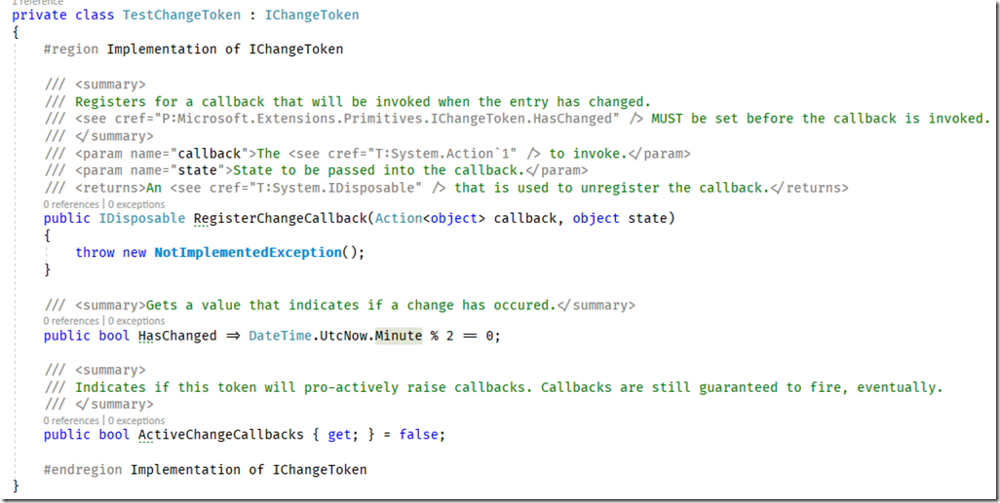

## 1>相关文章

### 1-1>.NET CORE 中的缓存使用

https://www.cnblogs.com/weihengblogs/p/11776497.html

### 1-2>拥抱.NET Core系列：MemoryCache 初识

[拥抱.NET Core系列：MemoryCache 初识](https://www.cnblogs.com/ants/p/8477223.html)

[拥抱.NET Core系列：MemoryCache 缓存过期](https://www.cnblogs.com/ants/p/8482227.html)

[拥抱.NET Core系列：MemoryCache 缓存选项](https://www.cnblogs.com/ants/p/8526935.html)

[拥抱.NET Core系列：MemoryCache 缓存域](https://www.cnblogs.com/ants/p/8533074.html)

### 1-3>C# Memory Cache 踩坑记录

https://www.cnblogs.com/CoderAyu/p/10242230.html

### 1-4>.NET Core MemoryCache缓存获取全部缓存键

https://www.cnblogs.com/leon-ytparty/articles/10831063.html

### 1-5>Redis缓存

https://www.cnblogs.com/taotaozhuanyong/p/11565527.html


## 2>IMemoryCache

### 2-1>简介

存储在 Web 服务器内存中的缓存, 支持

- 绝对过期支持

- 滑动过期支持（指定一个时间，TimeSpan，指定时间内有被Get缓存时间则顺延，否则过期）

- 过期回调

- 自定义过期

### 2-2>基本使用

*`包: Microsoft.Extensions.Caching.Memory`

*`依赖注入`:

```C#
public void ConfigureServices(IServiceCollection services)
{
	services.AddMemoryCache();
}
```

```C#
private IMemoryCache _cache;
public LoginController(IMemoryCache memoryCache)
{
	_cache = memoryCache;
}
```

```C#
//创建IMemoryCache
using IMemoryCache memoryCache = new MemoryCache(Options.Create(new MemoryCacheOptions()));

//设置缓存值
var cacheKey = "stu1";
Student student1 = new()
{
    Id = await SnowflakeID.GetInstance().GetNextIDAsync<long>(),
    Name = "dylanxu"
};
memoryCache.Set(cacheKey, student1);

//获取缓存值
var isExist = memoryCache.TryGetValue(cacheKey, out Student student2);
```

### 2-3>设置绝对到期时间（指定在一个固定的时间点到期）

```C#
//设置绝对到期时间
using IMemoryCache memoryCache = new MemoryCache(Options.Create(new MemoryCacheOptions()));
var count = 0;
var cacheKey = "cacheKey";
for (var i = 0; i < 10; i++)
{
	var resultInt = await memoryCache.GetOrCreateAsync(cacheKey, entry =>
	{
		entry.SetAbsoluteExpiration(TimeSpan.FromSeconds(2));
		count++;
		return Task.FromResult(count);
	});

	await Console.Out.WriteLineAsync(resultInt.ToString());
	await Task.Delay(TimeSpan.FromSeconds(1));
}

//设置绝对到期时间
using IMemoryCache memoryCache = new MemoryCache(Options.Create(new MemoryCacheOptions()));
var cacheKey = "cacheKey";
var cacheVal = "cacheVal";
memoryCache.Set(cacheKey, cacheVal, TimeSpan.FromSeconds(2));
await Task.Delay(TimeSpan.FromSeconds(1));
var isExist = memoryCache.TryGetValue(cacheKey, out var val);
await Console.Out.WriteLineAsync
(
	$"After 1s, key({cacheKey}) is exist:{isExist}."
);

await Task.Delay(TimeSpan.FromSeconds(2));
isExist = memoryCache.TryGetValue(cacheKey, out val);
await Console.Out.WriteLineAsync
(
	$"After 3s, key({cacheKey}) is exist:{isExist}."
);
```

### 2-4>滑动到期（在一个时间长度内没有被命中则过期）

```C#
//4>设置滑动到期
using IMemoryCache memoryCache = new MemoryCache(Options.Create(new MemoryCacheOptions()));
var cacheKey = "cacheKey";
var cacheVal = "cacheVal";
using (var entry = memoryCache.CreateEntry(cacheKey))
{
	entry.SetValue(cacheVal);
	entry.SetSlidingExpiration(TimeSpan.FromSeconds(2));
}
await Task.Delay(TimeSpan.FromSeconds(1));
var isExist = memoryCache.TryGetValue(cacheKey, out var val);
await Console.Out.WriteLineAsync
(
	$"After 1s, key({cacheKey}) is exist:{isExist}."
);

await Task.Delay(TimeSpan.FromSeconds(1.8));
isExist = memoryCache.TryGetValue(cacheKey, out val);
await Console.Out.WriteLineAsync
(
	$"After 1.8s, key({cacheKey}) is exist:{isExist}."
);

await Task.Delay(TimeSpan.FromSeconds(3));
isExist = memoryCache.TryGetValue(cacheKey, out val);
await Console.Out.WriteLineAsync
(
	$"After 3s, key({cacheKey}) is exist:{isExist}."
);
```

### 2-5>到期Token（自定义过期）

`IChangeToken`

- HasChanged: 用来返回是否发生了变更，在MSCache中如果返回了true则缓存项将会失效。

- ActiveChangeCallbacks: 该属性更多是一种描述，字面意思是该token是否会激活回调，取决于IChangeToken实现者的逻辑，如果这个值返回false则不要期望通过IChangeToken的RegisterChangeCallback来达到发生变更的时候有回调通知。

- RegisterChangeCallback: 注册一个回调，当变更发生时执行，一般配合ActiveChangeCallbacks来达成。

MS其它组件实现的IChangeToken:

- CancellationChangeToken （一个对CancellationToken的包装）
- CompositeChangeToken （组合ChangeToken，可以将多个ChangeToken包装成一个Token）
- ConfigurationReloadToken （配置重新加载Token，来自MS.Configuration组件）
- PollingFileChangeToken （通过轮询来监控文件变更）
- PollingWildCardChangeToken （通过轮询来监控文件变更，这个是支持通配符的）


```C#
//5>自定义过期Token
using IMemoryCache memoryCache = new MemoryCache(Options.Create(new MemoryCacheOptions()));
var cacheKey = "cacheKey";
var cacheVal = "cacheVal";
var cancellationTokenSource = new CancellationTokenSource();
var cancellationChangeToken = new CancellationChangeToken(cancellationTokenSource.Token);
memoryCache.Set(cacheKey, cacheVal, cancellationChangeToken);

await Task.Delay(TimeSpan.FromSeconds(1));
var isExist = memoryCache.TryGetValue(cacheKey, out var val);
await Console.Out.WriteLineAsync
(
	$"After 1s, key({cacheKey}) is exist:{isExist}."
);

//手动取消
cancellationTokenSource.Cancel();
isExist = memoryCache.TryGetValue(cacheKey, out val);
await Console.Out.WriteLineAsync
(
	$"After cancel by outer, key({cacheKey}) is exist:{isExist}."
);

//非常重要: 需要重新定义CancellationTokenSource和CancellationChangeToken
cancellationTokenSource = new CancellationTokenSource();
cancellationChangeToken = new CancellationChangeToken(cancellationTokenSource.Token);
memoryCache.Set(cacheKey, cacheVal, cancellationChangeToken);
await Task.Delay(TimeSpan.FromSeconds(1));
isExist = memoryCache.TryGetValue(cacheKey, out val);
await Console.Out.WriteLineAsync
(
	$"After 1s, key({cacheKey}) is exist:{isExist}."
);
```

*`自定义IChangeToken`




### 2-6>过期策略可以组合使用

*`过期策略是只要有一个策略命中, 那么这个缓存就无效了.`

```C#
//6>多个过期策略组合使用
using IMemoryCache memoryCache = new MemoryCache(Options.Create(new MemoryCacheOptions()));
var cacheKey = "cacheKey";
var cacheVal = "cacheVal";
using (var entry = memoryCache.CreateEntry(cacheKey))
{
	entry.SetValue(cacheVal);

	//1>设置绝对过期时间为10min
	entry.SetAbsoluteExpiration(TimeSpan.FromMinutes(10));
	//2>设置滑动过期时间为3s
	entry.SetSlidingExpiration(TimeSpan.FromSeconds(3));
}
var isExist = memoryCache.TryGetValue(cacheKey, out var val);

var count = 0;
while (isExist)
{
	await Task.Delay(TimeSpan.FromSeconds(count++));
	isExist = memoryCache.TryGetValue(cacheKey, out val);
	await Console.Out.WriteLineAsync
	(
		$"After {count}s, key({cacheKey}) is exist:{isExist}."
	);
}
```

### 2-7>缓存过期回调

*`过期回调内的动作不要使用异步, 也不要访问reson, 否则程序逻辑会出现异常.`

*`回调动作的触发的时机: 外部访问已经过期的缓存`

```C#
//7>过期回调
using IMemoryCache memoryCache = new MemoryCache(Options.Create(new MemoryCacheOptions()));
var cacheKey = "cacheKey";
var cacheVal = "cacheVal";
using (var entry = memoryCache.CreateEntry(cacheKey))
{
	entry.SetValue(cacheVal);

	//1>设置绝对过期时间为2s
	entry.SetAbsoluteExpiration(TimeSpan.FromSeconds(2));
	//2>注册过期回调动作
	entry.RegisterPostEvictionCallback( (key, value, reason, state) =>
	{
		try
		{
			var val = value == null ? "" : value.ToString();
			//访问reason, 程序逻辑就异常
			//Console.WriteLine(reason);
			//Console.WriteLine(state);
			Console.WriteLine($"{key}(val:{val}).");

			//await Console.Out.WriteLineAsync(key.ToString());
			//Console.WriteLine(key.ToString());
		}
		catch (Exception ex)
		{
			Console.WriteLine(ex.GetInnerExceptionMsg());
		}
	});
}
var isExist = memoryCache.TryGetValue(cacheKey, out var val);
await Console.Out.WriteLineAsync
(
	$"key({cacheKey}) is exist:{isExist}."
);

await Task.Delay(TimeSpan.FromSeconds(2.5));
isExist = memoryCache.TryGetValue(cacheKey, out val);
await Console.Out.WriteLineAsync
(
	$"key({cacheKey}) is exist:{isExist}."
);
```

### 2-8>GetOrCreate

`获取或创建, 此方法的使用场景: 当缓存失效后, 可以使用预先定义好的策略重新获取并设置新的缓存.`

```C#
//8>GetOrCreate
using IMemoryCache memoryCache = new MemoryCache(Options.Create(new MemoryCacheOptions()));
var cacheKey = "stu_dylan";
async Task<Student> CreateStuAsync()
{
	return
		await memoryCache.GetOrCreate(cacheKey, async entry =>
		{
			await Console.Out.WriteLineAsync($"Create {entry.Key}");
			//设置2s后过期
			entry.SetAbsoluteExpiration(TimeSpan.FromSeconds(2));

			Student student = new()
			{
				Id = await SnowflakeID.GetInstance().GetNextIDAsync<long>(),
				Name = "dylanxu",
			};
			return student;
		});
}

var stu = await CreateStuAsync();
await Console.Out.WriteLineAsync
(
	$"key({cacheKey}) is exist:{stu != default}."
);

await Task.Delay(TimeSpan.FromSeconds(2.1));
stu = await CreateStuAsync();
await Console.Out.WriteLineAsync
(
	$"After 2.1s, key({cacheKey}) is exist:{stu != default}."
);
```

### 2-9>MemoryCacheOptions

`Clock: 用来提供时间的一个成员.`


`ExpirationScanFrequency: 过期扫描频率 (默认为1分钟，可以理解为每过多久移除一次过期的缓存项).`

*什么时候会进行过期缓存清理:

- 添加新的
- 获取缓存项
- 删除缓存项目
- 当有缓存项过期（通过过期回调）


`SizeLimit: 缓存大小限制, 当所有缓存大小超过这个值的时候进行一次缓存压缩。`


`CompactionPercentage: 压缩率 (默认5%).`

- 那么当缓存大小超过SizeLimit时，MSCache会

- 先清理Low优先级的缓存项（不管是否过期）

- 再清理Normal优先级的缓存项（不管是否过期）

- 继续清理High优先级的缓存项（不管是否过期）

```C#
//9>MemoryCacheOptions
var memoryCacheOptions = Options.Create(new MemoryCacheOptions());
memoryCacheOptions.Value.ExpirationScanFrequency = TimeSpan.FromSeconds(30);
using IMemoryCache memoryCache = new MemoryCache(memoryCacheOptions);
var cacheKey = "stu_dylan";
using (var entry = memoryCache.CreateEntry(cacheKey)) 
{
	//TODO
}
```

### 2-10>[缓存域(缓存级联失效)](https://www.cnblogs.com/ants/p/8533074.html)

*`在绝对过期时间及自定义IChangeToken的情况, 子类缓存过期了, 父类也会自动过期.`

*`在相对过期时间的情况下, 子类缓存过期了, 父类也不会过期, 需要手动处理这种情况.`

### 2-11>封装

参考 `Dylan.FrameWork.Extension.MemoryCacheExtension.cs`

### 2-12>注意事项

*`存储在MemoryCache里的引用类型的数据, 获取出来的永远指向同一个对象, 所以要注意, 若对取出来的数据进行修改后, 不管调用 memoryCache.Set 与否, 都会改变cache里的值.`

```C#
using IMemoryCache memoryCache = new MemoryCache(Options.Create(new MemoryCacheOptions()));
var cacheKey = "stu1";
Student student1 = new()
{
	Id = await SnowflakeID.GetInstance().GetNextIDAsync<long>(),
	Name = "dylanxu"
};
memoryCache.Set(cacheKey, student1);
var isExist = memoryCache.TryGetValue(cacheKey, out Student student2);

await Console.Out.WriteLineAsync
	($"{cacheKey} is exist:{isExist}, student1({student1.GetHashCode()}) == student2({student2.GetHashCode()}):{object.ReferenceEquals(student1, student2)}.");

//修改student2数据, 再重新获取一次cache数据, 查看是否原来的数据=>是
student2.Name = $"{student2.Name}_111";
isExist = memoryCache.TryGetValue(cacheKey, out Student student3);
await Console.Out.WriteLineAsync
	($"{cacheKey} is exist:{isExist}, student3.Name:{student3.Name}, student2({student2.GetHashCode()}) == student3({student3.GetHashCode()}):{object.ReferenceEquals(student2, student3)}.");
```

*`MemoryCache是线程安全的, 缓存项目使用ConcurrentDictionary<object, CacheEntry> _entries.`	

*`过期回调内的动作不要使用异步, 也不要访问reson, 否则程序逻辑会出现异常.`

*`若MemoryCache需要全局有效, 需要使用静态类的静态属性来装载IMemoryCache.`

```C#
//Dylan.FrameWork.Utility.FramePublicFun.cs
/// <summary>
/// MemoryCache
/// </summary>
public static IMemoryCache MemoryCacheGlobal { get; set; } = default;
```


------


## 3>Redis

