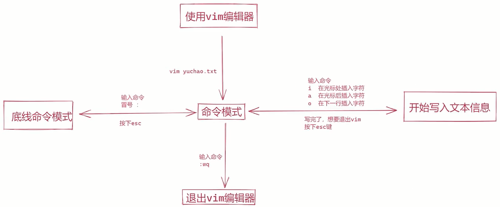

## 1>相关文章 

[阿里云开源镜像站](https://developer.aliyun.com/mirror/)

[阿里DSN解析服务](https://alidns.com/)

[Linux命令手册](http://linux.51yip.com/)

[【Linux】- CentOS查看IP](https://www.cnblogs.com/wangwust/p/9774190.html)

[Vim基本使用方法](https://blog.51cto.com/u_13525470/2053771)

[yum和apt-get的区别](https://www.cnblogs.com/klb561/p/8870307.html)

[wget命令详解](https://blog.csdn.net/m0_51627713/article/details/118082288)

## 2>远程连接

* xshell (推荐)

[Xshell6绿色免安装破解版本-实际用的这个](https://www.192luyou.com/soft/36660.html)

[SSH客户端 Xmanager Power Suite 6.0.0012r-实测可下](https://www.zhzz.org/asp/15445)

[Linux系列-XShell破解版安装教程, 安装包装不上](https://www.cnblogs.com/bowendown/p/11937159.html)

* securtCRT

[远程工具securtCRT配置](https://blog.csdn.net/shallow72/article/details/119089258)

* ssh命令连接

```bash
#ssh 账号@ip 端口号(可不写, 默认22)
ssh root@192.168.157.128 22
```

## 3>linux和win相互传输文件

* lrzsz

```bash
# 安装命令
yum install lrzsz -y
# rz: win=>linux, sz: linux=>win
# 输入rz后弹框, 将win的文件传到linux
rz
# 将指定文件传到win
sz new_zip_file.zip
```

* xftp
* ftp

## 4>常用命令

###### 命令格式

| 命令 | 空格 | 条件/参数 | 空格 | 对象/条件/目录    |
| ---- | ---- | --------- | ---- | ----------------- |
| rm   |      | -f        |      | /tmp/testFile.txt |

> * 若命令带多个参数时候, 有两种写法
>   * ls -l -h
>   * ls -lh

###### `whoami` 查看当前的登录账号

###### `who` 查看有多少用户登录到该系统, 简单显示

###### `w` 查看有多少用户登录到该系统, 详细显示

###### `which` 用来查询环境变量里的文件的所在目录

```bash
which ls
which mysql
```

###### `id` 验证用户是否存在

```bash
# 查看当前的用户信息, 等同whoami
id
# 验证dylanxu是否存在
id dylanxu
```

###### `su` 账号切换

```bash
# 推荐这种切换方式
su - root
su - dylanxu

# 这种方式没有变更环境变量和权限
su root
su dylanxu
```

###### `useradd` 创建系统用户

```bash
useradd testuser1
```

###### `passwd` 设置系统用户密码

```bash
passwd testuser1
```

###### `hostname` 查看主机名

###### `hostnamectl` 更改主机名

```bash
hostnamectl set-hostname dylanxu.centos7
```

###### `uname` 打印系统信息

```bash
uname -a
```

###### `man` 命令手册

```bash
man ls
```

###### `clear` 清空命令窗口

###### `pwd` 打印当前工作目录, print work directory

###### `cd` 切换目录

```bash
cd /etc
# 定位到上一次的工作目录
cd -
```

###### `ls` 打印列表

```bash
# -l: 列表方式展示信息
# -h: 已用户
# -d: 
# -a: 

# 以用户友好的方式，显示指定目录下的文件及文件夹信息
ls -lh /var/log
# 查看当前目录下所有文件, 包含隐藏文件
ls -a
# 查看当前文件夹的信息
ls -lhd
```

###### `tree` 树形结构显示文件及文件夹信息

* 如果提示没有tree命令, 则需要安装
  * ubuntu：sudo apt-get install tree
  * centos：yum -y install tree

```bash
tree
# 只显示以 /（根目录） 开头的目录树的第一级, -L 选项告诉树你想看到多少层目录.
tree -L 1/
# -N 显示中文, -F 显示文件类型
tree -FN
```

###### `state` 显示文件或文件系统的状态。

###### `touch` 创建普通文件

* 若该目录下，不存在同名文件，则创建新文件
* 若该目录下，存在同名文件，则更新文件的时间属性

```bash
touch /home/dylanxu/test_folder_1/test_file_1.txt
# 以点号开头的文件(文件夹), 为隐藏文件(文件夹)
touch .test1.txt
# 在同级目录下批量创建多个文件
touch ./f_1/{file_1.txt,file_2.txt,file_3.txt}
# 批量创建N个文件
touch f_2/temp{1..10}.log
```

###### `rm` 删除文件/目录

* 谨慎使用, 若用的虚机, 请做好快照
* 删前切换到root账号, 获取最大权限

```bash
# -r: 递归删除, 主要用于删除目录, 可删除指定目录及包含的所有内容, 包括所有子目录和文件
# -f: 强制删除, 不提示任何信息, 操作前一定要慎重
# -v: 显示进行的步骤
# -i: 执行删除前, 提示用户是否确认删除

# 递归强制删除文件夹
rm -rfv folder1/

# 强制删除文件
rm -f bb.txt
```

###### `mkdir` 创建目录

* 支持一次创建多个目录
* 支持创建层级目录
* 不允许创建同名目录

```bash
mkdir /home/dylanxu/test_folder_1
# 一次创建多个文件夹
mkdir test-folder-2 test_folder_3
# 递归创建文件夹
mkdir -p test_folder_4/test_folder_4_1
# 批量创建同级目录
mkdir -p ./f_1/{f_1_1,f_1_2,f_1_3}
# 批量创建N个文件夹
mkdir -p f_3/f3_{1..10}
```

###### `rmdir` 删除目录

* 删除空目录, 目录不为空, 则无法删除

```bash
rmdir test_fiolder_1
# 一次删除多个文件夹
rmdir t5/t5_1/ t5
```

###### `cp` 复制文件

```bash
# f: 如果目标文件无法打开则将其移除并重试
# -r: 递归复制目录及其子目录内的所有内容
# -v: 显示明细信息
# i: 覆盖前询问(使前面的 -n 选项失效)
# -l, --link: 链接文件而不复制
# -n: 不要覆盖已存在的文件
# -p --parents: 将目标的父目录结构copy到目标目录

# 将一个文件复制到指定目录下, 保持原来的文件名
cp ./aa.txt test_folder_1/
# 将一个文件复制到指定目录下, 使用新的文件名
cat aa.txt test_folder_1/aa_copy.txt
# 备份aa.txt，并在尾部加上.bak后缀
cp test_folder_1/aa.txt{,.bak}
# test_folder_3不存在的情况下, 将test_folder_2改名并复制成test_folder_3, 并将test_folder_2内的所有文件及文件夹递归复制到test_folder_3
cp -rfv test_folder_2 test_folder_3
# test_folder_4存在的情况下, 将test_folder_2及其内部所有的内容, 递归复制到test_folder_4
cp -rfv test_folder_2 test_folder_4
# 将aa.txt.clone文件复制到test_folder_5, 并在test_folder_5创建该文件的父目录结构
cp -f -v -p --parents test_folder_4/test_folder_2/aa.txt.clone test_folder_5
```

###### `mv` 剪切, 重命名

```bash
# -f: 覆盖前不询问
# -i: 覆盖前询问
# -v: 显示明细信息

# 将aa.txt重命名为hi.txt
mv aa.txt hi.txt
# 为hi.txt添加后缀.py
mv hi.txt{,.py}
# 将文件hi.txt.py移动到test_folder_7
mv hi.txt.py ./test_folder_7
# 将cc.txt移动到test_folder_7, 并重命名为cc.txt.bak
mv cc.txt ./test_folder_7/cc.txt.bak
# 将test_folder_6移动到test_folder_7, 若test_folder_7不存在, 则该命令的作用是将test_folder_6重命名为test_folder_7
mv test_folder_6 test_folder_7
# 将test_folder_7复制到test_folder_8, 并重命名为test_folder_7_clone
mv -fv test_folder_7 test_folder_8/test_folder_7_clone
```

###### `ip` 查看ip

```bash
ip address
```

###### `cat` 查看文件内容

```bash
# -n: 显示行号

cat test-file-1.txt
cat -n test_file_0.txt 
```

###### `head` 默认显示前10行记录

```bash
# -n 前N条

head -n 5 test-file-1.txt
head -5 test-file-1.txt
```

###### `tail` 默认显示前10行记录

```bash
# -n 最后N条

tail -n 5 test-file-1.tx
tail 5 test-file-1.tx
```

###### `grep` 输出包含指定字符串的行

```bash

grep 'dylanxu' test-file-1.txt
```


###### `history` 查看历史输入的命令, 默认3000条

```bash
# -c: 清空记录

# 显示历史记录
history
# 清除记录
history -c
```

###### `echo` 输出内容

```bash
# 单引号内的为纯字符串, 不会当做命令, 而双引号则会将特殊符号识别为命令
echo 'hi dylan'
echo ${PATH}
echo $name

# 将字符串写入到文件
echo 'hi dylan' > test_file_1.txt
# 将字符串追加到文件
echo 'good bye' >> test_file_1.txt
```

###### `exit` 退出当前账号

###### `logout` 退出当前账号

###### `bash` 重新加载用户的环境变量, 更新用户的机器信息

###### `ln` 创建快捷方式

###### `alias` 命令别名

* alias的效力仅及于该次登入的操作, 若要每次登入是即自动设好别名，可在/etc/profile或自己的~/.bashrc中设定指令的别名.

```bash
# 显示所有别名设置
alias
# 设置别名
alias cls='clear'
alias tree='tress -FN'
```

###### `unalias` 删除别名

```bash
# 删除指定别名
unalias cls
unalias tree
```

###### `tar` 将多个文件打包成一个文件

* 命名规范
  * .tar: 仅打包
  * .tar.gz: 打包+压缩
  * .tgz: 打包+压缩
* 仅用了打包, 解包不能用-zjJ参数
* 用什么参数压缩, 就用什么参数解压缩, 如压缩 `-czvf` , 则解压 `-xzvf`
* `-f` 一定要在最后

```bash
# -c: 创建包
# -v: 显示明细信息
# -f: 指定打包的文件名, 必须有这个参数, 且必须在最后一位
# -t: 列出包里的内容
# -u: 更新原打包文件中的文件
# -C: 解压到指定目录
# -x: 解包

# -z: 压缩为.gz格式
# -j: 压缩为.bz2格式
# -J: 压缩为.xz格式

# 将当前文件夹内的所有内容打包到all_file.tar, 不压缩
tar -cvf all_file.tar ./*
# 将当前文件夹内的所有内容打包并压缩到all_file.tar
tar -czvf all_file.tar.gz ./*
# 查看all_file.tar包里的内容
tar -tf all_file.tar
# 将压缩包all_file.tar.gz解压到test_folder_9目录
tar -xzvf all_file.tar.gz -C ./test_folder_9

# 将文件robot_1.txt到robot_3.txt文件打包到all_robot.tar, 打包后的文件大小为103M
tar -cvf all_robot.tar robot_{1..3}.txt
# 将文件robot_1.txt到robot_3.txt文件打包并压缩到all_robot.tar.gz, 打包后的文件大小为15M
tar -czvf all_robot.tar.gz robot_{1..3}.txt

```

###### `zip` 压缩多个文件或目录

* 压缩目录需要用`-r`
* 包的文件名如果没有后缀`.zip`, 会自动加上, 不过建议自己加上`.zip`

```bash
# -v: 显示明细信息
# -r: 用于压缩文件夹

# 压缩robot_1.txt和robot_2.txt文件到当前目录, 压缩包名称为robot.zip
zip robot.zip robot_{1..2}.txt
# 若robot.zip存在, 则往压缩包里追加robot_3.txt文件
zip robot.zip robot_3.txt
# 压缩robot_1.txt到robot_4.txt文件, 并且将folder_3/递归压缩
zip -rv new_zip_file.zip robot_{1..4}.txt folder_3/
```

###### `uzip` 查看zip包的内容, 测试压缩包是否完整, 解压缩zip包

```bash
# -t 检查压缩文件是否正确
# -v: 查看压缩文件信息
# -Z: 查看压缩文件信息
# -d: 将压缩包的内容解压到指定文件夹
# -j: 不处理压缩文件中原有的目录路径。
# -n: 解压缩时不要覆盖原有的文件。

# 校验压缩包正确性
unzip -t new_zip_file.zip
# 查看压缩包内容
unzip -v new_zip_file.zip
unzip -Z new_zip_file.zip
# 解压缩到当前文件夹
unzip new_zip_file.zip
# 解压缩到指定文件夹
unzip new_zip_file.zip -d ./tmp
```

###### `rename` 将文件重命名

```bash
# 将*.txt文件的txt改成html
rename txt html temp/*.txt
```

###### `md5sum` 获取文件md5值

```bash
md5sum new_zip_file.zip
```

###### `wget` 是一个下载文件的工具

* 支持HTTP, HTTPS和FTP协议, 可以使用HTTP代理
* 可以在用户退出系统的之后在后台执行
* 支持断点续传, 出错重试
* 从网络上下载资源, 如果没有指定目录, 则会默认下载到当前目录

```bash
# wget [参数] [URL地址]
# -b: 启动后转入后台执行
# -v: 显示明细信息
# -t=NUMBER: 设定最大尝试链接次数(0 表示无限制)
# -w=SECONDS: 两次尝试之间间隔SECONDS秒
# -nc: 不要覆盖存在的文件或使用
# -c: 接着下载没下载完的文件
# –-limit-rate=RATE 限定下载输率

# 下载并重命名
wget -O wordpress.zip http://www.minjieren.com/download.aspx?id=1080
# 限速下载
wget --limit-rate=300k http://www.minjieren.com/wordpress-3.1-zh_CN.zip
# 断点续传
wget -c http://www.minjieren.com/wordpress-3.1-zh_CN.zip
# 后台下载
wget -b http://www.minjieren.com/wordpress-3.1-zh_CN.zip
# 伪装代理名称下载
wget --user-agent="Mozilla/5.0 (Windows; U; Windows NT 6.1; en-US) AppleWebKit/534.16 (KHTML, like Gecko) Chrome/10.0.648.204 Safari/534.16" http://www.minjieren.com/wordpress-3.1-zh_CN.zip
# 使用wget –spider测试下载链接
wget --spider URL
# 增加重试次数
wget --tries=40 URL
# 把下载信息存入日志文件
wget -o download.log URL
# 使用wget FTP下载
# 匿名下载
wget ftp-url
# 用户名和密码认证的ftp下载
wget --ftp-user=USERNAME --ftp-password=PASSWORD url

# 编译安装
tar zxvf wget-1.9.1.tar.gz 
cd wget-1.9.1 
./configure 
make 
make install 

# 也可使用yum安装
yum install wget -y
```

###### `nmtui` 可视化界面配置网络参数

###### `sudo service network restart` 重启网络服务

## 5>vim

###### 简单操作

* 安装

```bash
yum install -y vim
```




###### 常用命令

```bash
# 退出
:q
# 强制退出
:q!
# 保存
:w
# 另存为名为filename文件
:w [filename]
# 将另外一个文件读入到正在编辑的文件
:r [filename]
# 将n1行到n2行的数据另存为名为filename文件
:n1,n2 w [filename]
# 保存并退出
:wq
# 保存并强制退出
:wq!
# 保存并退出
:x
# 跳转到指定行
:行号

# 开启代码高亮
:syntax on
# 关闭代码高亮
:syntax off
# 开启代码高亮
:syntax enable

# 开启搜索高亮
set hlsearch
# 关闭搜索高亮
set nohlsearch
# 输入搜索字符串的同时进行搜索
set incsearch
# 搜索时忽略大小写
set ignorecase

# 开启光标位置提示
set ruler
# 显示行号
set number
# 不显示行号
set nonu
# 命令部分高度为1
set cmdheight=1

# 自动缩进
set autoindent
# 不自动缩进
set noautoindent
# 智能缩进
set smartindent
# 当文件在外部被改变时，vim自动更新载入
set autoread
# 显示匹配的括号
set showmatch

# 删除操作
# 删除光标所在行
dd
# 删除从光标所在行开始，向下的n行
ndd
# 删除从光标所在行开始，到第一行的所有行
d1G
# 删除从光标所在行开始，到最后一行的所有行
dG
# 删除从光标所在位置，到行尾的所有字符
d$
# 删除从光标所在位置，到行首的所有字符
d0
# 每按一次，删除光标所在位置的后面一个字符
x
# 删除光标所在位置的“后面”n个字符
nx
# 大写的X，每按一次，删除光标所在位置的前面一个字符
X
# 删除光标所在位置的前面n个字符
nX

# 复制操作
# 复制光标所在行
yy
# 复制从光标所在行开始，向下的n行
nyy
# 复制3行
3yy
# 复制从光标所在行开始，到第一行的所有行
y1G
# 复制从光标所在行开始，到最后一行的所有行
yG
# 复制从光标所在位置，到行尾的所有字符
y$
# 复制从光标所在位置，到行首的所有字符
y0
# 将光标所在行与下一行合并成一行
J
# 复制当前光标所在的字母到该单词的最后一个字母
yw
# 复制当前光标所在的单词
yaw

# 粘贴操作
# 小写字母p，粘贴剪贴板中的数据，从光标所在行的下一行开始
p
# 大写字母P，粘贴剪贴板中的数据，从光标所在行的上一行开始
P

# 撤销与重做操作
# 撤销上一个操作
u
# 重复上一操作
.

# 替换操作
# 替换光标所在处字符
r
# 进入替换模式，直至按ESC退出
R
# 替换光标所在行
cc
# 替换光标所在的英文单词
cw
# 转换大小写
~

# 排版操作
# 光标所在行左对齐
:le
# 光标所在行右对齐
:ri
# 光标所在行居中
:ce

# 显示最近在vim里面输入的历史
:history

# 向下搜索字符串string
/string
# 向上搜索字符串string
?string

# 粘贴模式
# 进入粘贴模式
:set paste
# 退出粘贴模式
:set nopaste

```


## 6>yum

**yum是RedHat系列的高级软件包管理工具**

* 主要功能是更方便的添加/删除/更新RPM包。
* 能自动解决包的依赖性问题。
* 能便于管理大量系统的更新问题。
* 可以同时配置多个资源库(Repository)
* 简洁的配置文件(/etc/yum.conf)
* 自动解决增加或删除rpm包时遇到的倚赖性问题
* 保持与RPM数据库的一致性

```bash
# 安装软件包
yum install <package_name>
# 删除软件包
yum remove <package_name>
# 查找软件包
yum search <keyword>
# 列出所有可安装的软件包
yum list
# 列出所有可更新的软件包
yum list updates
# 列出所有已安装的软件包
yum list installed
# 列出所有已安装但不在 Yum Repository 内的软件包
yum list extras
# 列出所指定的软件包
yum list <package_name>
```


## 7>wget


## 8>其他知识点

###### linux系统大小写敏感

###### linux不关心扩展名, 用`ls -l`查看文件权限, 以权限位为准

###### linux注释符: `#`

###### Tab补全

* 指令补全, 命令敲一点, 使用Tab提醒匹配的命令

* 文件及文件夹(路径)补全, 文件或文件件敲一点, 使用Tab提醒匹配的命令

###### Linux命令提示符

`[dylanxu@localhost ~]`

`dylanxu -> 登录账号`

`@ -> 占位符`

`localhost -> 主机名`

`~ -> 当前在哪儿个文件夹`

###### 文件夹概念

* . 当前工作目录
* .. 当前工作目录的上层目录
* ~ 用户的家目录
* \- 前一个目录

###### 常见的重要目录

* /opt, 第三方软件安装目录
* /home, 普通用户家目录
* /root, root用户的家目录
* /etc, 存放各种配置文件的目录
* /var/log, 各种系统日志


###### 变量

```bash
param1='dylanxu'
# 推荐写法
echo ${param1}
# 简写
echo $param1
```

###### 环境变量

`${PATH}`

作用跟win system一样, 以冒号分割的路径字符串, 查找顺序从左往右, 挨个搜索文件夹

```bash
# 修改环境变量的值
echo ${PATH}
# /usr/local/bin:/usr/bin:/usr/local/sbin:/usr/sbin:/home/dylanxu/.local/bin:/home/dylanxu/bin
PATH=/usr/local/bin:/usr/bin:/usr/local/sbin:/usr/sbin:/home/dylanxu/.local/bin:/home/dylanxu/bin:/home/dylanxu/test-folder-1
echo ${PATH}
# /usr/local/bin:/usr/bin:/usr/local/sbin:/usr/sbin:/home/dylanxu/.local/bin:/home/dylanxu/bin:/home/dylanxu/test-folder-1
```

`${LANG}`

可以修改linux的中英文切换

```bash
# en_US.UTF-8
echo ${LANG}


# 切换成简体中文
LANG='zh_CN.UTF-8'

```

###### linux系统文件

>`/etc`初始化系统重要文件

* /etc/sysconfig/network-scripts/ifcfg-eth0 网卡配置文件
* /etc/resolv.conf linux系统DNS客户端配置文件
* /etc/hosts 系统本地的DNS解析文件
* /etc/fstab 配置开机设备自动挂载的文件
* /etc/rc.local 存放开机自动启动程序命令的文件
* /etc/iinittab 系统启动设定运行级别等配置的文件
* /etc/profile及/ect/bashrc 配置系统的环境变量/别名等的文件
* /etc/profile.d 用户登录后执行的脚本所在的目录
* /etc/issue和/etc/issue.net 配置在用户登录中断前显示信息的文件
* /usr/lib/systemd/system 软件启动从恒旭所在的目录
* /etc/motd 配置用户登录系统自后显示提示内容的文件
* /etc/redhat-release 声明redhat版本号和名称信息的文件
* /etc/sysctl.conf linux内核参数设置文件

>`/proc`重要路径

* /proc/meminfo 系统内存信息
* /proc/cpuinfo 关于处理器的信息, 如类型, 厂家, 型号, 性能等

###### 文件(夹)命名规则

* 区分大小写

* 尽量都用小写字母
* 如果需要对文件名进行分割, 使用_
* 长度不能超过255字符
* 文件尽量给正确的拓展名, 易于查看

###### linux分2个大类

* RedHat系列: `Redhat`、`Centos`、`Fedora` 等
  * 常见的安装包格式 `rpm`, 安装rpm包的命令是 `rpm -参数`
  * 包管理工具 `yum`
  * 支持 `tar` 包
* Debian系列: `Debian`、`Ubuntu`等
  * 常见的安装包格式 `deb`, 安装deb包的命令是 `dpkg -参数`
  * 包管理工具 `apt-get`
  * 支持 `tar` 包


## 9>账号

> all user pwd: 070806880507
