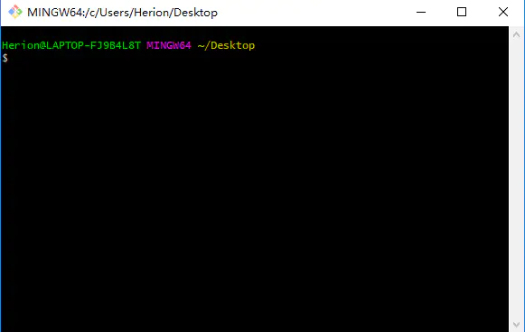
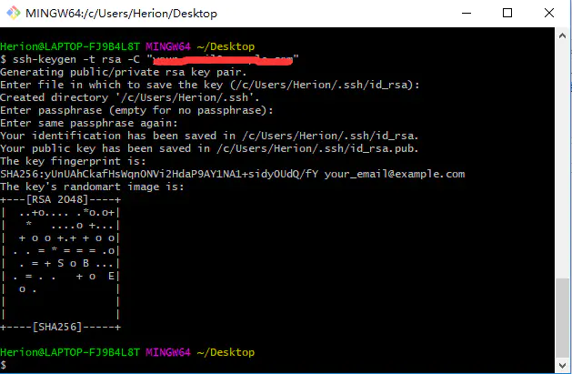
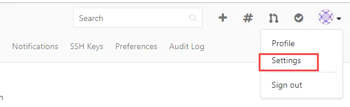
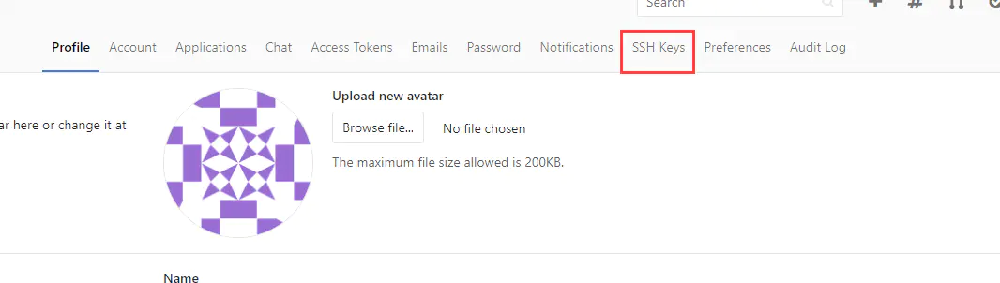

## 1>命令

### 1. 变量的配置

#### 1.1 全局变量的配置

`git config --global user.name`
全局用户名，这个名字在ssh模式下可以随便设置

`git config --global user.email`
这个用户名和邮箱是可以随便配置的（不提倡），如果你配置的邮箱是github里真实存在的邮箱，则commits里显示的是这个邮箱对应的账号；如果配置的邮箱是一个在github里不存在的邮箱，则commits里显示的是你配置的用户名。

`git config --global user.xxx “xxx”`
用于配置全局用户名或者地址

#### 1.2 局部变量的配置

在1基础上去掉–global参数，配置的即为局部用户名或者地址
局部变量多用于特定仓库中
使用变量的时候优先从局部变量中搜索

#### 1.3 ssh公钥的配置

输入ssh-keygen（并不需要加参数，因为默认的生成的公钥已经足够）生成公钥私钥。在~/.ssh/目录下找id_rsa.pub，将内容复制添加到你的网页远端的ssh公钥处。这样在提交修改后代码的时候就不用再输入账号密码验证了。因为你机器上生成的公钥已经给了网页服务端，它可以通过这个验证。
远端网页服务器添加多个公钥，就表明这些公钥对应的私钥所在客户端和远端服务器通信的时候都不需要密码验证了。

### 2. 初始化仓库

#### 2.1 拉取别人的仓库做开发建设的情况

在网页fork别人的仓库为自己的
在本地创建一个文件夹test,进去执行下面的操作
`git init`
`git config user.name “xxx”`（这里是配置局部变量，如果你的全局变量配置对应着你的gitee，也可以不用设置局部变量的）
`git config user.name “xxx”`
这一步添加你fork的仓库
`git remote add 仓库别名 url`
可以换成ssh的url，这样提交时就不用验证了。
`git pull`
拉取远端仓库内容以同步仓库状态，之后就可以修改
提交
`git add .`
`git commit -m “xxx”`
`git push 仓库别名 master`

#### 2.2 拉取自己仓库情况

在2.1配置远端仓库的时候，将url设置为自己的远端仓库即可。

#### 3. git版本控制

在本地仓库里，可使用此功能回退到相应版本的代码处，版本号可以从网页服务器端获取。
git reset --hard 版本号
此功能多用来找丢失文件或者回退到稳定版本
注意，找到文件后，应该让本地仓库回到最新版本状态。

#### 4. git分支管理

master分支是默认分支，一般是软件正式发布的正确代码
在本地仓库可以创建新分支
本地仓库可以切换到新分支，在新分支中进行的修改，不会影响master分支
可以将新分支merge到master分支，实现分支合并
命令
`git branch`
#查看分支
`git branch 分支名`
#创建以此分支名为名字的分支
`git checkout 分支名`
#转到此分支
`git push 仓库别名 分支名:分支名`
#提交此分支的内容，冒号意思是，如果远端仓库没有此分支则创建一个此分支
`git merge 分支名`
#将分支名所表示分支合并到当前分支。直接进入分支，不会让文件处于工作区或者暂存区。

#### 5. 工作区，暂存区，仓库分支

工作区文件是红的
暂存区是绿的add可以提交到暂存区
`git status`可以查看当前分支工作区和暂存区状态

#### 6. 快速开发

在配置好ssh情况下，直接在仓库文件夹下clone远程仓库，url选择ssh版本的，在此仓库中可以直接进行修改文件等一系列操作。前提是此仓库是你自己主页的，而不是从别人主页clone来的。如果想要别人的仓库，自己可以先fork一份。

#### 7. http模式

push的时候需要输入仓库所在账号密码才能成功push成功

#### 8. 初始管理远程所有分支

`git clone url`

`git clone -b 2.0.0 https://gitee.com/calcdev/RAD.git`

默认只拉取HEAD指向的master分支，其他的分支没有拉取到本地
`git -b（branch） 分支名`

拉取指定分支到本地 
`git branch -a`
查看所有分支，包括此仓库的所有远端分支名
`git checkout -b 本地分支名 origin/远端分支名`
创建本地分支a，转到本地分支a,并将远端分支关联到本地分支
`git branch -d 分支名`
删除本地分支
`git push origin --delete BranchName`
删除远端分支

#### 9. 一般的git提交分支流程

1.拉取master
2.以master为基创建dev开发分支
3.开发…开发完成，有多个dev本地commit
4.将多个dev本地commit合并为一个
5.pull master获取master最新内容
6.将master rebase到 dev，在dev中解决冲突问题
7.将dev merge到master，让本地master处于在服务端的最新版本基础上又添加了自己的改动的最新状态
8.提交master到远程仓库

具体如下:

拉取远端master分支
建立master为基的分支dev
在master中使用git branch dev创建，就是以master为基创建dev分支
如果用git checkout -b dev则新创建的分支和master没有关系，也没有任何内容
在dev中进行修改工作，该提交本地仓库就提交
修改工作完成后，先回到master，pull最新master
此处是master有可能在远端被其他开发者更改了，所以需要先把master最新信息同步到本地master
回到dev
git rebase -i HEAD~number
将dev分支中的number个提交化为一个提交
可以修改弹出来的内容为除了第一项之外前面都改成s,表示合并提交到一次中（本来一个commit就是一次提交）
git rebase master
由于dev是基于master产生的，所以这一步的意思是将master内容合并到自己修改之处。此处合并若有冲突产生，则rebase过程会停止，在自己开发仓库中处理冲突。
git status
使用此命令查看冲突文件
使用vim打开冲突文件进行修改，删除git给你添加的冲突标志线和其他提示信息。然后保存退出编辑器。但是我们需要将rebase过程走完。
git rebase --continue
这一步是继续进行将master合并到自己的dev开发分支，也就是将rebase或称走完。合并完毕后，自己的dev开发分支就处于最新远端仓库的版本上又添加了自己内容的状态
回到master，将dev分支合并到master
因为我们dev分支中除了有当前master的内容，又加上了我们自己的内容。
git checkout master
git merge dev
合并完毕之后提交
git push origin master

追加：回退历史版本

1、使用git log命令查看所有的历史版本，获取某个历史版本的id 比如：42294a2adc041c6b37d99fd776dac00a425e4b96

2.恢复到历史版本

git reset --hard 42294a2adc041c6b37d99fd776dac00a425e4b961
3、 把修改推到远程服务器( 注意：reset之后push到远程上会删除这个历史版本之后的所有版本 )。

git push -f -u origin master
备注：强制push到远程 master分支

备注：穿梭前，用git log可以查看提交历史，以便确定要回退到哪个版本。
要重返未来，用git reflog查看命令历史，以便确定要回到未来的哪个版本。

其他命令

`git config --global http.sslVerify "false"`

`git config --globa http.postBuffer 524288000`

`git rm --cached package-lock.json` //移除指定文件的版本管理

## 2>浅谈GIT中的Fork

https://blog.csdn.net/qq_29947967/article/details/80519113

## 3>Windows下GitLab配置SSH

#### 3-1> 确定自己的电脑用户路径下没有**.ssh**文件夹，如果有，则删除

#### 3-2>设置本地git的账户邮箱和用户名

请先确认自己的电脑安装过git客户端
在电脑任意位置右击，选择Git Bash Here，此时会弹出git的命令窗口

然后在窗口中输入以下命令：
`git config --global user.name "Git账号"`回车
`git config --global user.email "Git邮箱"`回车

在执行两条命令的过程中，如果没有任何异常提示，则说明执行成功了。当然，我们也可以用命令查看配置的git账户和邮箱是否成功了
 `git config user.name`回车，查看用户名
 `git config user.email`回车，查看用户邮箱

#### 3-3>生成一个新的SSH密钥

在git命令窗口中执行以下命令
`ssh-keygen -t rsa -C "你的Git邮箱"`
然后连续敲三次回车，如果没问题你会看到如下界面

#### 3-4>将SSH公钥添加到GitLab账户

在这个文件夹中有一对密钥文件
使用notepad++等工具打开`id_rsa.pub`，复制其中的内容，千万不要改变其中的内容

登陆你的gitlab账户，在gitlab的设置页面，找到设置SSH的地方

